# `cases/gates/` —— C / D 类门的**被跟踪**证据

★★★ **打开这一个文件就能把全部 C/D 门的图肉眼过一遍。**

| | |
|---|---|
| 谁写它 | `tests/C/*` 与 `tests/D/*`，经 `gate_evidence_dir` fixture |
| 何时写 | ★ 只在 **`PYFP3D_GATE_FIGURES=1`** 时；平时跑**不写盘**，断言对着已提交的 `summary.csv` |
| 为什么这样 | 图与断言来自**同一次计算**（构造保证）；平时不写 ⇒ 一次普通 `pytest` **不脏工作树** |
| 刷新 | `PYFP3D_GATE_FIGURES=1 pytest tests/C tests/D` —— 数字变了要走再基线的**勘误清单**纪律 |

★★ **A / B / E / F 不在这里，而且不该在**：它们的判据**就是断言本身**，没有「肉眼检查」这个环节。
2026-08-24 之前那些图写进 gitignored 的 `artifacts/`，于是
**规则要求「每个视觉门留下产物」而 `.gitignore` 保证它永不进 HEAD** —— 按纪律 3 从来就不是证据，
却有 11 处文档把它当证据引用。`artifacts/` 与它的 fixture **已一并删除**。

★ 目录里出现的 `G1.3` / `G2.4` 这类内层名字是**历史门号**，刻意保留 —— 它把新门号接回旧证据链。

---

## C01_laplace_mms

**判据读的 CSV**（平时跑就是对着它断言）：
- [`C01_laplace_mms/summary.csv`](C01_laplace_mms/summary.csv) — 4 行，列 `n, h, l2_error, cg_iterations`

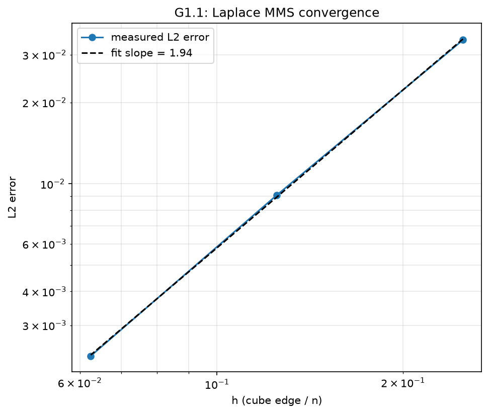

*C01_laplace_mms/mms_convergence_loglog.png*

## C02_cylinder_wall_correction

**判据读的 CSV**（平时跑就是对着它断言）：
- [`C02_cylinder_wall_correction/G1.3/summary.csv`](C02_cylinder_wall_correction/G1.3/summary.csv) — 5 行，列 `level, h_wall, max_cp_err_uncorrected, mean_cp_err_uncorrected, max_cp_err_corrected, mean_cp_err_corrected, max_rhs, spanwise_floor_uncorrected, spanwise_floor_corrected, n_cg_iterations, residual_norm`

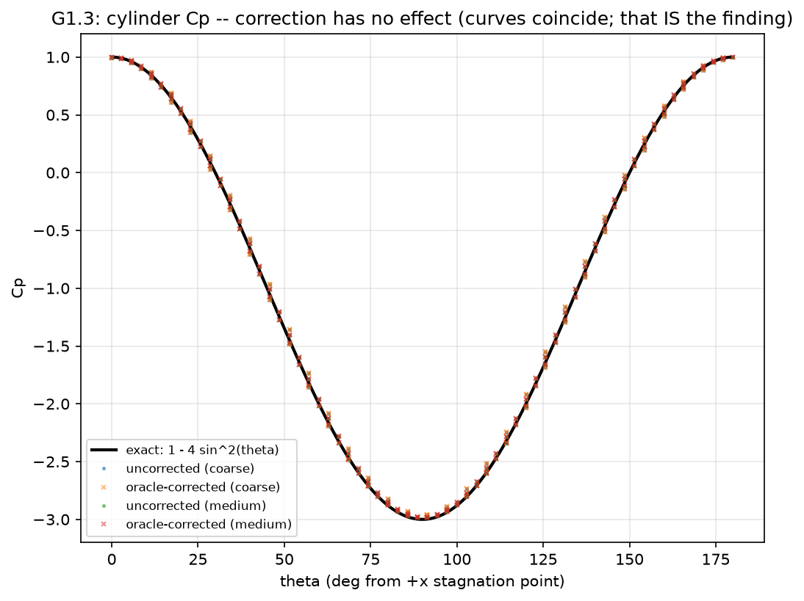

*C02_cylinder_wall_correction/G1.3/cp_theta_overlay.png*

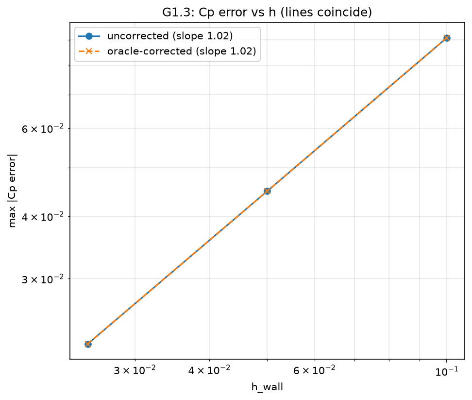

*C02_cylinder_wall_correction/G1.3/error_vs_h.png*

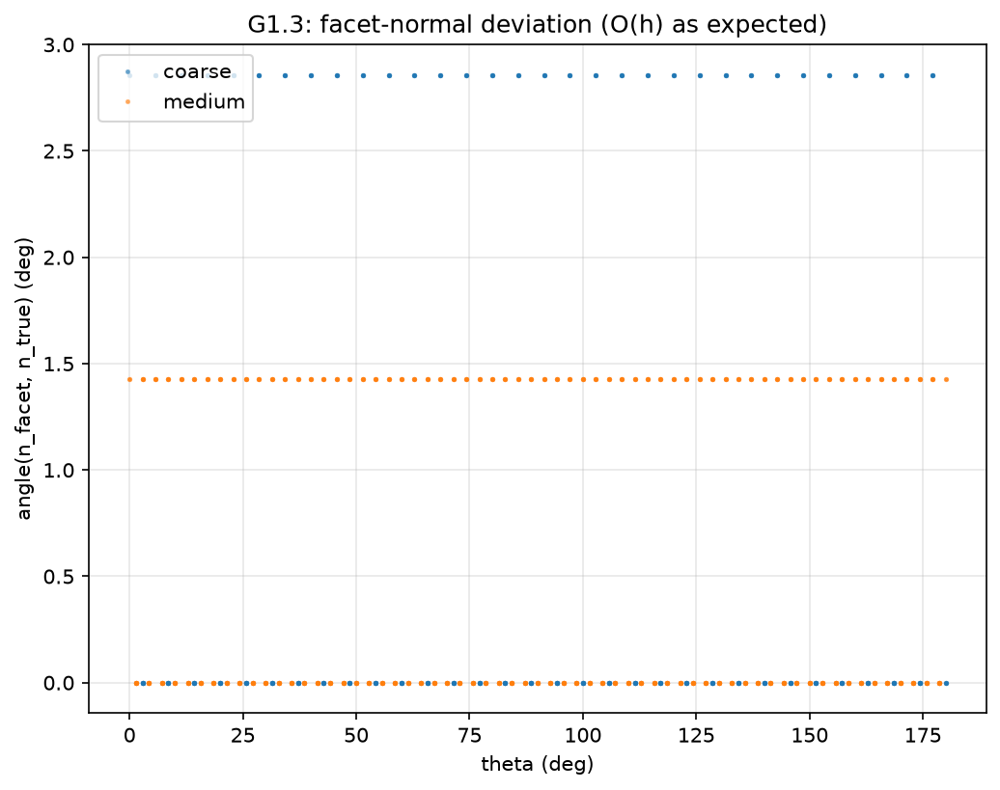

*C02_cylinder_wall_correction/G1.3/normal_deviation.png*

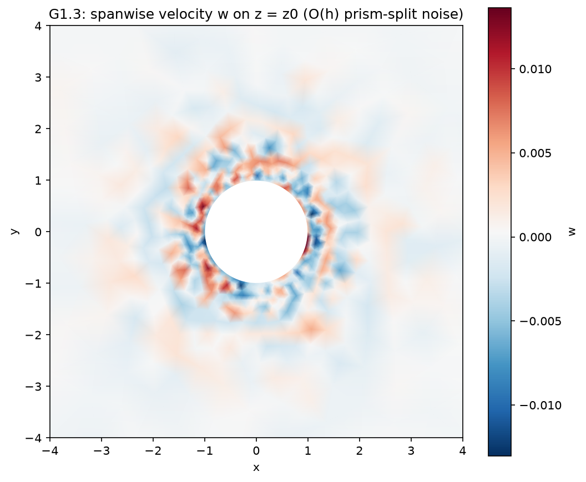

*C02_cylinder_wall_correction/G1.3/section_symmetry_plane.png*

## C03_laplace_sphere

**判据读的 CSV**（平时跑就是对着它断言）：
- [`C03_laplace_sphere/summary.csv`](C03_laplace_sphere/summary.csv) — 5 行，列 `metric, value`

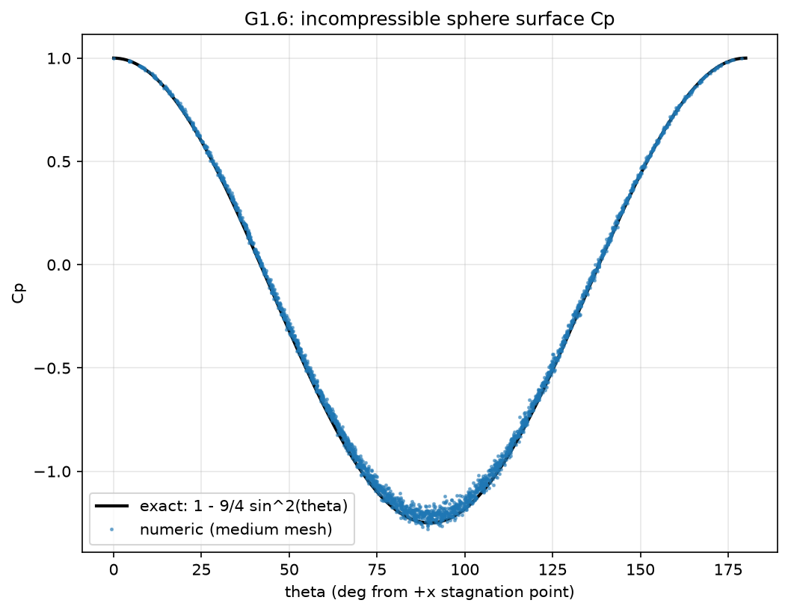

*C03_laplace_sphere/sphere_cp_meridian.png*

## C05_nozzle_quasi1d

**判据读的 CSV**（平时跑就是对着它断言）：
- [`C05_nozzle_quasi1d/summary.csv`](C05_nozzle_quasi1d/summary.csv) — 4 行（3 级阶梯 + **反例腿**），列 `nx, h, n_max, converged, reason, n_newton, residual, x_shock, x_s_exact, err_x, err_cells`

★★★ **项目里唯一带激波的精确解。** 左图三级 u(x) 全部贴在精确准一维解上，激波稳定落在
精确位置 x_s = 12 的**上游**约 0.7 个单元；右图 `|err_x|` 沿一阶线走（实测阶 **0.927 / 0.834**），
而 `|err_cells|` 几乎是平的（0.651 / 0.685 / 0.768）—— **位置在收敛，捕捉宽度保持亚单元**。

★★★ **CSV 第 4 行不是阶梯的一部分，它是本门最值钱的一条**：从 x_s = 8 的解出发
（边界数据仍是 x_s = 12 的真值），nx = 200 收敛到 **`reason=tol`、|R| = 1.3e-15**（机器零），
而激波停在 **x = 7.98**，错 **−40.17 个单元**。而 `verify_uniqueness` 证明**连续解唯一**
（Δφ 19.3186 > 17.6307）⇒ 那是**离散算子的伪根**。**在一个有真值的案例上，
`converged` 被证明不是正确性证书** —— `bench/usability.py` 在翼型上只能拿共识当锚点。

★★ **h = 0.05 那条腿 `reason=cap`，本门仍然用它 —— 许可是门自己证的**：迭代上限
20 → 40 → 80 时残差只在 ~2e-8 的地板上晃（4.45e-08 → 1.89e-08），而 **x_shock 只动
1.3e-06 = 2.6e-05 个单元** ⇒ 对**位置**可用、对**残差**不可用。

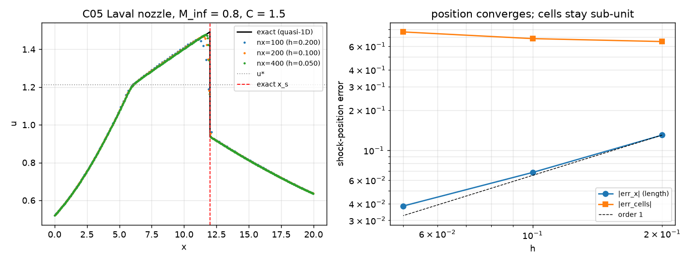

*C05_nozzle_quasi1d/c05_nozzle_shock.png*

## C06_lifting_cylinder

**判据读的 CSV**（平时跑就是对着它断言）：
- [`C06_lifting_cylinder/summary.csv`](C06_lifting_cylinder/summary.csv) — 3 行，列 `level, h_wall, n_nodes, n_wall, cp_max, cp_rms, cl_p, cl_exact, cl_rel, residual, n_kutta`

★★★ **本门的核心是「给进 Γ、量出 cl」** —— 圆柱没有尖尾缘，Kutta 选不出环量，所以
Γ 被**规定**（`gamma_fixed`，实测 `n_kutta_updates == 0`）；右图里 `cl rel err` 那条线
走的是**表面 Cp 恢复 + 面积分**，对的是 Kutta–Joukowski 的 `2Γ/(U c)`，两条路毫无交集。

★★ **右图标题「all scales refined together」是判据的一部分，不是描述**：实测把
`h_far` 钳成固定值（只加密壁面）会让 Cp 阶从 **1.686 塌到 0.325**、cl 误差**完全不动**
（1.124 % → 1.136 %）—— 与 P11 在球上测到的固定体网格污染地板同一形状。

★ 右图 `cl rel err` 在两个粗级之间**是平的**（3.393 % → 3.477 %，阶 −0.035）：
xcoarse 只有 598 节点、`h_far` 12 而域半径 15，仍在**前渐近区**。**如实画出、记为
RECORDED，不纳入收敛判据** —— 收缩只从 coarse → medium 判（实测 3.06×）。

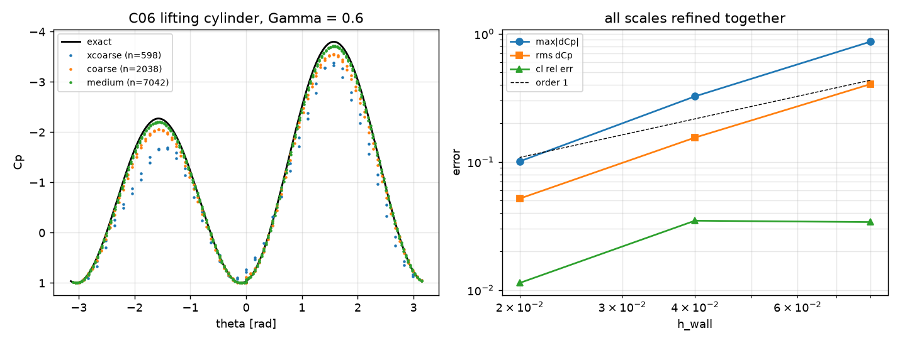

*C06_lifting_cylinder/c06_lifting_cylinder.png*

## C07_karman_trefftz

**判据读的 CSV**（平时跑就是对着它断言）：
- [`C07_karman_trefftz/summary.csv`](C07_karman_trefftz/summary.csv) — 3 行，列 `level, h_wall, n_nodes, n_wall, n_kutta, gamma, gamma_exact, gamma_rel, cl, cl_exact, cl_rel, cp_rms, band_LE, band_MID, band_TE, n_LE, n_MID, n_TE, match_max`

★★★ **唯一能把 Kutta 条件对精确 Γ 检验的门。** C06 的圆柱没有尖尾缘、Γ 是**规定**的；
KT 有**有限尾缘角**，Kutta **必须自己选出** Γ（`n_kutta` 列 = 2，不是 0），而精确值有解析式。
medium：**Γ 2.803 % / cl 3.045 %**，两条独立路线（Kutta 行 vs 表面压力积分）**相差 8 %**。

★★★ **右图的标题就是本轮的发现：积分量收敛，前缘点值不收敛 —— 而且在同一个解上。**
Γ 阶 2.109 / 1.493、cl 阶 1.957 / 1.468、Cp **MID** 带 2.893 / 1.761；而 **LE 带阶 0.085**、
**TE 带 0.53 / 0.65**。两个慢带都有已定位的成因：
· **LE** = 本项目 **G1.6 那一族**（P1 场在前缘吸力峰上的固有能力），**首次在有精确解的
二维翼型上复现**；排除过两个混淆项 —— 折线几何点数 ×20 只让 LE 阶 0.241→0.287，
oracle 采样加密 5×（匹配距 3.5e-05→6e-06）只让 LE RMS 0.1594→0.1574。
· **TE** = **有限楔角本身**：精确解 |q| 以 (ζ−b)^(τ/π) 趋零，τ=10° 时指数只有 0.0556，
θ=1e-5 处精确 |q| 还有 0.49 ⇒ **精确解自己就没有干净的驻点**。

★★ **紫线（LE 带）只有两个点，不是漏画**：xcoarse 上 x<0.05 内**一个壁面节点都没有**
（`n_LE` 列 = 0）。**自变量改变了样本是否存在** ⇒ LE 带只判「显著慢于 MID」（实测 20.6×），
不判它自己的阶。

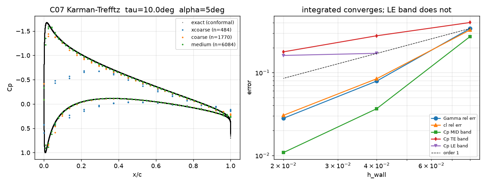

*C07_karman_trefftz/c07_karman_trefftz.png*

## C08_ringleb

**判据读的 CSV**（平时跑就是对着它断言）：
- [`C08_ringleb/summary.csv`](C08_ringleb/summary.csv) — 5 行（`upwind_c` 扫描 + `m_crit` 腿），列 `leg, h, upwind_c, m_crit, converged, reason, n_newton, residual, r_exact, rms, rms_sup, rms_sub, n_sup, n_cell, m_num_max, m_ex_max`

★★★ **唯一 2-D 跨声速精确解，而且是全速势方程本身的解。** 与 C05 的分工是它存在的理由：
喷管里**有激波** ⇒ 数值解本该与等熵精确解不同，那里只能判**激波位置**；Ringleb 的超声速
口袋是**无激波、光滑**的 ⇒ **人工密度加的每一分耗散都是纯误差**。

★★★ **左图把归因画死了**：速度误差**几乎只存在于精确声速线（黑）圈出的口袋里** ——
口袋内低估、紧下游高估，其余全场近零。右图是**剂量-响应**：超声速区 RMS
**C=1.5 → 0.1001**、C=0.5 → 0.0477、C=0.25 → 0.0376（收缩 **2.66×**）。
**证明那 10 % 是人工密度而不是离散化的，是这条剂量-响应，不是论证。**

★★ **红叉是价格**：`upwind_c = 0` **不收敛**（60 步撞顶，|R| 2.5e-07）⇒ 那份耗散买的是
稳健性，现在有价格。**绿三角**：`m_crit` 从 0.95 抬到 1.20 把超声速误差降到 **0.0293**
（3.4×）且仍收敛，代价是 Newton 步数 11 → 37 —— **RECORDED 而非建议改默认**，
因为本门只测了一个**无激波**算例。

★ **收敛阶判在别处**：解的误差由模型误差主导、**不随 h 收敛**（6.4e-2 → 5.9e-2 → 7.3e-2），
所以阶判在 **`r_exact` 列**（把精确解代进离散残差，实测 **2.32 / 2.28 阶**）——
那一半**不需要求解**。拿解的误差判阶会把模型误差误报成离散化缺陷。

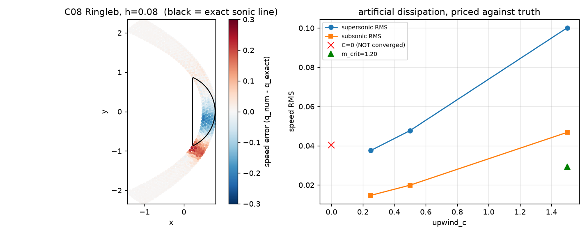

*C08_ringleb/c08_ringleb.png*

## C09_prandtl_glauert_peak

**判据读的 CSV**（平时跑就是对着它断言）：
- [`C09_prandtl_glauert_peak/G3.1/summary.csv`](C09_prandtl_glauert_peak/G3.1/summary.csv) — 1 行，列 `cp_peak_incompressible, cp_peak_pg_corrected, cp_peak_compressible, rel_diff_pct, n_picard, picard_converged, mach2_max`

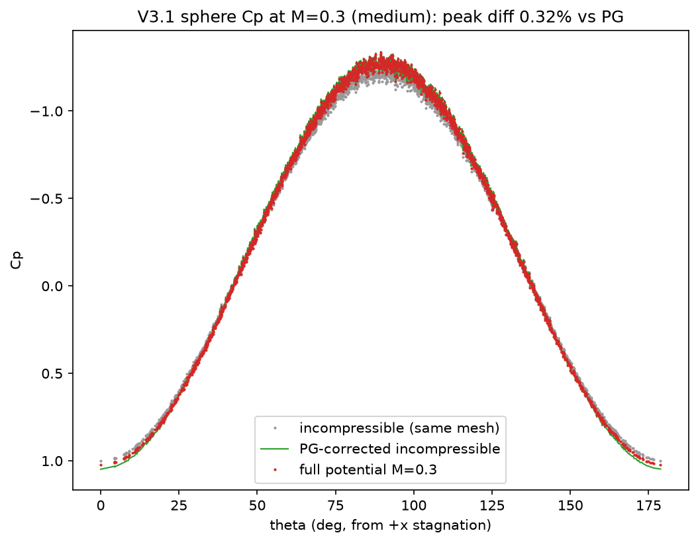

*C09_prandtl_glauert_peak/G3.1/v3_1_sphere_cp.png*

## D01_naca0012_incompressible_panel

**判据读的 CSV**（平时跑就是对着它断言）：
- [`D01_naca0012_incompressible_panel/G2.2/summary.csv`](D01_naca0012_incompressible_panel/G2.2/summary.csv) — 496 行，列 `x, phi_minus, phi_plus, jump`
- [`D01_naca0012_incompressible_panel/G2.3/summary.csv`](D01_naca0012_incompressible_panel/G2.3/summary.csv) — 2 行，列 `level, cl_pressure, cl_gamma, cl_panel_ref, rel_err_pct, n_kutta_updates`
- [`D01_naca0012_incompressible_panel/G2.3/v2_3_cp_curves.csv`](D01_naca0012_incompressible_panel/G2.3/v2_3_cp_curves.csv) — 408 行，列 `x_c, cp, surface`
- [`D01_naca0012_incompressible_panel/G2.4/summary.csv`](D01_naca0012_incompressible_panel/G2.4/summary.csv) — 1 行，列 `cl_pressure, cl_gamma, rel_diff_pct`
- [`D01_naca0012_incompressible_panel/G2.5/summary.csv`](D01_naca0012_incompressible_panel/G2.5/summary.csv) — 4 行，列 `level, case, max_abs_w_over_uinf, p99_abs_w_over_uinf, rms_abs_w_over_uinf`

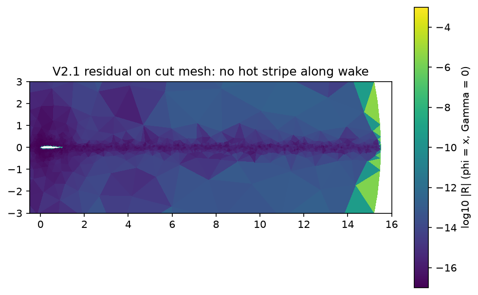

*D01_naca0012_incompressible_panel/G2.1/v2_1_residual_heatmap.png*

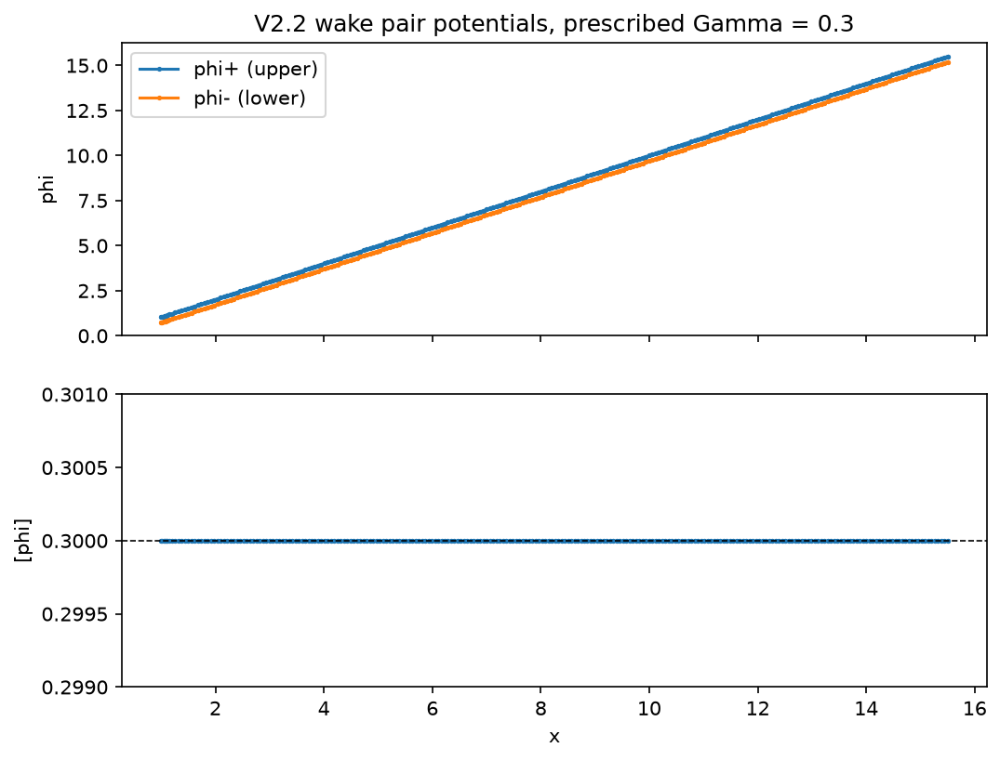

*D01_naca0012_incompressible_panel/G2.2/v2_2_wake_jump.png*

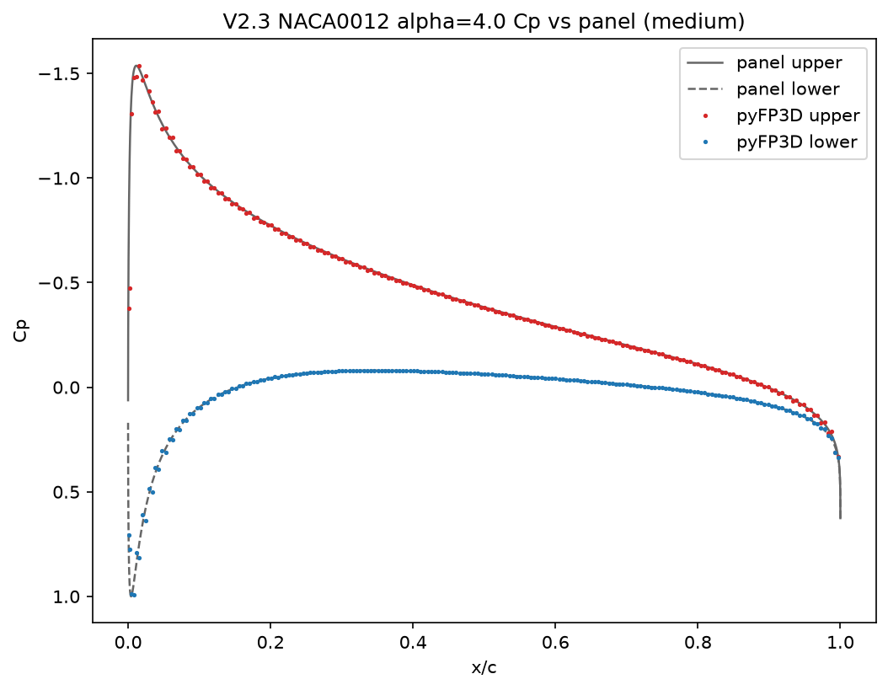

*D01_naca0012_incompressible_panel/G2.3/v2_3_cp_vs_panel.png*

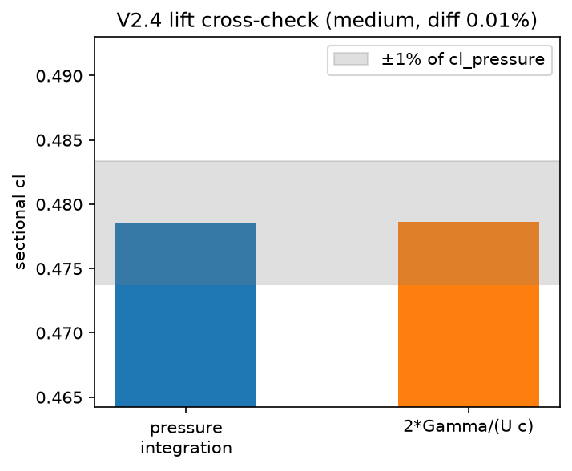

*D01_naca0012_incompressible_panel/G2.4/v2_4_cl_crosscheck.png*

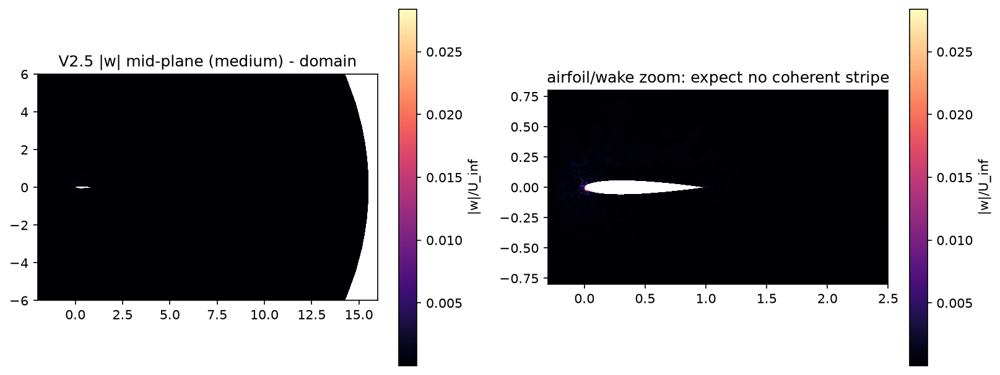

*D01_naca0012_incompressible_panel/G2.5/v2_5_spanwise_w_heatmap.png*

## D02_naca0012_m05_panel

**判据读的 CSV**（平时跑就是对着它断言）：
- [`D02_naca0012_m05_panel/G3.2/summary.csv`](D02_naca0012_m05_panel/G3.2/summary.csv) — 2 行，列 `level, cl_pressure, cl_gamma, cl_ref_pg, cl_ref_kt, cl_ref_mid, rel_err_mid_pct, n_picard, n_solves, mach2_max`
- [`D02_naca0012_m05_panel/G3.2/v3_2_cp_curves.csv`](D02_naca0012_m05_panel/G3.2/v3_2_cp_curves.csv) — 408 行，列 `x_c, cp, surface`

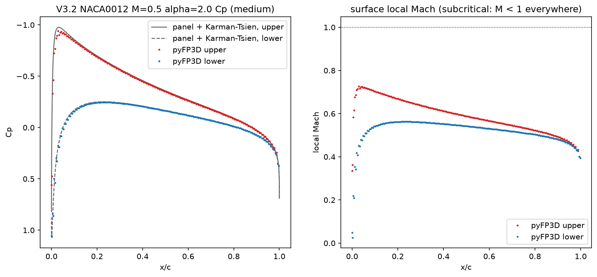

*D02_naca0012_m05_panel/G3.2/v3_2_cp_mach_vs_reference.png*

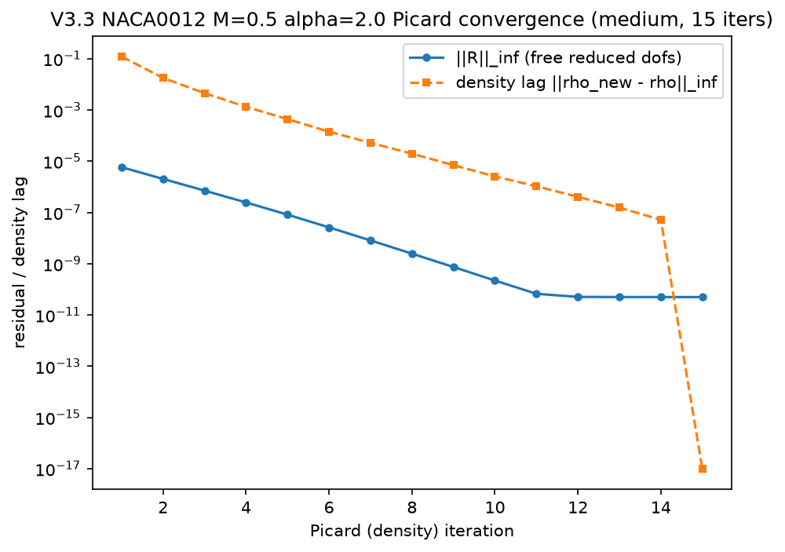

*D02_naca0012_m05_panel/G3.2/v3_3_picard_residual.png*

## D03_naca0012_m080_shock

**判据读的 CSV**（平时跑就是对着它断言）：
- [`D03_naca0012_m080_shock/G4.1/summary_coarse.csv`](D03_naca0012_m080_shock/G4.1/summary_coarse.csv) — 27 行，列 `quantity, value`

## D11_naca0012_experiment_bias

**判据读的 CSV**（平时跑就是对着它断言）：
- [`D11_naca0012_experiment_bias/summary.csv`](D11_naca0012_experiment_bias/summary.csv) — 6 行（3 工况 × 2 级），列 `case, level, converged, mode, residual, n_newton, n_limited, n_floored, mach_max, cl_p, rms_upper, rms_lower, pre_shock_rms, post_shock_rms, x_shock, x_shock_exp, shock_offset`

★★★ **本门的产物是"偏置"，不是 pass/fail** —— 裁决三：**对无粘用 Euler 设门、对实验记录偏置**。
拿一个无粘全速势解对实验做 pass/fail，会把**我们刻意不建模的物理**（边界层位移、
激波-边界层干涉、分离）算成缺陷。★ 这批数据**在 2026-08-27 之前从未被任何代码读过**，
发现它的是一个包住 `open` 的**运行时探针**，不是 grep。

★★★ **三个工况按"粘性物理有多重要"干净分层，图上一眼可见**（medium 上表面 RMS）：
**0.0779（近零升） < 0.3944（α=2°） < 1.5235（近失速）**。左图无粘曲线基本贴住实验点、
两条激波线几乎重合；中图无粘上表面明显更负、激波远在下游（+0.1219 c）；
右图前缘吸力峰冲到 −9 而实验约 −7。

★★ **激波前 / 激波后的分离，印证了裁决一「(b) 设门、(d) 只记录」**：M0.803 的激波**前**
RMS 随加密 **0.0926 → 0.0369 改善**，激波**后** **0.0609 → 0.0807 恶化**。
⇒ 激波前是无粘模型能负责的地方，激波后不是。

★★ **两处判据是被实测收窄的**：① 「无粘激波在实验激波下游」只挂在 **M0.778 coarse
（+0.1219 c）**，因为 **M0.803 的偏置跨越零**（coarse −0.0151、medium +0.0129）——
那一格的激波弱、位置分辨不到 ±0.015，符号在那里没有意义；② M0.778 的 **medium 腿是
`limit_cycle`**（残差尾巴 2.29e-07 → 3.82e-07 → 2.61e-07，周期 3），**不被任何判据引用**。

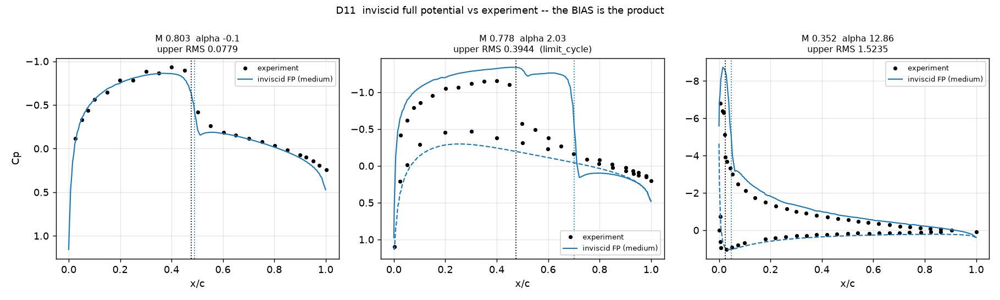

*D11_naca0012_experiment_bias/d11_experiment_bias.png*

## D12_rae2822_experiment_bias

**判据读的 CSV**（平时跑就是对着它断言）：
- [`D12_rae2822_experiment_bias/summary.csv`](D12_rae2822_experiment_bias/summary.csv) — 4 行（2 工况 × 2 级），列 `case, level, converged, mode, residual, n_newton, n_limited, n_floored, mach_max, cl_p, cn, cn_exp, cn_rel, rms_upper, rms_lower, x_shock, x_shock_exp, shock_offset`

★★★ **与 D11 同一形状：产物是偏置，不是 pass/fail。** medium 实测 —— **无粘全速势把法向力
高估 38–55 %**（Case 7 **+54.7 %**、Case 9 **+38.0 %**），**激波压后 ~0.12 c**。两者是同一件事
的两面：边界层位移把真实激波前移、并使有效弯度下降，无粘模型两样都没有。
★ 与有粘路径对照：GV5.2 在**耦合**路径上测到激波仍偏后 0.06–0.10 c —— 本门的 0.12 c 是**无粘**量级。

★★ **用 cn 不用 cl，是为了同尺**：实验只有 (x, Cp)、**没有 y** ⇒ 轴向项不可得，两边都只取
`cn = ∫(cp_l − cp_u) d(x/c)`。

★★★ **这道门在建的过程中查出了一个真实的库缺陷**（已修，见 `pyfp3d/post/section_cut.py`）：
侧别判据原是 `dot(mid, hint) > 0`，即 **y > 0** —— 对称翼型对，**有弯度翼型错**。
RAE2822 尾缘段下表面 y 为正 ⇒ 被判成上表面：`x_lower` 在 **0.9100 截断**，那 **37 个点**
以 Cp ≈ +0.40 **交错进 `x_upper`**（真上表面那里 Cp ≈ 0.00）。后果是图上密集锯齿、
上表面二阶差分中位 **0.58**、**平滑无效**，并污染 `rms_upper` 与 `cn`。
★★ 它是**看已提交的图**看出来的 —— 而我的前两个解释（绘图未排序 / 真实锯齿）都是错的，
第三次测量才落到实处。
★ 修法是局部**外法向**判据；**实测勘误半径为零**：NACA0012 与 M6 的截面曲线**逐位相同**。

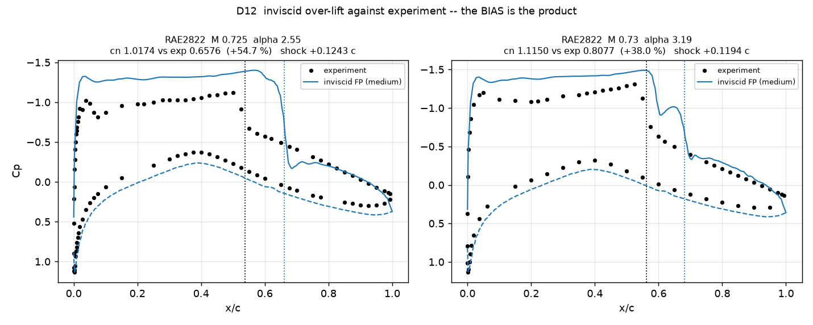

*D12_rae2822_experiment_bias/d12_rae2822_bias.png*

## D13_ibl_vs_xfoil

**判据读的 CSV**（平时跑就是对着它断言）：
- [`D13_ibl_vs_xfoil/summary.csv`](D13_ibl_vs_xfoil/summary.csv) — 50 行（2 级 × 2 面 × 12 站 + 2 行 cl），列 `level, surface, x_c, dstar_ibl, dstar_xfoil, dstar_ratio, cf_ibl, cf_xfoil, asym_ibl, asym_xfoil`

★★ **XFOIL 6.99 是本项目对边界层量的指定参照**（外部代码、非本仓依赖、不由被检验的求解器派生）。
工况与参考**逐字一致**：NACA0012、M 0.5 / Re 3.0e6 / α 2° / x_tr 0.05 双面。
★ 只用 **xtr005**：另一份 xtr030 的上表面 e^N 自然转捩在 0.2668、**早于** 0.30 的 trip，而我们无 e^N ⇒ 不可比。

★★★ **判据形状：(a)(b) 设门 · (c)(d)(e) 锁成 RECORDED**（使用者裁决 2026-08-28）。
后三条是**已定位但未解决**的模型问题 —— 按本项目的规矩记录并锁住结构，而不是给容差蒙过去，
否则将来有人修好了也不会有人知道。

**图上四板，三条现象一个根因：**
· **右上**：灰带是 (a) 的设门区间（x ≤ 0.30）。**实线（上表面）在带内，虚线（下表面）冲到 1.5–1.74**
—— 这就是 (a) **只门上表面**的理由：两面共用一个带子要放宽到 0.8–1.85，近乎空判据。
带外一路**单调下滑到 0.46–0.70** = **(c)**。
· **左下** c_f：转捩峰形状对得上，但 XFOIL 峰 0.0079 / 我们 0.0055，而**下游我们反而更高**
（0.0027 vs 0.0010）。
· **右下**（最干净的一张）：上/下 δ* 之比，**XFOIL 全程 1.26–1.49**（α=+2° 该有的上厚下薄），
**我们贴着 1.0、前半弦还倒过来** ⇒ **耦合分不开上下表面** = **(e)**。

⇒ 三者都是「**边界层对压力梯度响应太弱**」，即湍流闭合关系的 **H 族**：H 偏小 ⇒ 摩擦偏高 ⇒
边界层更饱满 ⇒ **既长不快（下游漂移），也分不开上下面**。**一个根因，所以锁在一起。**

★ **(d)**：**加密使耦合效应变弱** —— cl 离 XFOIL 从 +2.3 % 走到 +5.6 %（medium 反而更靠近无粘
0.2921），尾缘 δ* 比 0.524 → 0.464；而 δ* 分布本身两级几乎重合 ⇒ **不是网格分辨率问题**。

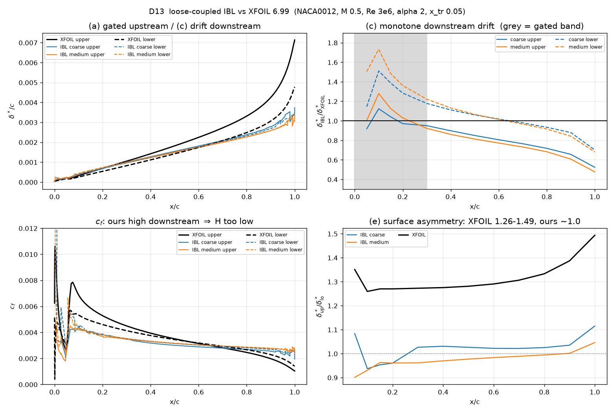

*D13_ibl_vs_xfoil/d13_ibl_vs_xfoil.png*

---

## D05 — pyFP3D 无粘 vs CFL3D Euler，NACA0012

**七条腿里五条设门**（含 **M1 靶子条件 M0.80/α1.25 本身**，Δcl −1.98 %），
两条只记录。设门/记录的划分依据是**分歧的大小**，不是收敛旗标 —— 见下。

| 工况（medium, 16 线程） | Δcl | 判定 |
|---|---|---|
| M0.50/α2.0 | **+0.04 %** | 设门 |
| M0.72/α0 · M0.75/α0 | \|cl\| ≤ 0.0013（**绝对**带）| 设门 |
| **M0.80/α1.25（M1 靶子）** | **−1.98 %** | 设门 |
| M0.778/α2.03 | +43.9 % | 记录 |
| M0.803/α−0.10 | 绝对 0.0135（"−47 %"分母近零）| 记录 |

★★★ **收敛旗标不能设门**：M0.80 在 8/12 线程 80 步封顶、16 线程收敛到
|R| 2.9e-13，cl 只差 0.36 %；M0.803 反过来（8 线程收敛、16 线程不收敛，
cl 五位相同）。**旗标在两个方向上随线程数翻转而答案不动** ⇒ 证据 CSV 带
`n_threads`，门只断言旗标可读。

★★ **M0.75 的激波位置对这份参考不可分辨**：差 0.0047 vs 参考自身 L2→L3 差
0.018（且非单调）= **0.26×**。与 D06 的 35× 正好相反 —— **参照物的分辨率是
逐例的性质**。

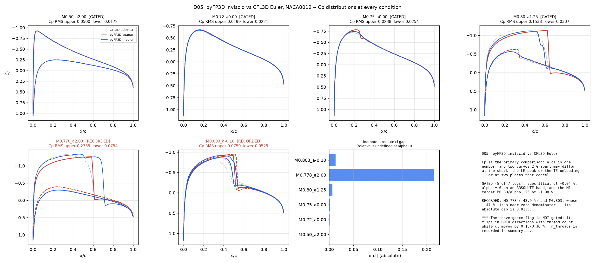

*D05_euler_naca0012/d05_vs_cfl3d_euler.png*

---

## D06 — pyFP3D 无粘 vs CFL3D Euler，RAE2822

两条腿**都设门**（@16 线程均收敛）：M0.725/α2.55 **+3.53 %**、
M0.730/α3.19 **+0.27 %**。

★★★ 这道门里曾有一条 `assert not converged` —— 把一个**环境依赖结果里坏的
那一侧**焊进门里（M0.730 在 4/6 线程不收敛、8/12/16 线程收敛，cl 只差 0.15 %）。
**是那条断言自己红了**才暴露问题，不是复核。它现在被一条解释它为何消失的
测试取代。

★ 与 D05 相反：这份参考的激波不确定度是 **0.00088**，同样的比较**可分辨**（35×）。
★ 方向在两个翼型上相反（NACA 上游 / RAE 下游）⇒ **没有可登记的符号**。

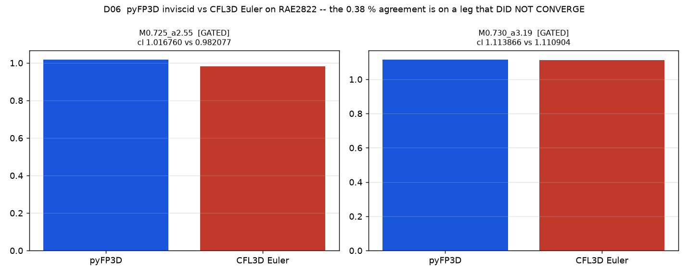

*D06_euler_rae2822/d06_vs_cfl3d_euler.png*
