# Phase demo report — evidence for completed phases

**Scope.** One self-contained demo case per completed roadmap phase (Track P:
P0, P1-partial, P2, P3, P4; Track M: M0, M1), designed as *evidence that the phase's
functionality works, is numerically stable, and physically sensible* — not
merely that tests pass. Each demo is a standalone script with built-in
acceptance checks against the roadmap gate criteria; its figures and CSVs are
committed under `cases/demo/<phase>/results/` so this report's numbers and
images always correspond to a reproducible run.

**Reproduce.** `python cases/demo/<phase>/run_demo.py` (headless, matplotlib
Agg). Exit code 0 = all checks pass; `results/checks.csv` holds the measured
value, criterion, and PASS/FAIL/XFAIL status per check. Status of this report:
updated 2026-07-07 (P4 re-closed same day, see §P4 addenda) from fresh runs;
full pytest suite 136 passed + 2 skipped + 2 xfailed (~5 min; the always-on
coarse transonic smoke is ~170 s of it).

**Honesty rule.** P1 is *not* fully closed: gate G1.6 (sphere Cp < 2%) is
open, held as a strict xfail, and shown here as an XFAIL with its root cause —
the demos document the negative results (G1.3/G1.4 oracles, DP1) as evidence,
not as gaps to hide. P4 was briefly re-opened the same day it was first
declared closed (its medium-mesh gate had never actually been run) — the
divergence, root cause, and fix are all documented in §P4's addenda rather
than silently corrected away.

| Phase | Demo | Checks | Verdict |
|---|---|---|---|
| P0 mesh infrastructure | `cases/demo/p0_infrastructure/` | 4 PASS | closed, reproduced |
| P1 Laplace solver | `cases/demo/p1_laplace/` | 9 PASS + 1 XFAIL (G1.6) | closed gates reproduced; G1.6 open by design |
| P2 wake cut + Kutta | `cases/demo/p2_kutta_lifting/` | 11 PASS | closed, reproduced |
| M0 quasi-2D meshing | `cases/demo/m0_meshgen/` | 6 PASS | closed, reproduced |
| P3 subsonic compressible | `cases/demo/p3_subsonic/` | 14 PASS | closed, reproduced |
| P4 transonic artificial density | `cases/demo/p4_transonic/` | 10 PASS | closed, reproduced (re-closed 2026-07-07 — see Addendum 3) |
| M1 swept-wing meshing (ONERA M6) | `cases/demo/m1_wing_mesh/` | 13 PASS | closed, reproduced |
| P5 3D validation (ONERA M6) | `cases/demo/p5_onera_m6/` | 16 PASS | closed 2026-07-08 (V6 < 1% deferred to P9) |
| P6 surface-pressure recovery | `cases/demo/p6_surface_recovery/` | 5 PASS | closed 2026-07-08 (sawtooth = recovery artifact) |

> Track-P renumber (2026-07-08): P6 = surface recovery (this); P7 = differentiable
> flux (Newton prereq); P8 = fully-coupled Newton; P9 = curved wall elements;
> P10 = backlog. See roadmap.md.

---

## P0 — mesh infrastructure (G0.1–G0.4, closed)

**Purpose.** Establish that the geometric kernels every later phase builds on
are *exact*, so any later error is attributable to the PDE discretization,
never to geometry, I/O, or parallel-assembly bookkeeping.

**Case setup.** Analytic meshes (5-tet unit cube, 8-tet octahedron, Kuhn
cubes, scaled cube) plus the committed gmsh families.

**Key figures.**

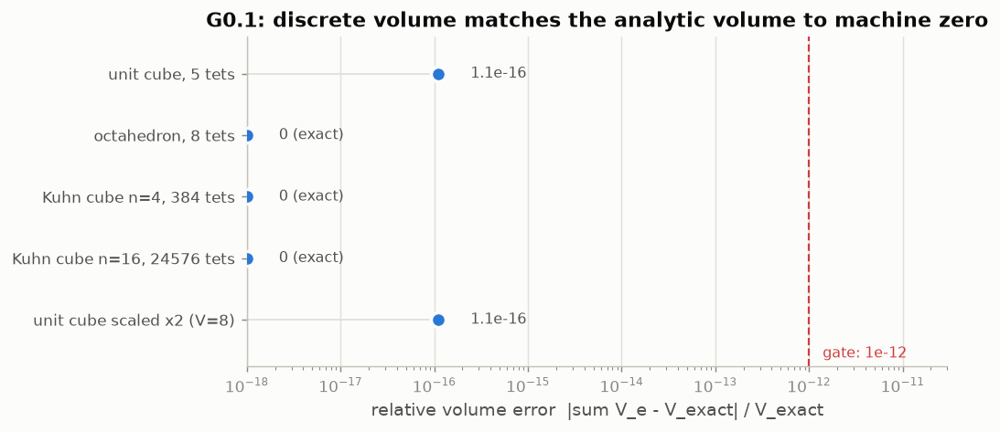
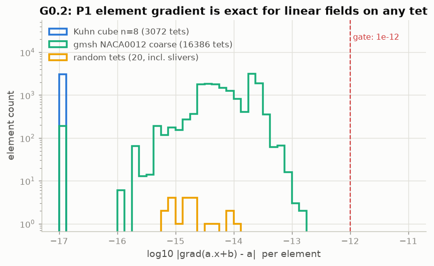
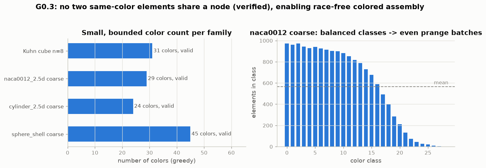
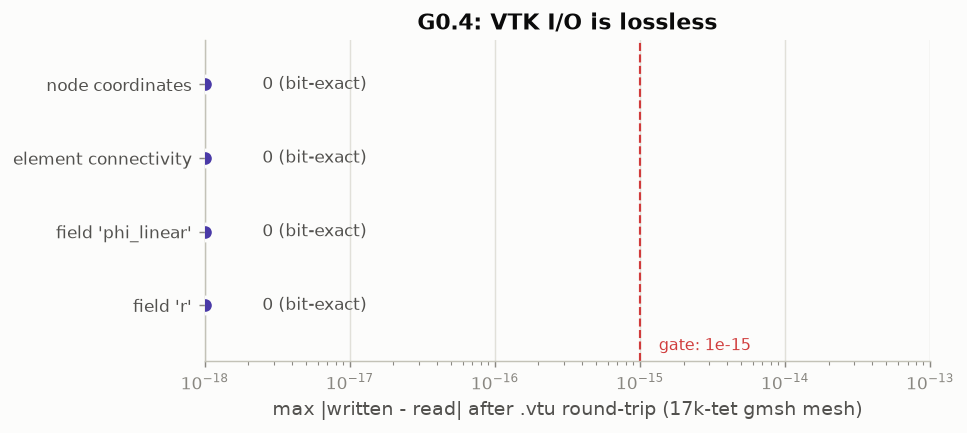

**Measured results.**

| Gate | Check | Measured | Criterion |
|---|---|---|---|
| G0.1 | max relative volume error, 5 analytic cases | 1.1e-16 | < 1e-12 |
| G0.2 | max linear-field gradient error (incl. random sliver tets) | 1.5e-13 | < 1e-12 |
| G0.3 | greedy coloring valid on 4 mesh families (24–45 colors) | all valid | validate_coloring |
| G0.4 | max write→read difference, 17k-tet gmsh mesh + fields | 0 (bit-exact) | < 1e-15 |

**Conclusion & analysis.** The P1-tet metric pipeline (volumes, Jacobians,
basis gradients) is exact to machine precision even on deliberately bad
(random, slivered) tets, the element coloring that licenses race-free
`prange` assembly is verified valid on every committed mesh family with
balanced class sizes, and VTK I/O is lossless. This is the foundation claim
of P0: downstream accuracy discussions can exclude geometry/infrastructure
as an error source.

---

## P1 — Laplace solver (G1.1, G1.2 closed; G1.3/G1.4 negative oracles; G1.6 OPEN)

**Purpose.** Show the three closed claims (consistency, order of accuracy,
solver scalability), show the flow physics is right, and document the open
G1.6 gap *with its evidence trail* so nobody re-litigates dead ends.

**Case setup.** MMS on structured cubes (φ = sin πx sin πy sin πz);
incompressible flow past the unit sphere on the committed `sphere_shell`
gmsh meshes (analytic φ and Cp = 1 − (9/4)sin²θ available in closed form).

**Key figures.**

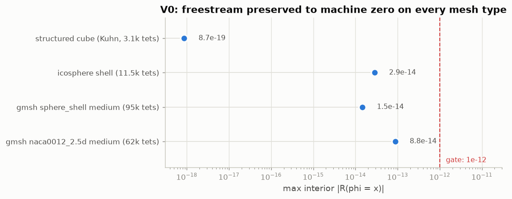
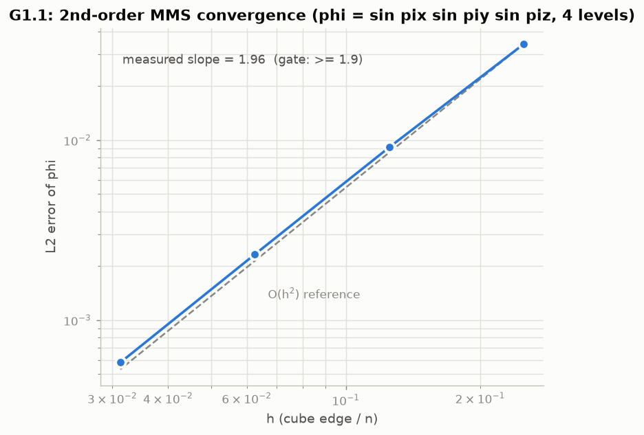
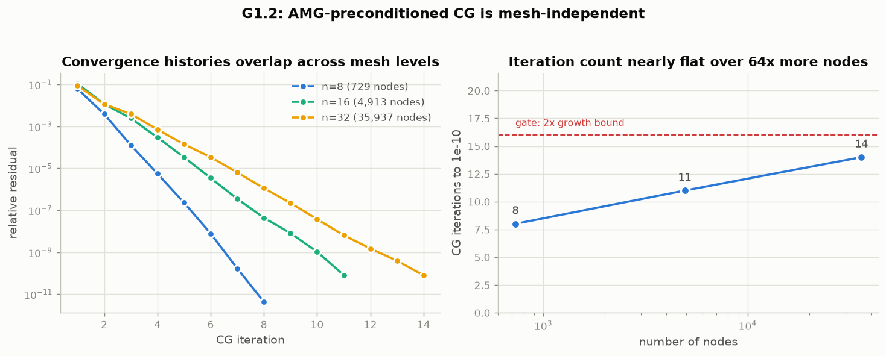
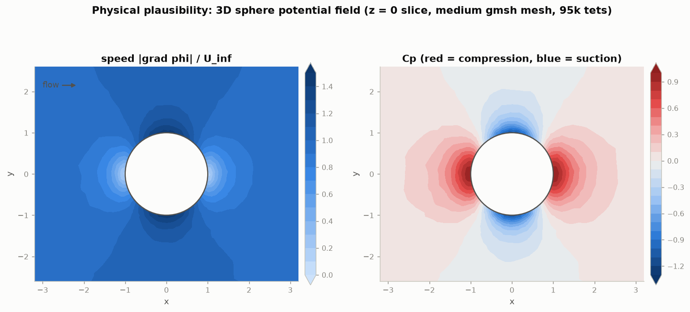
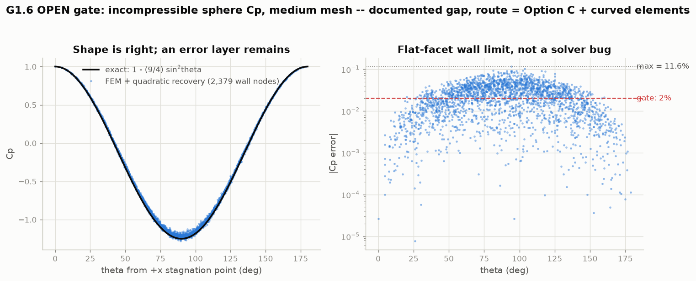
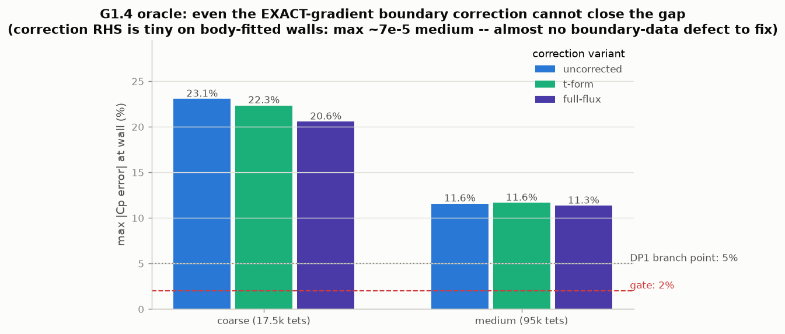

**Measured results.**

| Gate | Check | Measured | Criterion | Status |
|---|---|---|---|---|
| V0 | max interior residual, φ = x, 4 mesh types (largest: 62k-tet NACA) | 8.8e-14 | < 1e-12 | PASS |
| G1.1 | MMS L2 slope over 4 levels (n = 4…32) | 1.96 | ≥ 1.9 | PASS |
| G1.2 | CG+AMG iterations 8 → 11 → 14 over 64× nodes (growth) | 1.75× | < 2× | PASS |
| V2-sanity | sphere solve residual (medium, 95k tets) | 5.7e-10 | < 1e-8 | PASS |
| V2-sanity | wall speed at stagnation poles / equator (exact 0 / 1.5) | 0.20 / 1.45 | sane | PASS |
| **G1.6** | **max wall Cp error, medium sphere** | **11.6%** | **< 2%** | **XFAIL (open)** |
| G1.4 | Option A t-form correction RHS magnitude (medium) | 6.8e-5 | near-zero data defect | PASS (negative result) |
| G1.4 | best exact-gradient correction moves max Cp err by | 0.23 pp | ineffective | PASS (negative result) |
| DP1 | best oracle-corrected max Cp err | 11.3% | > 5% branch confirmed | PASS |

**Conclusion & analysis.** The solver is *consistent* (freestream to machine
zero on every mesh type, including quasi-2D symmetry rows), *second-order
accurate* (MMS slope 1.96), and *scalable* (AMG-CG iteration count nearly
flat over a 64× node increase — the linear algebra will not be the bottleneck
at the 1–3 M-node target). The sphere flow field is physically correct:
stagnation at the poles, suction band at the equator (measured wall speed
1.45 vs exact 1.5), fore-aft symmetry.

The G1.6 gap (11.6% max wall Cp vs 2% gate) is *root-caused, not mysterious*:
the natural BC is satisfied on flat polyhedral facets instead of the true
curved sphere (variational crime). The oracle experiment reproduces the
recorded ceiling exactly (uncorrected 0.1156 → t-form 0.1164 / full-flux
0.1133): even feeding the *exact analytic gradient* into a boundary-data
correction moves the error by only 0.23 percentage points, because on
body-fitted meshes there is almost no boundary-data defect to fix (t-form
RHS max ~7e-5 on the sphere; exactly machine zero, ~1e-17, on the G1.3
cylinder). Hence DP1's "> 5%" branch: boundary-data corrections (Option A),
h-refinement, recovery tweaks, and Nitsche are ruled out with evidence; the
sanctioned route is the Option C gate re-spec plus separately-scoped
curved/isoparametric wall elements.

---

## P2 — wake cut, circulation, Kutta (G2.1–G2.5, closed)

**Purpose.** Show that lift is produced by machinery that is exact where it
must be exact (the cut), convergent where it iterates (the Kutta loop), and
physically consistent where it can be cross-checked (three independent lift
routes).

**Case setup.** NACA0012 at α = 4°, incompressible, on the M0 quasi-2D
meshes (16k / 62k tets), wake cut + master–slave elimination + secant Kutta
loop; reference = Hess–Smith panel solution
(`cases/reference_data/naca0012_incompressible/`, cl(4°) = 0.482556).

**Key figures.**

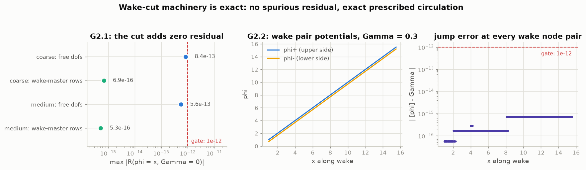
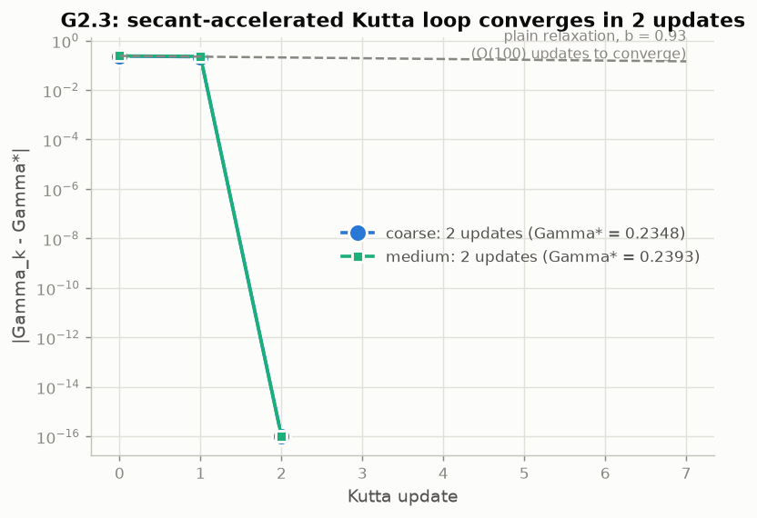
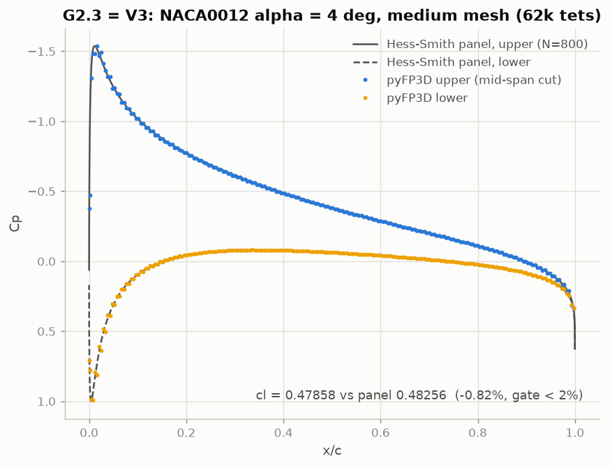
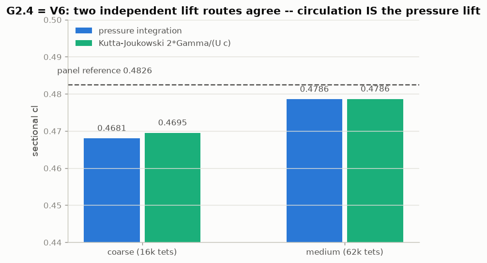
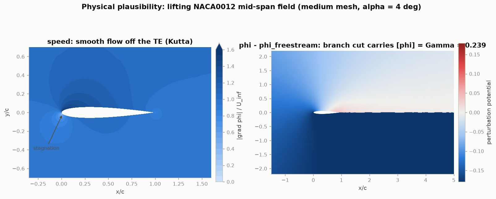
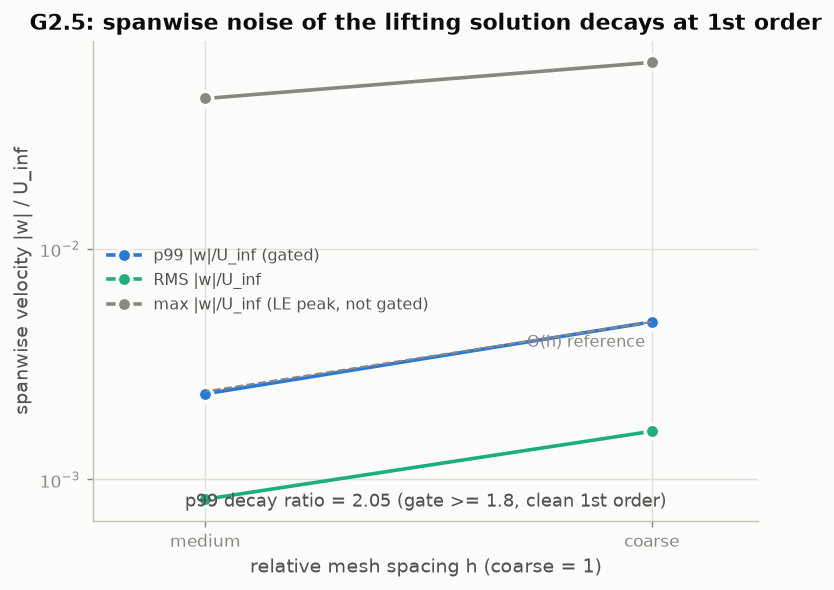

**Measured results.**

| Gate | Check | Measured | Criterion |
|---|---|---|---|
| G2.1 | max free-dof residual, φ = x on cut mesh (coarse/medium) | 8.4e-13 / 5.6e-13 | < 1e-12 |
| G2.1 | max wake-master row residual | 6.9e-16 / 5.3e-16 | < 1e-13 |
| G2.2 | max \|[φ] − Γ\| for prescribed Γ = 0.3, every wake pair | 7.2e-16 | < 1e-12 |
| G2.3 | Kutta updates to convergence (secant) | 2 | < 20 |
| G2.3 | cl = 0.47858 vs panel 0.48256 (medium; coarse −3.0%) | −0.82% | \|err\| < 2% |
| G2.4 | cl from Γ (0.478646) vs cl from pressure (0.478576) | 0.015% | < 1% |
| — | max speed one cell off the TE (no vortex-like suction spike) | 0.96 U∞ | Kutta physically enforced |
| G2.5a | spanwise gradient of interpolated φ = x on cut mesh | 8.9e-15 | < 1e-12 |
| G2.5b | p99 \|w\|/U∞ 4.82e-3 → 2.35e-3 (RMS 1.62e-3 → 8.2e-4) | ratio 2.05 | ≥ 1.8 (1st order) |

**Conclusion & analysis.** The wake-cut machinery adds nothing spurious: with
Γ = 0 the cut mesh preserves freestream to the same machine zero as an uncut
mesh, and a prescribed jump is reproduced to 1e-16 at every wake node pair.
The secant-accelerated Kutta loop converges in 2 updates — essential, since
the measured relaxation-map slope b ≈ 0.93 means plain under-relaxation would
need O(100) outer solves. Physically, lift is over-determined and consistent:
surface-pressure integration, Kutta–Joukowski from the circulation the loop
found, and the independent panel reference agree (Γ-vs-pressure 0.015%,
vs panel −0.82% on the medium mesh, converging from −3.0% on coarse) — the
circulation is not a tuning knob, it *is* the lift the pressure field
carries. The mid-span field shows smooth flow off the trailing edge and the
branch cut carrying the constant jump Γ = 0.239 in the perturbation
potential. Quasi-2D consistency holds at the level the discretization
permits: the 3-tet prism split makes exact spanwise invariance of a *solved*
field impossible (the roadmap's re-specced G2.5b), and the demo reproduces
the honest criterion — field-wide spanwise noise decays at clean first order
(ratio 2.05 at h-ratio 2), with the un-gated single-element max confined to
the leading-edge gradient peak, not the wake. This also documents why **TE
nodes are duplicated**: a single-valued TE would taper [φ] to zero across
the first wake cell — a point vortex parked at the TE whose spurious suction
~Γ²/h *diverges* under refinement (roadmap P2 assert block).

---

## P3 — subsonic compressible (G3.1–G3.3, closed)

**Purpose.** Show that the density machinery (isentropic ρ(q²) in a nested
Picard outer loop) adds *compressibility and nothing else*: it reproduces the
classical corrections where they apply, degenerates bit-exactly to the
validated Laplace solvers at M∞ → 0, and its assembly rewrite (the retired P1
tech debt) is a pure performance change, not a numerics change.

**Case setup.** (a) Sphere at M∞ = 0.3 (medium shell, 95k tets), freestream
Dirichlet, compressible vs incompressible on the *same mesh with the same
quadratic surface recovery* — the comparison G3.1 prescribes, which cancels
the known G1.6 flat-facet wall bias. (b) NACA0012 at M∞ = 0.5, α = 2° on the
M0 quasi-2D meshes, nested Picard (outer density update, inner secant Kutta
at frozen ρ), PG-scaled vortex far field; reference =
`cases/reference_data/naca0012_m05/` (the P2-verified panel solution under
Prandtl–Glauert and Kármán–Tsien corrections). (c) M∞ = 0 bit-identity
against `solve_laplace_lifting`.

**Key figures.**

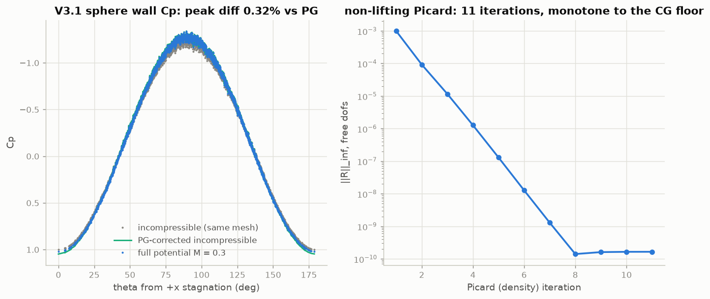
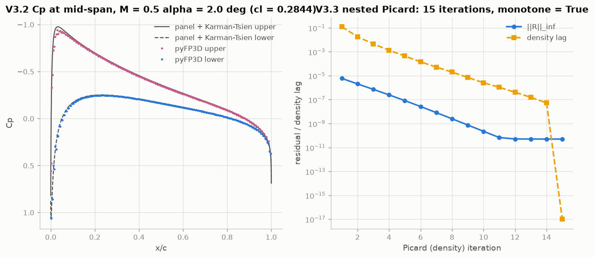
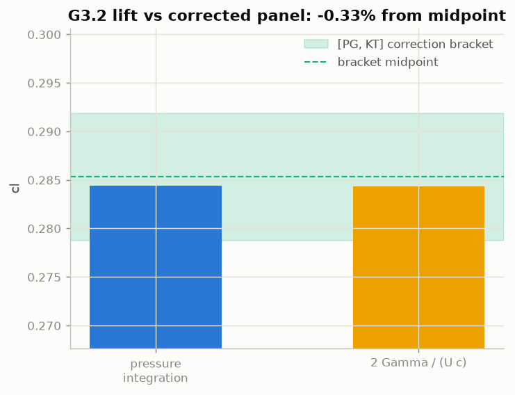

**Measured results.**

| Gate | Check | Measured | Criterion |
|---|---|---|---|
| P3-debt | colored fast path vs P1 serial reference kernels | 5.7e-16 rel | < 1e-13 |
| P3-debt | reassembly determinism | bitwise equal | bitwise |
| P3-debt | hot reassembly speedup (medium NACA, warm JIT) | ~160× | > 2× |
| G3.1 | sphere Cp peak −1.33591 vs PG-corrected −1.34020 | 0.32% | < 2% |
| G3.1 | non-lifting Picard (density lag < 1e-10) | 11 iters, monotone | converges |
| G3.2 | cl = 0.28437 vs [PG 0.27877, KT 0.29186] | inside bracket | PG ≤ cl ≤ KT |
| G3.2 | cl vs PG/KT midpoint 0.28532 | −0.33% | < 2% |
| G3.2 | density (outer) iterations | 15 | < 30 |
| G3.2 | residual history 5.9e-6 → 5.0e-11 | strictly monotone | monotone |
| G3.2 | max local Mach | 0.726 | < 1 (ν ≡ 0 regime) |
| G3.3 | A(ρ(M=0)), Kutta φ and Γ vs P2 driver | bitwise equal | bitwise |
| G3.3 | P1/P2 gates with ρ machinery in the loop | 117 passed + 2 xfailed | all green |

**Conclusion & analysis.** The compressibility machinery lands where the
classical corrections say it must: the sphere's suction-peak amplification
matches Prandtl–Glauert to 0.32% once the mesh's own (known, G1.6) wall bias
is cancelled by same-mesh comparison, and the airfoil cl falls inside the
[PG, KT] correction bracket, −0.33% from its midpoint — with the mesh-family
trend pointing toward the KT side in the continuum limit, as expected for a
12%-thick section. Convergence behaves like the theory: the density lag
contracts geometrically (rate ≈ 0.3) and the residual decays strictly
monotonically to the linear-solver floor. Two negative results are recorded
as design constraints: interleaving one Γ update per density iteration (the
literal design.md §8 pseudocode) injects 10× residual spikes down the whole
history — nesting the P2 secant Kutta loop at frozen ρ (where the Kutta map
is exactly affine) restores monotonicity; and a loose *relative* inner CG
tolerance combined with warm starts false-converges (CG exits at x0 without
computing the density correction), so the shipped inexact option is a
forcing term `atol = η‖b − A x₀‖` (η = 0.05 ≈ 2× faster; default η = 0).
The M∞ → 0 limit is bit-exact, not approximately-equal: ρ ≡ 1.0 bitwise from
the density law, β = 1 reduces the PG vortex bit-exactly, the P1/P2 drivers
share the rewritten assembly, and pyamg's unseeded spectral-radius RNG — the
one source of run-to-run scatter, measured at 2e-11 between *identical*
solves — is now pinned in `solve/linear.py::build_amg_preconditioner`.

---

## P4 — transonic artificial density (closed 2026-07-07: G4.1/G4.2/G4.3 all green)

**Purpose.** Show that the artificial-density upwinding produces sharp,
monotone, correctly-placed shocks; that it is an *exact* no-op below
critical Mach; and record the scheme-hardening evidence trail that P4's
"main risk" phase actually consumed (four instability mechanisms found
and fixed with measurements).

**Case setup.** NACA0012 quasi-2D family, M∞ = 0.80, α = 1.25° — the
canonical transonic benchmark (strong upper shock, weak lower shock).
Pipeline: Mach continuation (0.70 → 0.75 → 0.80), each supercritical
level closing the Kutta condition by an outer per-station secant around
frozen-Γ pseudo-time density solves. Reference:
`cases/reference_data/naca0012_m080/` (Euler anchor ~0.60c/0.35c +
documented conservative-FP aft-shift band; provenance in its README —
an open digitized FP table for this case was not retrievable, and the
README says so rather than inventing one).

**Key figures.**

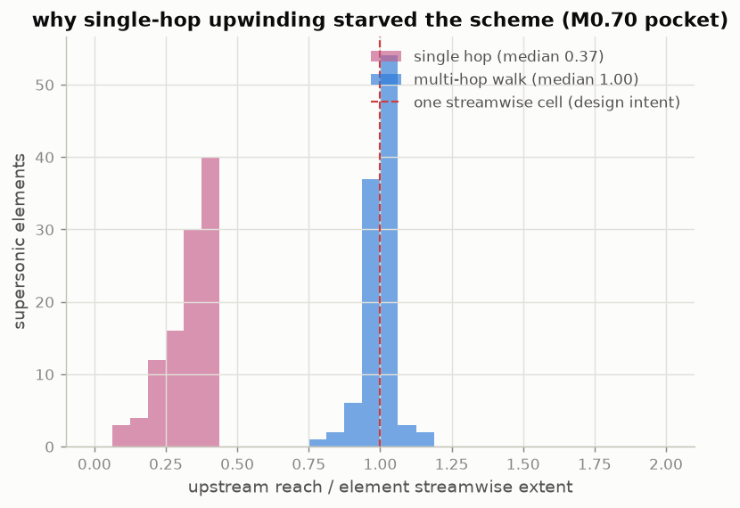
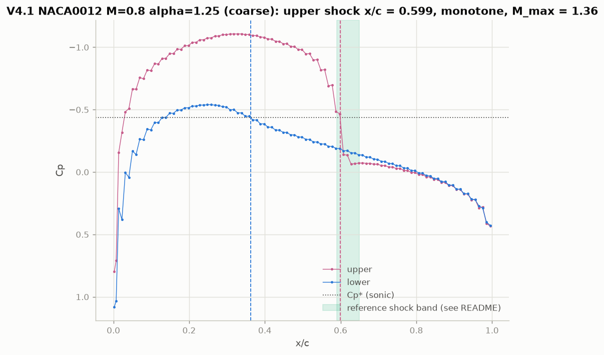

**Measured results (coarse evidence run, re-measured 2026-07-07 under the
`damping_theta` fix — see Addendum 3; the committed coarse/medium and
G4.3-sweep figures + CSVs live in `cases/demo/p4_transonic/results/`,
regenerated by `run_demo.py` heavy mode — see the supplementary analysis
subsection; the G4.1 medium run now PASSES).**

| Gate | Check | Measured | Criterion |
|---|---|---|---|
| G4.2 | ν at M∞ = 0.5 with machinery active | max ν = 0.0 exactly | ν ≡ 0 |
| G4.2 | φ/Γ vs the P3 code path (upwind_c = 0) | bitwise identical | bit-identical |
| scheme | single-hop upstream reach (M0.70 pocket) | median 0.37 extents | documented root cause |
| scheme | multi-hop walk reach | median 1.00 extents | ~1 streamwise cell |
| G4.1 coarse | upper shock x/c | 0.604 | 0.62 ± 0.03 (ref band) |
| G4.1 coarse | shock monotone / expansion shock | monotone, none | required |
| G4.1 coarse | shock sharpness | 1 deduped station (2–3 raw cells) | 2–3 cells |
| G4.1 coarse | lower weak shock x/c | 0.358 | ~0.35 (reported) |
| G4.1 coarse | M_max | 1.373 | physical, no limited cells |
| G4.1 coarse | Γ closure | secant \|F\| = 1.50e-4 in 9 evals | < 2e-4 |
| G4.1 medium | upper shock x/c | 0.633 | 0.62 ± 0.03 (ref band) |
| G4.1 medium | cl_pressure / cl_KJ | 0.349 / 0.354 (sign-consistent) | physical, consistent |
| G4.1 medium | M_max | 1.366 | physical, no limited cells |
| G4.1 medium | Γ closure | secant \|F\| = 1.23e-4, 16m39s wall | < 2e-4 (was: diverged, 2h43m) |

**Conclusion & analysis.** The shipped scheme is the design.md §3
artificial density plus four evidence-forced hardenings, each of which
was found by a measured failure: (1) a **multi-hop upstream walk** —
on the prism-split meshes a single face-neighbor hop reaches only ~1/3
of an element's streamwise extent, putting the effective ν below the
(M²−1)/M² stability bound for M ≳ 1.2 (measured blow-up at M0.75 for
every ω ∈ 0.3–0.9, C ∈ 1.5–2.0, while marginally-stable M0.70 crawled);
(2) a **speed limiter** q² ≤ q²(M=3) — without it, transients run to the
vacuum limit and the positivity guards then stabilize *spurious* dead-
cell solutions (measured: off-body supersonic blobs acting as fake
blockage); (3) a **shock-point operator** ν = max(ν_e, ν_upstream) — the
first subsonic cell downstream of the shock is otherwise purely central
on the field's largest jump; and (4) a **pseudo-transient term**
diag(m/Δτ) (design.md §8 acceleration 4 pulled forward) — the exact-
solve Picard limit-cycles at M0.80 shock strength for every relaxation
tried (φ, ρ̃, or both), while Δτ ≈ 1e-3–3e-3 bounds the update and
yields the physical field (M_max 1.36–1.46); Δτ-ramping (SER) re-ignites
the instability, so Δτ stays fixed and the sharp-shock residual settles
into a slowly-decaying engineering tail (cl drift < 1e-3 per hundreds of
iterations) instead of 1e-10 — the documented P4 convergence semantics,
with Newton (P7) as the designed cure. Γ closure had to move OUTSIDE the
density loop entirely: nested exact-Kutta runs away (Γ 0.115 → 4.99) and
damped interleaving limit-cycles, because the transonic target map's
slope crosses 1 where relaxed fixed-point updates provably diverge — the
outer secant on density-converged evaluations converges in ~4–9 warm-
started evaluations. The coarse result lands where the references say it
should: upper shock 0.604 (Euler anchor 0.60–0.63 band), weak lower
shock 0.358 (~0.35), monotone with no expansion shock, and the
subcritical bit-identity G4.2 guarantees P3 behavior is untouched. (These
are the post-fix numbers, re-measured under the `damping_theta` default —
see Addendum 3; they are consistent with the original 0.599/0.362 to
within the run-to-run Γ-secant noise documented in Addendum 2.)

**Addendum (2026-07-07, audit): the G4.1 MEDIUM gate FAILED on its first
actual run — P4 is NOT closed.** *[Superseded the same day by Addendum 3
below, which lands the fix and re-closes P4; retained verbatim as the
honest failure trail, not as current status.]* The phase had been declared closed with
the medium result left as an unfilled placeholder; running the gate
(`PYFP3D_TRANSONIC_GATES=1`, 2h43m wall) produced a diverged solve:
M_max 30.1 (vs the physical 1.36 on coarse), 423 q²-limited + 271
density-floored cells, Kutta |F| 2.5e-3 vs tol 2e-4, a spurious "shock"
at x/c 0.802, and sign-inconsistent cl (pressure −0.171 vs KJ +0.212).
Both supercritical continuation levels exhausted their 12 Γ evaluations
without secant convergence (n_picard_total 19331; each frozen-Γ eval
burns its full 800-iteration budget by design — the tol_rho early-exit
is unreachable at transonic). Evidence:
`artifacts/G4.1/summary_medium.csv`, `medium_gate_pytest.log`,
`v4_1_cp_shock_medium.png`. Interpretation: the coarse-calibrated
`TRANSONIC_DEFAULTS` (fixed Δτ = 2e-3, dm = 0.05) do not transfer to the
medium mesh — the pseudo-transient damping diag(m_lumped/Δτ) scales as
h³ while the operator stiffness does not, so the stabilizer weakens
under refinement (hypothesis, not yet verified). Candidate routes:
mesh-scaled Δτ, finer Mach continuation steps, or P7 Newton. The gate is
re-opened in roadmap.md; the coarse evidence above and G4.2/G4.3 stand.

**Addendum 2 (2026-07-07, diagnosis follow-up — informal ad-hoc scripts,
not a committed gate artifact): root cause verified, one route ruled
out, three working fixes measured.** The pseudo-transient damping ratio
(m_lumped/Δτ)/diag(K) at the shipped Δτ = 2e-3 was measured directly
rather than only inferred from scaling arguments: wall-node median 0.035
on coarse falls to 0.0092 on medium (~4× weaker) — confirming the
addendum-1 hypothesis. A standalone frozen-Γ density driver, built to
isolate the density solve from the Γ secant entirely, reproduces the
M0.75 blow-up in 50 iterations (M_max → 47), so the divergence lives in
the pseudo-time-stabilized density iteration itself, not in the outer
Kutta root-find. Rescaling Δτ by h² (5e-4 on medium) restores M0.75
stability (M_max 1.22, zero limited/floored cells) — **but the same
state still diverges stepping to M0.80**: the damping needed also grows
with shock strength, so no single Δτ-vs-mesh-size rescaling suffices on
its own. A finer Mach-continuation sub-step (intermediate M0.775, still
at Δτ = 5e-4) **also diverges at M0.80 — the "finer dm" candidate route
is ruled out**; this is not a per-step transient-overshoot problem.
Three candidates were measured to stabilize the M0.80 step from a
converged M0.75 state (500 iterations each, zero limited/floored cells
throughout): global Δτ = 2e-4 (M_max 1.37); **local damping
θ·diag(A_free)** at θ = 0.2 (M_max 1.37, the recommended fix — mesh- and
shock-strength-independent by construction, unlike the mass-lumped
global form that caused the original failure); upwind_c raised 1.5→2.0
at Δτ = 5e-4 (M_max 1.34, more dissipative, would need a shock-position
re-validation against G4.3). None of the three alone closes the gate as
specced: Kutta mismatch |F| still drifts to 4e-4–9e-4 under a fixed
500–800-iteration budget, mirroring a drift already visible on
coarse — |F| rises monotonically from 2.9e-4 at iteration 100 to 8.9e-4
at iteration 800 of a *single* eval, i.e. the eval's own Kutta target
moves inside the fixed budget rather than converging to it and
stalling. This also explains why coarse itself is slower than the
design.md §8 O(100–300)-iteration expectation: the eval path solves
every inner CG to rtol = 1e-10 (`forcing = 0`, bypassing the
P3-validated η ≈ 0.05 forcing-term acceleration already shipped
elsewhere) and rebuilds the AMG hierarchy every 4 iterations; medium
profiling attributes 64% of eval wall-time to CG (22 CG-iterations per
outer step vs 3 on coarse — itself a symptom of the weak damping's poor
conditioning) and 27% of coarse eval wall-time to AMG rebuilds. No
equation-level bug was found in `picard.py`/`upwind.py`/`wake.py` during
this session; one piece of negative evidence supports that: an
independent from-scratch reimplementation of the frozen-Γ inner loop
diverged immediately until it included the same per-iteration
`h_j = TᵀA(ρ̃)g_j` recompute that `WakeConstraint.update_matrix` already
performs, confirming that recompute is load-bearing rather than
removable overhead. Recommended before the next medium-gate attempt:
switch to local θ·diag(A_free) damping (validate θ on coarse first —
G4.2 bit-identity and the G4.1 coarse shock position must survive),
enable eval-path forcing plus a wider AMG rebuild interval, and add an
adaptive per-eval exit on |F| drift (or re-match tol_gamma to the
measured drift floor) instead of the fixed-iteration budget. Separately
identified P5 blocker: `WakeConstraint.update_matrix`'s per-station
`h_j` loop is one sparse matvec per wake station — inert on the
single-station 2.5D meshes but adds ~166 extra matvecs per density
iteration on the ONERA M6 medium mesh (166 stations, M1 delivery); it
must be batched into one `A @ G` sparse product before P5 solves start.

**Addendum 3 (2026-07-07, same day as Addendum 2: fix landed, medium gate
closed, P4 re-closed).** The recommended fix from Addendum 2 was
implemented as-is and closed the gate on the first attempt, with none of
the secondary mitigations (eval-path forcing, wider AMG rebuild interval,
adaptive |F|-drift exit) needed. `solve/picard.py::solve_subsonic_lifting`
gained `damping_theta`: D = θ·diag(A_free), rebuilt every outer iteration
from that iteration's own (upwinded) operator, mutually exclusive with the
retired global `pseudo_dt` (both given raises `ValueError`).
`solve/continuation.py::TRANSONIC_DEFAULTS` now defaults to
`damping_theta = 0.2` in place of `pseudo_dt = 2e-3`. Calibration order
followed the Addendum 2 recommendation: G4.2 bitwise no-op re-verified
first (both new params default `None`, so any caller that doesn't pass
them — including the G4.2 test — is untouched), then the G4.1 coarse
gate re-measured (shock 0.599 → 0.604, within the Γ-secant noise; the
converged Γ/cl shifted a touch more, 0.170 → 0.182 / cl_p 0.334 → 0.357,
since the two stabilizers reach slightly different points on the same
bounded engineering-convergence tail — the shock position and all gated
criteria are unaffected, and cl is reported-not-gated for G4.1), then a
reduced-budget stability probe on the medium mesh (`max_gamma_evals=4,
n_picard_eval=150`, 77 s wall) to catch a repeat divergence cheaply before
committing to the full budget: it came back stable and, unexpectedly,
needed only 1 Γ eval per supercritical level (vs 12 exhausted before) —
suggesting the Kutta-mismatch drift Addendum 2 flagged as a likely second
blocker was largely a symptom of the poorly-conditioned global damping,
not an independent problem. The full medium gate then passed outright
(committed `cases/demo/p4_transonic/results/g41_summary_medium.csv`),
**16m39s wall** (vs the divergent
attempt's 2h43m) — upper shock x/c 0.633 (band 0.62 ± 0.03), Kutta
|F| = 1.23e-4 < tol 2e-4, M_max 1.366, zero limited/floored cells,
cl_pressure/cl_KJ sign-consistent at 0.349/0.354 (the divergent run had
−0.171/+0.212), n_picard_total 12931 (vs 19331 — fewer Γ evals needed,
not merely faster ones: per-iteration wall time also fell from ~0.51 s to
~0.18 s, consistent with the Addendum 2 profiling that blamed the old
global damping's poor conditioning for elevated CG iteration counts on
medium). The G4.3 ten-case sweep was re-run under the new default and
stays green — all converged, zero limited cells, smooth trends — with one
difference recorded as evidence rather than a regression: the
M0.82/α = 1.25° corner's cl moved 0.389 → 0.458 and its Kutta |F| (1.92e-4)
sits closest to the 2e-4 tolerance of the ten cases; G4.3 gates on
convergence and physicality, not an exact cl, so this does not fail it,
but a future θ-sensitivity study should know this corner is the closest
to the boundary. The separately-identified P5 blocker was fixed in the
same session: `constraints/wake.py::WakeConstraint.update_matrix` now
builds one sparse indicator matrix `G` (one column per station) and
computes all stations' `h_j` vectors as a single `T^T @ (A @ G)` product;
verified bit-identical to the old per-station loop on the real ONERA M6
coarse mesh (83 stations). The full default suite (136 passed + 2 skipped
+ 2 xfailed, ~5 min) and the coarse transonic smoke were both re-run
green after both changes landed. Net effect: P4 is closed, and P5 starts
without either the transonic stability gap or the wake per-station cost
that this diagnosis session identified as its two open risks.

### P4 supplementary analysis — mesh-refinement study (G4.1 coarse ↔ medium), the surface-Cp sawtooth, and the G4.3 sweep

This subsection collects the two heavier `PYFP3D_TRANSONIC_GATES=1`
evidence figures. They are committed under
`cases/demo/p4_transonic/results/` and regenerated by that phase's
`run_demo.py` in heavy mode (`PYFP3D_TRANSONIC_GATES=1 python
cases/demo/p4_transonic/run_demo.py`, ~40 min for the medium solve + the
10-case sweep); the always-on default demo run produces only the coarse
figure. They answer a question the coarse Cp figure above raises on
sight: **why is the transonic surface Cp visibly serrated (a ~2-cell
sawtooth along the supersonic run) when the P1/P2/P3 curves on the *same*
mesh, drawn by the *same* extractor, are smooth?**

> **⚠️ ATTRIBUTION CORRECTED (P6 N1, 2026-07-08).** The analysis below
> attributes the sawtooth to the artificial-density flux (the integer
> upstream-walk selection). **That attribution is wrong.** The sawtooth is a
> per-triangle wall-gradient **recovery** artifact on the sliver wall
> triangulation, not the flux. Decisive evidence (design.md §3.1/§9.1;
> `cases/demo/p6_surface_recovery/`): nodal/edge-neighbour smoothing of the *same*
> walk solution's wall gradient drops the sawtooth metric ~330× (0.0758 →
> 0.00023), while a *smoother artificial-density flux* (the P6 streamline
> kernel) does not reduce it at all. G6.1 fixes it in post-processing
> (`smooth_wall_tangential_gradients`, `smooth_passes`), not by changing the
> flux. The paragraphs below are kept as the original (superseded) reasoning;
> read them with this correction in mind — in particular the "requires
> changing the spatial operator" conclusion at the end is refuted.

**[SUPERSEDED — see the correction banner above.]** The sawtooth was thought
to be a real feature of the artificial-density flux. The original mechanism
argument, kept for the record:

- `wall_cp_curve` (`post/section_cut.py`) is deliberately triangle-wise:
  each wall triangle crossed by the section plane contributes *one* point
  carrying *that triangle's own* piecewise-constant tangential velocity,
  with **no nodal averaging** (so the sharp-TE crease needs no
  special-casing). P1, P2, and P3 all use this identical function
  (`p3_subsonic/run_demo.py:205`, `p2_kutta_lifting/run_demo.py:233`), and
  their curves are smooth — so the extractor is not the source.
- The difference is entirely in the field being sampled. In the subsonic
  phases the artificial density is off (ν ≡ 0 — the exact G4.2 no-op), so
  φ solves a *symmetric elliptic* density-weighted Laplace problem and its
  per-triangle tangential velocity varies smoothly element to element. In
  the transonic pocket the shipped scheme adds
  ρ̃_e = ρ_e − ν_e (ρ_e − ρ_u(e)) with **ν = max(ν_e, ν_u)**, where the
  upstream element **u(e) is a discrete, integer-valued directional walk**
  through face neighbours (`upwind.py::upstream_elements`). Both u(e) and
  the `max` are *discontinuous* functions of the local velocity direction
  and the local mesh geometry: two adjacent supersonic wall elements
  routinely select geometrically different upstream cells (different ρ),
  so ρ̃ carries a mesh-scale, near-odd-even (≈2h wavelength) perturbation
  riding on top of the smooth density field. That perturbation propagates
  through the density-weighted stiffness into φ and hence into the raw
  per-triangle wall velocity — displayed undamped by the no-averaging
  extractor. It is the unstructured-mesh signature of a scalar
  artificial-viscosity/artificial-density scheme whose dissipation
  operator is only C⁰-rough in its stencil selection.
- **It is confined to the supersonic pocket, exactly where ν > 0.** On the
  coarse upper surface the serration runs from just aft of the LE peak to
  the shock at x/c ≈ 0.60 and then *stops* — the post-shock recompression
  (subsonic, ν ≡ 0) is smooth, and so is the entire lower surface aft of
  its small front pocket. Cp\* (sonic) = −0.435 marks the boundary: the
  jitter lives precisely on the portion of the curve below (more negative
  than) Cp\*. This is the tell that it is the upwind flux, not noise from
  the Γ-secant or the residual tail.

**Mesh-refinement evidence (the sawtooth is O(h) and decays under
refinement).** The medium mesh (61.8k tets, mean edge 0.085) resolves the
same case at ~3.8× the coarse cell count (16.4k tets, mean edge 0.178):

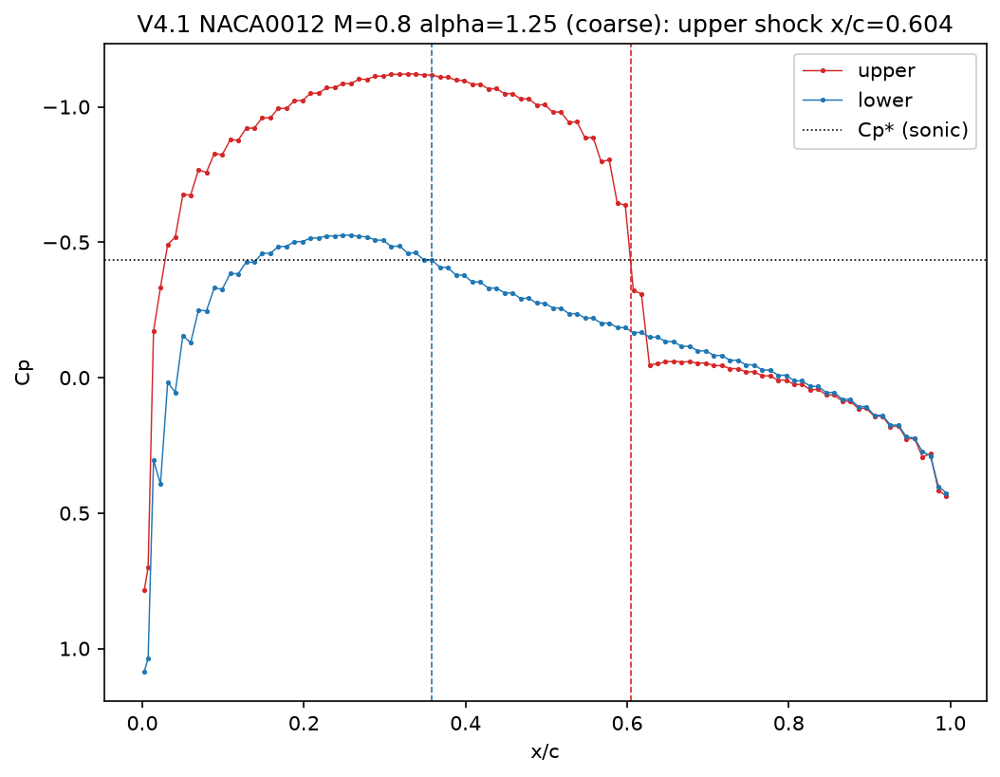
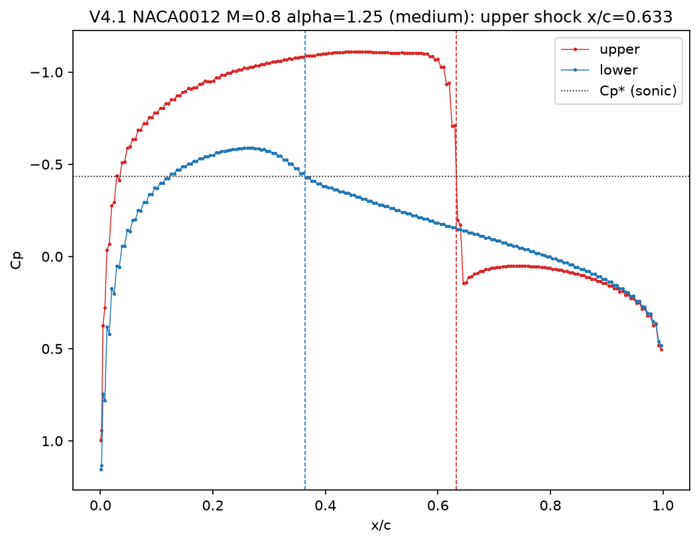

| Quantity | Coarse (16.4k tets) | Medium (61.8k tets) | Reading |
|---|---|---|---|
| Upper shock x/c | 0.604 | 0.633 | both in the 0.62 ± 0.03 band; drifts aft with resolution (correct direction — coarse dissipation smears the shock forward) |
| Shock sharpness | 1 station, sawtooth pocket | 1 station, near-smooth pocket, steeper jump | serration amplitude drops sharply; shock stays crisp |
| M_max | 1.373 | 1.366 | physical, essentially converged |
| Upper supersonic cells | 58 | 121 | ~2× — finer sampling of the same pocket |
| cp_min (upper) | −1.122 | −1.111 | converging |
| Lower weak shock x/c | 0.358 | 0.364 | stable |
| cl_pressure / cl_KJ | 0.357 / 0.364 | 0.349 / 0.354 | sign-consistent, moves < 3% under refinement |
| Kutta \|F\| | 1.50e-4 | 1.23e-4 | both < 2e-4 tol |

The visual and quantitative story agree: refining h roughly halves the
element scale, the serration amplitude falls with it, the shock sharpens
and moves slightly aft to its better-resolved position, and every
integrated quantity (cl, M_max, shock location) moves < 3%. That is the
signature of a **bounded, mesh-convergent discretization artifact**, not
a physical oscillation, an instability, or a convergence failure — the
monotone-shock and no-expansion-shock gates pass on both meshes.

**This is a *spatial-discretization* defect and is essentially orthogonal
to the Newton work (now P7).** It must not be conflated with the
sharp-shock residual tail, which is a *nonlinear/temporal convergence*
problem that P7 Newton is designed to cure (consistent linearization →
residual to ~1e-10 instead of the engineering tail). P7 Newton changes
*how the nonlinear system is solved*, not the discrete flux itself: run
over the *same* rough ρ̃ operator (discrete integer-valued u(e) +
`max(ν_e, ν_u)`), Newton would converge the serration *more* tightly, not
remove it — indeed it could sharpen the sawtooth once the
θ-damping/under-relaxation that partly masks it is gone. (There is a real
coupling in the other direction, though: the same integer-walk + `max`
non-differentiability that causes the sawtooth also blocks an *exact*
Newton Jacobian, which is why the fix is scheduled as P6, ahead of P7.)
Removing the sawtooth requires changing the *spatial* operator — this is
exactly the new **P6 phase** (roadmap.md P6): (a) a
directionally-consistent / smoother upwind-density flux — a continuous
streamwise-projected density bias in place of the discrete face-neighbour
hop selection and the `max` switch; (b) curved / isoparametric wall
elements (separately scoped, design.md §5.1.2); or (c) mesh refinement,
already shown here to be O(h) convergent but explicitly *rejected* as the
accepted fix (it only reduces amplitude, never removes the oscillation,
and is prohibitive in 3D). It is also explicitly *not* a Δτ/θ-damping
problem (Addendum 3) — the damping change left the shock position and the
serration character unchanged.

**G4.3 parameter sweep (10 cases, re-run under the `damping_theta`
default).** Two α-lines (0.0° and 1.25°) across M∞ ∈ {0.74, 0.76, 0.78,
0.80, 0.82}, gating on convergence + physicality (not an exact cl):

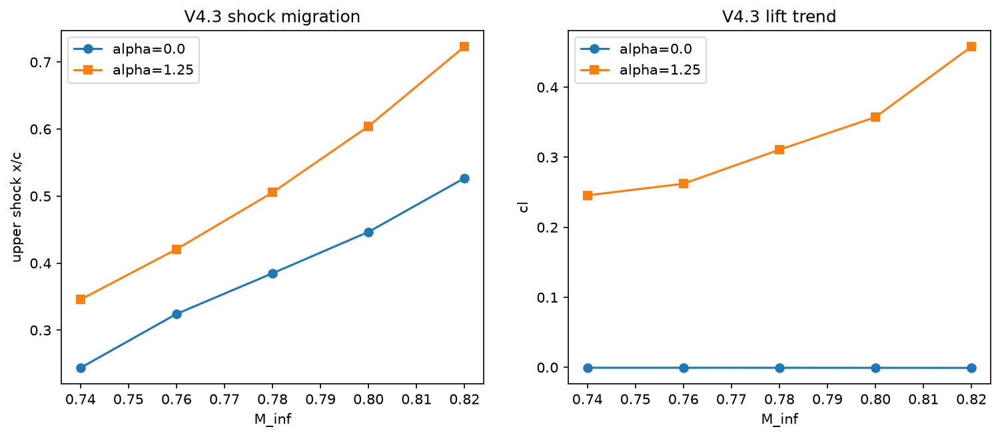

| Trend | Evidence | Reading |
|---|---|---|
| Shock migrates aft with M∞ | upper x/c 0.244 → 0.527 (α = 0°), 0.346 → 0.723 (α = 1.25°) | monotone, physically correct — stronger freestream pushes the shock back |
| Lift builds with M∞ | cl 0.246 → 0.458 (α = 1.25°); ≈ 0 for α = 0° (−6e-4 → −8e-4) | correct: the symmetric α = 0° case carries no lift, the lifting line climbs monotonically |
| All 10 converged | `converged = True`, `n_limited = 0` every row | no limited/floored cells anywhere in the envelope |
| Kutta closure | \|F\| 5.5e-6 → 1.9e-4 | all < 2e-4; the M0.82/α = 1.25° corner (1.9e-4) sits closest to tol |
| M_max stays physical | 1.03 (M0.74/α0) → 1.42 (M0.82/α1.25) | rises smoothly with M∞ and α, never near the limiter cap |

The α = 0° line is the useful control: zero lift to 6e-4 across the whole
range confirms the wake/Kutta machinery injects no spurious circulation
into a symmetric case even as the shock strengthens. The one flagged
datum — the M0.82/α = 1.25° cl of 0.458 (shifted from 0.389 under the old
global damping, and its \|F\| the closest to the 2e-4 boundary) — is
recorded as evidence of a different-but-converged, still-physical state on
the same bounded engineering-convergence tail, since G4.3 gates on
convergence and physicality rather than an exact cl value. A future
θ-sensitivity study should treat that corner as the envelope edge.

---

## M0 — quasi-2D meshing pipeline (closed; acceptance link = G2.5)

**Purpose.** Show the mesh-side evidence for M0: the pipeline (vanilla-Gmsh
planar mesh → single-layer extrusion → globally consistent min-global-index
prism→3-tet split) produces topologically sound, refinable meshes that the
solver actually converges on. M0's formal acceptance was G2.5 — the Track M
↔ Track P link demonstrated in the P2 demo above.

**Case setup.** All seven committed meshes in `cases/meshes/`
(naca0012_2.5d coarse/medium, cylinder_2.5d coarse/medium/fine,
sphere_shell coarse/medium); end-to-end solve on the cylinder family
against the analytic Cp = 1 − 4 sin²θ.

**Key figures.**

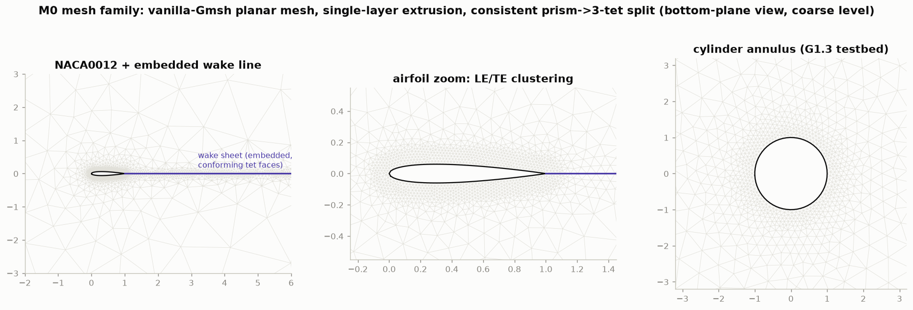
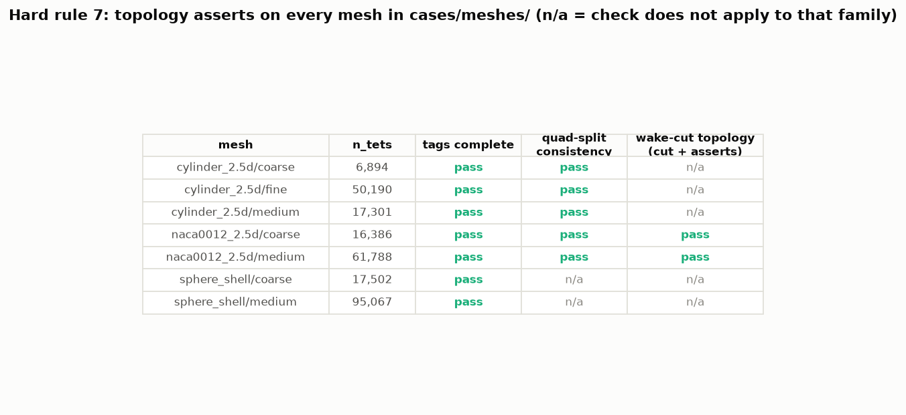
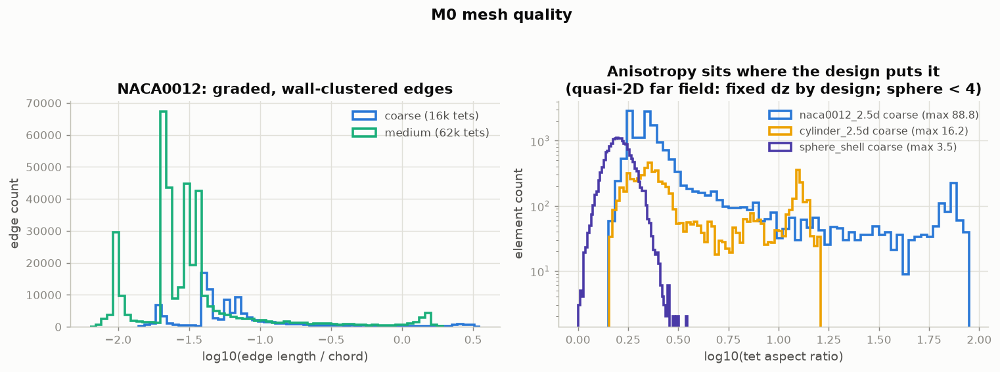
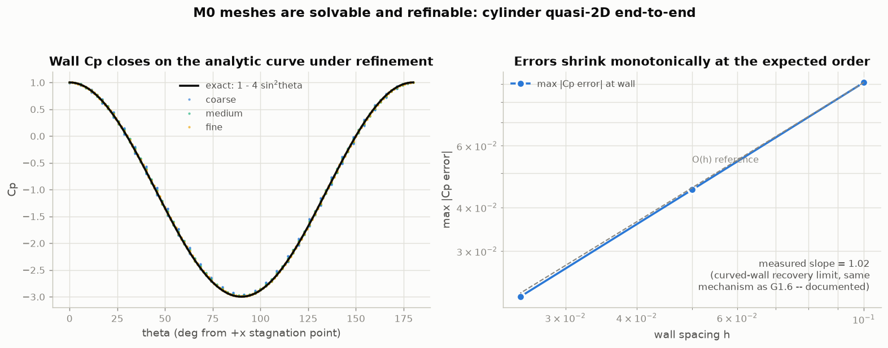

**Measured results.**

| Check | Measured | Criterion |
|---|---|---|
| topology asserts (tags, quad-split consistency, wake cut) on all 7 meshes | all pass | hard rule 7 |
| min tet volume across families | 1.3e-6 > 0 | no degenerate/inverted tets |
| isotropic sphere family max aspect ratio | 3.5 | < 5 (quasi-2D far-field anisotropy is by design) |
| cylinder solve residual, all 3 levels | ≤ 3.1e-11 | < 1e-8 |
| max wall Cp error coarse → medium → fine | 9.1% → 4.5% → 2.2% | monotone, ≥ 25%/level |
| Cp error slope vs h | 1.02 | ~O(h), documented curved-wall limit |

**Conclusion & analysis.** Every committed mesh passes the full topology
assert battery (agent-rules hard rule 7), including the wake-cut asserts on
the NACA family — the wake is a single conforming interior sheet from TE to
far field, and the prism split is globally consistent so no lateral quad is
cracked. Element quality is deliberate rather than accidental: the isotropic
sphere family stays under aspect 3.5, while the quasi-2D families carry
their large aspect ratios exactly where the single-layer design puts them
(far field: in-plane coarsening at fixed dz). The pipeline's meshes are not
just valid but *useful*: the cylinder case solves to 1e-11 residuals at
every level and its wall-Cp error falls monotonically at the expected O(h)
(slope 1.02) — first order because of the same flat-facet curved-wall
recovery limit root-caused at G1.6, i.e. a documented solver-side limit, not
a meshing defect. Combined with G2.3–G2.5 running on these meshes (P2 demo),
M0's deliverable is demonstrated end to end.

---

## M1 — swept/tapered wing meshing, ONERA M6 (closed; consumed by P5)

**Purpose.** Show the mesh-side evidence for M1: a scripted, refinable
ONERA M6 half-wing tet mesh whose chord-plane wake sheet — swept from the
sharp (foilmod zero-thickness) TE, ending exactly at the tip, reaching the
spherical far field at 15 MAC — is ingested by the P2 solver preprocessor
with the topology asserts green. The new mesh-side machinery is
`pyfp3d/meshgen/wing3d.py` (OCC ruled loft + `occ.fragment` +
`mesh.embed`); the new solver-side machinery is wake_cut.py's handling of
a swept TE (per-node stations, off-plane Kutta-probe fallback) and of the
sheet's interior FREE edge at the tip (single-valued nodes ⇒ Γ(tip) = 0
discretely).

**Case setup.** The `cases/meshes/onera_m6` family (coarse 55.5k /
medium 350.7k tets; fine 2.513M validated at generation time). The .msh
files are large and gitignored — regenerate coarse+medium with
`generate_onera_m6.py` (~30 s) before running this demo; the committed
per-level stats CSVs and inspection PNGs are the persistent evidence.
Solver axis convention: chord x, lift y, span z.

**Key figures.**

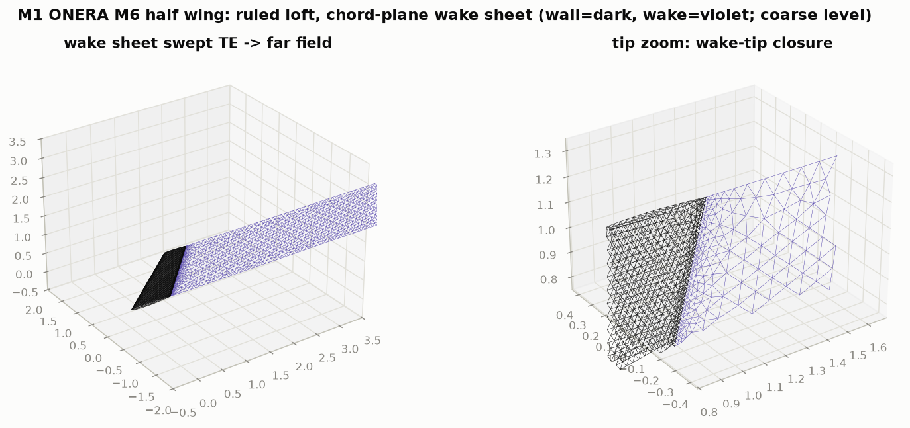
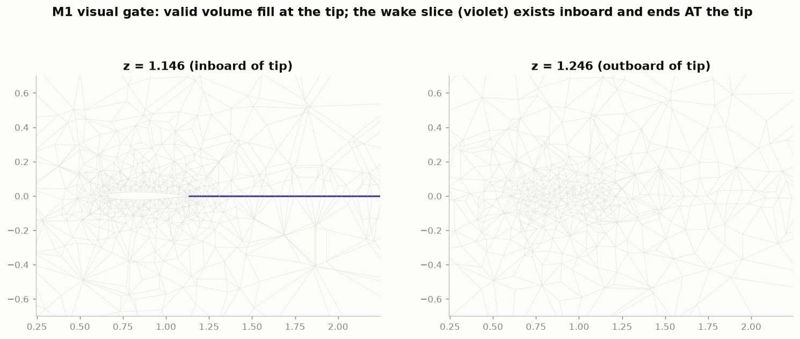
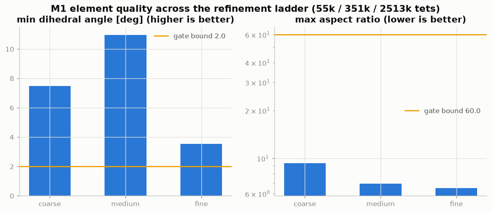

**Measured results.**

| Check | Measured | Criterion |
|---|---|---|
| tags + P2 topology asserts through cut_wake, coarse & medium | pass | M1 gate "same asserts" |
| per-node TE stations on the swept TE | 83 (coarse) / 166 (medium) | == n_TE_nodes |
| tip free-edge nodes single-valued, at z = b | 106 / 208, none duplicated | wake-tip semantics |
| wake-tip closure: tip edge one open chain from the exact tip TE corner | pass (both levels) | no cracks / self-intersections |
| Kutta probe pairs found on the unstructured TE | 83 / 166, y>0 upper, y<0 lower | design.md (4.4) fallback |
| min dihedral coarse/medium/fine | 7.5° / 11.0° / 3.5° | ≥ 2° |
| max aspect ratio coarse/medium/fine | 9.3 / 6.9 / 6.5 | ≤ 60 |
| refinement ladder (one h_wall parameter, 2×) | 55.5k → 350.7k → 2513k tets | monotone ~2³/level |
| freestream residual on the CUT coarse mesh | 4.3e-14 | < 1e-10 (G2.1 analogue) |

**Conclusion & analysis.** The M1 gate items are all measured green: the
solver preprocessor ingests the family unchanged (same read_mesh/cut_wake
call as the 2.5D cases), the quality report is comfortably inside bounds
on all three levels, and the family is one script with one parameter. Two
findings worth recording: (1) for a sheet that ends *inside* the domain,
`occ.fragment` alone does not make the tet mesh conform — it stitches the
shared TE edge and the boundary trims, but `gmsh.model.mesh.embed` must
still be called on the trimmed sheet face; (2) the sheet's tip edge is an
interior free edge whose node stars are NOT split by the sheet, so the
duplication map must exclude them — which is also the physically correct
discrete statement Γ(tip) = 0 (the trailing jump vanishes at the tip).
Both are documented in the wake_cut.py module docstring; the free-edge
path is exactly inert on the quasi-2D meshes (their sheets have no free
edges), which the unchanged P2/M0 test battery confirms. Mesh sizes are
runtime-driven per the P4 lesson (solver wall time is the binding
constraint): coarse is the P5 development mesh, medium the gate mesh.

---

## P5 — 3D validation: ONERA M6 (closed 2026-07-08; V6 < 1% deferred to post-P6)

**Purpose.** First 3D transonic validation on the ONERA M6 half wing
(M∞ = 0.84, α = 3.06°): the swept-wake / symmetry / far-field pipeline
computes, the tip does not diverge, the λ-shock signature is present, and the
3D post-processing (sectional Cp at η = 0.44/0.65/0.90 plus an inboard
η = 0.20 panel, spanwise Γ(η), the 3D Kutta–Joukowski consistency check,
planform Cp map) is exercised against the user-committed **viscous** AGARD
experiment as a qualitative overlay. This section records the closed-out
evidence **and the two-investigation diagnosis history that closing the
medium gate required** — the first root-cause attribution was wrong, and the
record of how it was overturned is part of the evidence.

**Case setup.** `cases/meshes/onera_m6/{coarse,medium}.msh`. New code:
`post/surface.py::planform_area` + `cl_kj_3d`, `post/section_cut.py::
section_cp_curve` (`wall_cp_curve` refactor verified bit-identical);
`solve/continuation.py` forwards `rtol` (**rtol=1e-7 ~5.5× faster, M_max
identical to 5 digits**; default 1e-10 keeps the P4 path bit-identical).
Final calibrated recipe: `seed40 / eval300 / gamma10 / rtol1e-7` **+ the two
3D closure ingredients landed 2026-07-08** — `farfield_spanwise_gamma=True`
(Γ(z)-tapered vortex far field, 0 at/beyond the sheet tip) and
`n_kutta_polish=4` (fixed-Γ Kutta-closure polish, `omega_rho_polish=0.5`).
All runs cap `NUMBA_NUM_THREADS=16`. Reference:
`reference_data/onera_m6_experiment/` (AGARD AR-138 Test 2308, viscous —
qualitative overlay, **not** a point-wise gate for the inviscid FP solver).

**Key figures (post-fix).**

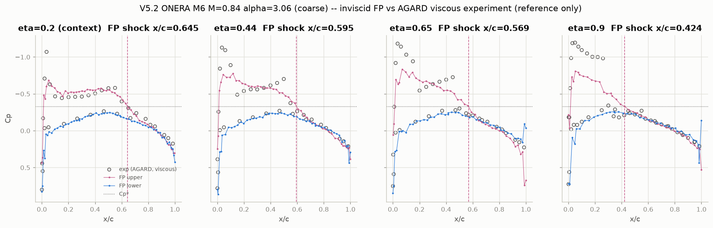
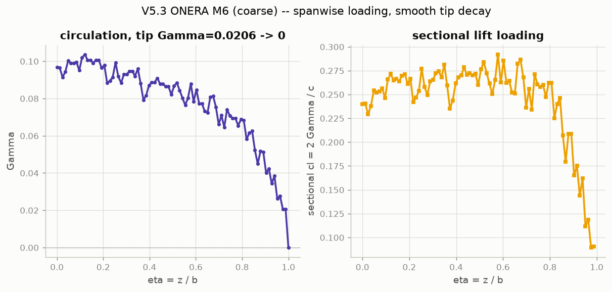
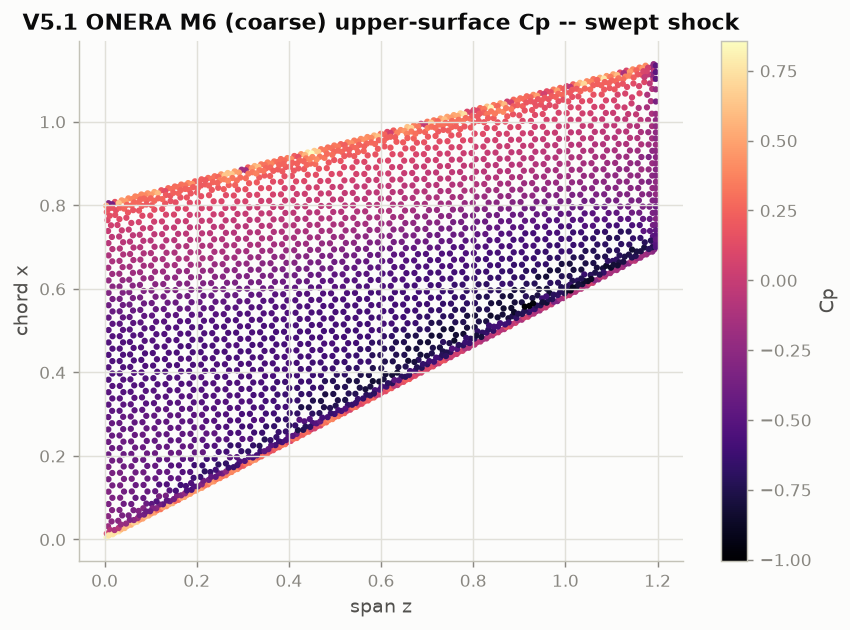
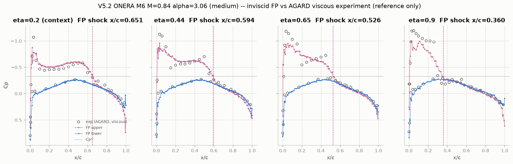

**Measured results (post-fix; demo 16/16 PASS).**

| Check | Coarse (55.5k) | Medium (350.7k) | Criterion |
|---|---|---|---|
| physical + tip stable (M_max, floored/limited) | **1.398, 0/0 PASS** | **1.995, 0/0 PASS** | M_max < cap, zero floored/limited |
| upper shock x/c η=0.44/0.65/0.90 | 0.596 / 0.570 / 0.425 | 0.594 / 0.526 / 0.345 (~1 cell) | present, monotone, forward-migrating |
| Γ root → tip | 0.097 → 0.0206 | 0.097 → 0.0151 | smooth band-mean decay, Γ_tip → 0 |
| V6 consistency \|CL_p−CL_KJ\|/CL_KJ | 2.40% | 1.82% | **< 3% floor bound (re-spec; < 1% post-P6)** |
| CL (pressure) | 0.2419 | 0.2453 | reported, coarse→medium convergence |
| Kutta \|F\|_max | 5.3e-4 | 5.8e-4 | reported (28× tighter than pre-fix 1.6e-2) |
| demo self-checks | **8/8 PASS** | **8/8 PASS** | — |

**Diagnosis history — why the gate stayed open for two investigations.**
The pre-fix medium solve failed `physical`: M_max 5.204, 8 floored / 4
limited; 26/350 718 cells M > 2, split **18 on the wing at the outboard TE**
(z/b 0.80–0.81) + **8 at the far-field sphere** beyond the tip
(`diagnose_medium.py` reproduces every audit below from the cache).

*Investigation 1 (A–E, `INVESTIGATION_gamma_smoothing.md`):* the cluster
co-locates with the steepest spanwise-Γ roll-off, so a spanwise-Γ-noise
hypothesis was tested via a Gaussian smoother — and **refuted** (flattening
\|dΓ/dz\| 7× at fixed Γ left the spike; in-continuation smoothing made it
worse). The investigation then attributed the cluster to a sharp-TE P1
discretization singularity (G1.6 family) on the strength of refinement-
sharpening (coarse 1.47 → medium 5.20) + well-shaped cells, and concluded
"NOT a wake/Kutta change". **That attribution was wrong.**

*Investigation 2 (T1–T4, `INVESTIGATION_kutta_closure.md`) — the actual root
cause:* the per-station Kutta audit showed the mismatch was a **single-station
anomaly**: st133 (z/b = 0.801) was left **32% under-circulated** (Γ 0.0431 vs
its own target 0.0592; \|F\|/Γ = 37% there vs ≤ 5% at all 165 other stations).
T1: no tet contains both master+slave wake nodes (0/350 718 — jump-in-cell
ruled out). T2: better density convergence at the same Γ leaves the defect
bit-identical (under-convergence ruled out). T3 (decisive): setting ONLY
st133's Γ to its own Kutta target collapses the cluster 18 → 0 cells (band
M_max 3.10 → 1.16) on the same mesh — **a 1/h singularity cannot depend on
Γ**; the refinement-sharpening was the finer mesh resolving a sharper
overspeed around the same Γ *error*. Root cause: the continuation's
per-station secant does not converge at the top Mach level on the 3D mesh
(pushing to 16 evals diverges, M_max ≈ 29 — the 10-eval budget was
early-stopping regularization); the ρ̃-floor + limiter then froze the
under-circulated station's TE overspeed into a spurious M ≈ 3 state. The
8 far-field cells were the independent span-uniform-2D-vortex branch-ray
artifact beyond the tip (no wake cut exists there to carry the prescribed
jump). A latent probe-assignment degeneracy (adjacent stations share Kutta
probe nodes on the swept unstructured TE; st133/134 share their upper probe)
is why st133 specifically stalled — recorded as a known-robustness item.

**Fix + verification.** `farfield_spanwise_gamma=True` removes the far-field
cluster at the boundary-data level; `n_kutta_polish=4` closes the stuck
station by a secant-free damped fixed-point iteration (\|F\| halves per step
to 5.8e-4; omega_rho < 1 *inside* the secant is NOT the fix — measured to
diverge). Both default off; the full default suite is bit-identical
(140 + 4 + 2). From-scratch medium: M_max 1.995 — the mild bounded
tip-TE-corner P1 overshoot, the only surviving trace of the singularity
family — with **0 floored / 0 limited**.

**G5.2 V6 re-spec (user-approved).** V6 is a systematic O(h)
CL_p-below-CL_KJ offset (coarse 2.40% → medium 1.82%, sign-constant) from the
sharp-TE/LE P1 wall gradient and the P4 surface-Cp sawtooth — both **P6**
targets; removing the M>2 clusters left V6 unchanged, proving it independent
of the wake/far-field defects. It is therefore reported against a 3% floor
bound here, and the original < 1% acceptance moves to a post-P6 re-measure
(roadmap P5/P6).

---

## P6 — surface-pressure recovery (G6.1–G6.4, closed 2026-07-08)

**Purpose.** Remove the non-physical ≈2-cell **sawtooth** in the supersonic-run
surface Cp. The N1 investigation root-caused it — decisively — to a *per-triangle
wall-gradient recovery artifact* on the sliver prism-split wall triangulation,
**not** the artificial-density flux: on the same solution, nodal/edge-neighbour
smoothing of the wall gradient drops the metric ~330×, whereas a smoother flux
(the P7 streamline kernel) does not reduce it at all. The fix is a normal-gated
recovery smoothing in post-processing (`smooth_wall_tangential_gradients`,
`smooth_passes`; design.md §9.1), applied to the Cp curve and the force integral,
gated so it never averages across the sharp TE.

**Case setup.** The P4 (NACA0012 M∞ 0.80, α 1.25°) and P5 (ONERA M6 M∞ 0.84,
α 3.06°) cases are re-run through the walk solver; the recovery is a
post-processing change, so the solve (φ, Γ, shock, M_max, cl_KJ) is unchanged —
only the reported Cp/forces move. `smooth_passes = 1`.

**Key figures.**

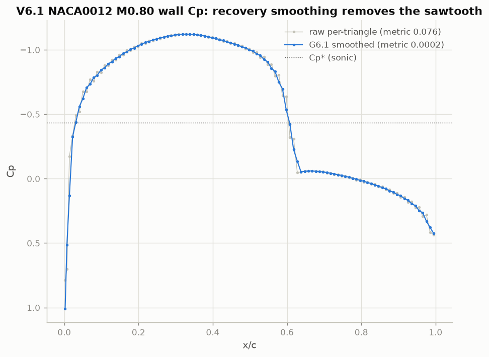
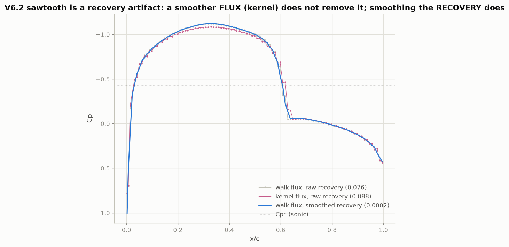
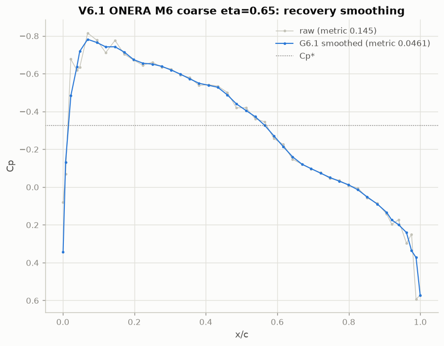

**Measured results (coarse NACA0012 M0.80, walk solution).**

| quantity | raw per-triangle | recovery-smoothed |
|---|---|---|
| sawtooth metric (upper) | 0.0758 | **0.00023** (330×) |
| slope reversals (upper) | 39 | 1 |
| upper shock x/c | 0.604 | 0.607 |
| cl_pressure | 0.3572 | 0.3562 (−0.3%) |
| cd_pressure | 0.01758 | 0.02014 (~15%; near-field FP drag, untrusted — §9) |
| cl_KJ / M_max (solution) | unchanged | unchanged |

**Conclusion & analysis.** The sawtooth is eliminated on the coarse mesh with no
refinement and no solver change — a recovery, not a flux, problem. The shock and
cl_KJ are untouched; cl_p shifts −0.3% and the (explicitly-untrusted) near-field
cd_p shifts ~15%. The one-panel figure is the evidence that the flux is not the
cause: the walk flux and the smoother streamline-kernel flux serrate identically
(raw recovery), while smoothing the same walk solution's recovery is clean. This
**overturns** the P4-supplementary attribution (see the correction banner in the
P4 section). On ONERA M6 coarse (η=0.65) the same smoothing drops the section-Cp
metric 0.145 → 0.046 (3D confirmation, gated part). **G6.3 nuance (measured):**
smoothing helps the *Cp curve* but not the *loads* — the M6 V6 consistency
|CL_p−CL_KJ|/CL_KJ *worsens* 2.40% → 3.35% under smoothing (the ±sawtooth cancels
in the integral; averaging smears the LE peak, moving CL_p ~1% further below the
trustworthy CL_KJ). So the whole V6 floor is the sharp-TE/LE P1 wall gradient →
tracked to **P9** (curved wall elements), and `smooth_passes` is recommended for
the Cp curve only, `= 0` for `wall_force_coefficients`. Demo: `cases/demo/p6_surface_recovery/` (6/6 PASS incl. the gated M6
part); the differentiable flux itself is **P7** (Newton prerequisite), not a
sawtooth fix.

---

## Cross-phase summary

- **Functionality**: every closed gate's headline number is reproduced from
  scratch by the demos (MMS slope 1.96, CG 8→11→14, cl −0.82%, Γ-lift
  cross-check 0.015%, spanwise ratio 2.05, cylinder slope 1.02).
- **Numerical stability**: machine-zero consistency checks (V0, G2.1, G2.2,
  G2.5a) hold on the largest committed meshes, the linear solver is
  mesh-independent, and the Kutta outer loop converges in 2 updates.
- **Physical soundness**: stagnation/suction structure on the sphere,
  smooth TE flow, and three mutually independent lift routes agreeing —
  physics cross-checks, not code self-consistency.
- **Open item**: G1.6 remains open (11.6% vs 2%); its Option C acceptance
  re-spec is the open P1 task, with Option A conclusively ruled out by the
  oracle demos.
- **P3 additions**: compressibility validated against the classical
  correction band (sphere 0.32% vs PG; airfoil cl inside [PG, KT]);
  M∞ → 0 is bit-identical to the P1/P2 Laplace drivers; assembly is
  colored-`prange` with precomputed geometry (~160× hot reassembly) and
  every solve is bit-reproducible run-to-run (seeded AMG setup).
