# Phase demo report — Track B (level-set embedded wake)

> Split verbatim from `docs/demo_report.md` on 2026-07-15 (content unchanged;
> only this header was added; sections keep their original chronological order).
> Scope, reproduce instructions and the honesty/evidence rule: see the
> [demo_report.md](../demo_report.md) index. Roadmap gates: [roadmap/](../roadmap/).

## Track B — level-set embedded wake (B1 ✓ B2 ✓ B3 ✓ B4 ✓ B5 ✓ B7 ✓, closed 2026-07-11/12; B6 ◐; B11–B15 ✓ incl. **B14 Schur+AMG 2026-07-17**)

**What the track replaces.** The conforming path represents the wake as a *mesh
surface*: the sheet is embedded in the geometry, its nodes are duplicated by the
preprocessor, and Γ is a global unknown eliminated by a master–slave constraint
and chased by a secant loop. Track B removes all of that. The wake becomes a
**level set** evaluated on an *unmodified* mesh; elements the sheet passes through
get a second set of DOFs (multivalued / CutFEM-style); the jump is convected by a
wake least-squares condition; and Γ is no longer an unknown at all — it is a
**result**, pinned by a Kutta condition at the TE.

**Purpose (user-arbitrated 2026-07-11): mesh/geometry workflow capability, NOT
solver speed.** No pre-embedded wake surface, α sweeps without remeshing, blunt-TE
anchoring, multi-wake/wake–fuselage intersections, and the structural elimination
of the P5 st133-class Kutta-probe failures. The original "kill the Γ-secant for
speed" motivation is obsolete post-P8 Newton.

**Dual-mesh rule (the acceptance discipline).** Every gate runs on **both** mesh
families:

| family | meshes | role |
|---|---|---|
| **wake-embedded** (the "C-grid" analogue) | M0 quasi-2D, M1 ONERA M6 | nodes lie *exactly* on the sheet ⇒ stresses the ε side-shift at scale, and enables a strict **same-mesh A/B against the conforming solver** |
| **wake-free** (the "O-grid" analogue) | M3 quasi-2D, M4 ONERA M6 | **no `wake` tag at all**; the level set makes generic cuts through generic elements — **the actual workflow target**, where no conforming counterpart exists |

**Evidence map.**

| gate | evidence | checks | verdict |
|---|---|---|---|
| B1 cut-element identification | `tests/test_b1_cut_elements.py` | 34 PASS | closed 2026-07-11 (test-only; no demo dir) |
| B2 multivalued FE assembly | `tests/test_b2_multivalued.py` | 17 PASS | closed 2026-07-11 (test-only; no demo dir) |
| B3 lifting solve + implicit Kutta | `cases/demo/b3_levelset_lifting/` + `tests/test_b3_lifting.py` | 13 demo PASS + 6 PASS | closed 2026-07-12 |
| B4 TE control volume / Kutta | same demo + `tests/test_b4_te_control_volume.py` | 8 PASS | closed 2026-07-12 |
| B5 far-field A/B | `cases/demo/b4p5_farfield/` + `tests/test_b45_farfield.py` | 9 demo PASS + 10 PASS | closed 2026-07-12 |
| B6 transonic (level-set) | `cases/demo/b6_transonic/` + `tests/test_b6_transonic.py` | 14 demo PASS + 9 PASS (+2 gated) | ◐ IN PROGRESS 2026-07-12 — coarse M0.80 gate met, medium M0.7875 fold deferred to LS Newton |

Numerics spec: [design_track_b.md](../design_track_b.md) (supersedes DN1;
B6 findings in §10). **B6 in progress** (transonic on the level-set path);
**next = B7** (ONERA M6 3D).

### B6 — transonic on the level-set path (IN PROGRESS 2026-07-12)

B6 carries the multivalued implicit-Kutta solver into the transonic regime.
Three measured findings, each overturning a "transplant the conforming recipe"
default (design_track_b.md §10):

1. **Per-side artificial density** (D10): a cut element has two velocity
   states, so `rho_tilde` is evaluated once per side and the upstream walk
   runs on a same-side-restricted face graph (the wake is a slip line).
   Subcritically an exact no-op; the M0.80 blow-up cells sit in the pocket
   ABOVE the airfoil (zero on the wake strip), so the shock machinery is
   isomorphic to conforming.
2. **Damping must be LOCALIZED to the ν>0 zone.** The P4 whole-field
   θ·diag stabilizer is a Jacobi smoother — near-transparent-yet-throttling
   to smooth global modes. The implicit Kutta makes Γ a smooth global
   SOLUTION mode (conforming keeps it as an outer secant unknown, outside the
   damped matrix), so global damping throttles it: Γ crawls 0.0005→0.017 in
   160 outers vs undamped convergence in 35. `damping_scope="supersonic"`.
3. **Near the FP fold the option-a Γ→vortex feedback has loop gain > 1** —
   Γ climbs monotonically through both the conforming-Picard stall and the
   Newton truth, then blows up; the López **Neumann outlet** (B5 option b,
   no Γ feedback) removes the loop and converges. ⇒ B6 transonic recipe =
   `farfield="neumann"`.

**★ A/B inversion (the headline result):** the raw same-mesh Picard-vs-Picard
Γ gap grows with pocket strength (+10.5% at coarse M0.75), which looks like an
LS error — but same-mesh conforming **Newton** arbitration shows the
*conforming Picard* under-circulates 4–8% (its P4-erratum stall bias,
quantified at weak shocks), while the LS Picard sits within **+0.25–1.0%** of
the Newton truth and converges toward it under refinement. **User arbitrated
(2026-07-12): the B6 gate baseline is the same-mesh conforming Newton truth,
not the conforming Picard.**

Coarse M0.80 α1.25 (Neumann), vs the G8.1 Newton truth (Γ 0.2295 / shock 0.658
/ cl_p 0.459; the conforming Picard stall is Γ 0.1819 = −21%):

| mesh | Γ | vs Newton | shock | cl_p | M_max | lim/flr |
|---|---|---|---|---|---|---|
| M0 wake-embedded | 0.2114 | −7.9% | 0.644 | 0.4154 | 1.39 | 0/0 |
| M3 wake-free | 0.2315 | **+0.9%** | 0.678 | 0.4556 | 1.39 | 0/0 |

**Medium M0.7875 = the FP fold.** With more dissipation (C=2.0, θ=0.5
localized, dm=0.025 — the coarse recipe diverges) the LS solve stays bounded
and physical (M_max 1.44, 0 lim/flr) but stalls at Γ −18.8% of the same-mesh
Newton truth (0.2643): a Picard method — conforming or level-set — does not
reach the isolated fold solution (why G8.1 re-specced the conforming path to
Newton locks). The quantitative medium gate needs the **LS Newton** (post-B6
re-derivation, design_track_b.md §5.5, explicitly deferred).

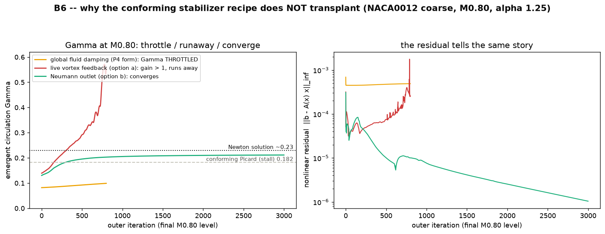
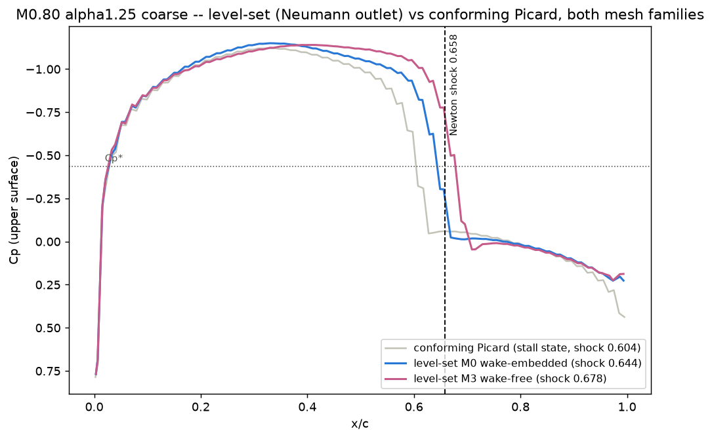
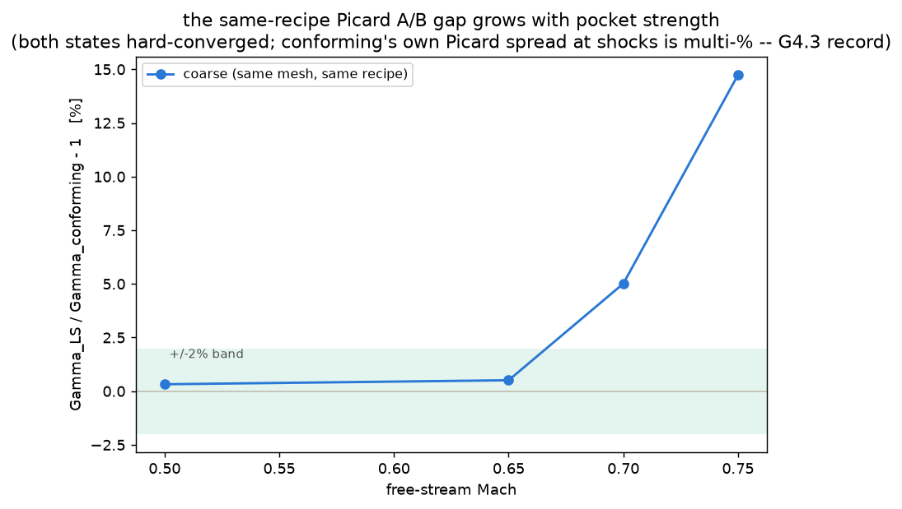

> **Track-B renumber 2026-07-12.** Two renumbers landed the same day: a new **B4**
> (TE control volume) was inserted, then the half-integer IDs were regularized
> away. The far-field A/B gate documented below as **B5** was called *B3.5*, then
> *B4.5*, in earlier docs — including the demo directory name
> `cases/demo/b4p5_farfield/`, which is kept as-is so the committed paths stay
> stable. See roadmap.md for the full mapping.

---

### B1 — level-set wake + cut-element identification (closed 2026-07-11)

**Evidence:** `tests/test_b1_cut_elements.py` — **34 passed**, across the full
dual-mesh matrix (2.5D M0/M3 coarse+medium *and* 3D M1/M4 ONERA M6). No demo
directory: B1 delivers no solve, only a geometric predicate, so its evidence is
the test matrix rather than a figure.

**Deliverable.** `wake/levelset.py` + `wake/cut_elements.py`: a TE-**polyline**
ruled level set, and the census of elements it cuts. The mesh is never modified.

| check | measured | why it matters |
|---|---|---|
| M0 (embedded): cut census vs the conforming wake | **exactly** == `cut_wake`'s minus-side element star, element by element | the level set reproduces the conforming topology it replaces |
| M0: on-sheet nodes | every one ε-shifted **"+"** | D4 side-shift stress test at scale |
| M3 (wake-free): corridor TE → far field | gap-free at α=0 **and** after `update_direction` to α=4° **on the same mesh** | α sweeps without remeshing — the workflow payoff |
| M1/M4 (ONERA M6, 3D): census vs conforming | strict **superset**: **0 missing**, **+2.9%** extras, all tip-edge straddlers | expected — the sheet's tip *edge* need not conform in an embedded method |
| M1/M4: spanwise clip | verified (nothing cut wholly outboard of the tip) | encodes Γ(tip) = 0 |

**★ Two 3D-only mechanisms found and fixed here — both invisible on quasi-2D
meshes.** This is the concrete justification for the dual-mesh rule:

1. **The swept TE span axis is not perpendicular to the wake direction.** The
   spanwise coordinate must be measured in the **oblique (v, d̂, n̂) frame**. An
   orthogonal projection leaks the downstream distance into the spanwise
   coordinate and wrongly clipped **~60% of the true M6 cut set** (measured, then
   fixed, now regression-pinned).
2. **The spanwise clip is mandatory** (crossings must satisfy 0 ≤ q ≤
   span_length). Without it the level set cuts the wake-plane *extension beyond
   the tip* — i.e. it re-creates P5's far-field **branch-ray artifact**. The
   conforming path gets the same semantics for free from its free-edge rule.

**The meshes the rule needs** (Track M deliverables M3/M4, built the same day).
Left: the M3 wake-free quasi-2D layer — note there is no wake line in the
topology, only a size-field corridor. Right: the M4 wake-free ONERA M6 corridor.

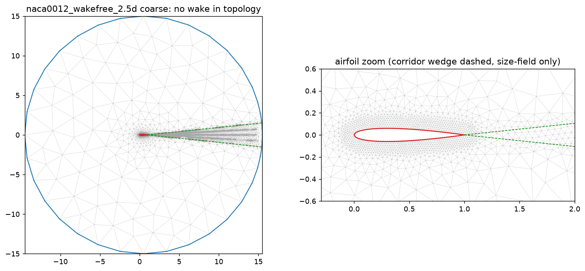
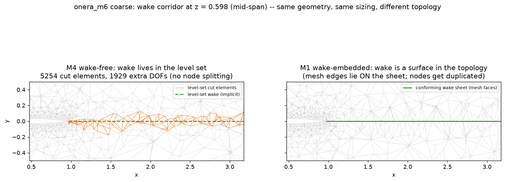

M3 coarse: 29,250 tets, corridor median edge 0.0595 vs an h_wake target of 0.06.
M4 coarse/medium: 50,605 / 329,645 tets — **within 6–9% of the M1 counts at equal
h_wall**, which is precisely what makes the B7 A/B against the P5/P8 baseline a
*controlled* comparison.

---

### B2 — multivalued FE assembly (closed 2026-07-11)

**Evidence:** `tests/test_b2_multivalued.py` — **17 passed** (coarse+medium of both
2.5D families, M6 coarse of both 3D families; some parametrizations skip in CI
where the meshes are gitignored). Test-only, like B1: B2 delivers the assembly, not
yet a lifting solve.

**The key design insight.** A cut element is *the same P1 element matrix assembled
twice*, once with `dofs_upper` and once with `dofs_lower`. That is expressible as a
sparse **column redirection** of the ordinary single-valued matrix: on a cut
element, entries whose two nodes lie on **opposite** sides move their column
main(b) → aux(b) (`multivalued_redirection_coo`). Everything else is byte-identical
to `PicardOperator.assemble_matrix()`. There is **one mesh and one extra DOF per cut
node** — *not* two meshes (López fig. 3.6's "two meshes" is a visualization only).

At B2 the aux rows carry a **continuity ("weld") closure** aux_k = main_j, which
forces the jump to zero. That makes the extended system a strict generalization of
the single-valued one — and that is exactly what B2 proves:

| gate | measured | criterion |
|---|---|---|
| extended matrix folds back to the single-valued stiffness | **1e-13** | the weld closure degenerates *exactly* |
| V0 freestream (φ = U·x) on the cut mesh, 2.5D M0/M3, α=0 and α=4° | **0.0** (exact linear field) | < 1e−12 |
| V0 freestream, 3D M6 M1/M4 | **1.1e−14 / 3.4e−14** | < 1e−12 |
| V1 MMS convergence slope (cube cut by an 8°-tilted half-plane, generic position) | **1.94** | ≥ 1.9 |
| Laplace at α = 0 ⇒ cl ≈ 0, main potential vs the single-valued `solve_laplace` oracle | **~3e−11** | the weld forbids a jump ⇒ cl_KJ = 0 |

**Recorded consequence:** the extended matrix is structurally **nonsymmetric** (the
weld rows), so CG is inapplicable — B2 solves by sparse-direct LU (`spsolve`), and
GMRES+AMG is the B3+ scaling path.

---

### B3 — lifting solve with implicit Kutta (closed 2026-07-12)

**Demo:** `cases/demo/b3_levelset_lifting/` — `python run_demo.py`, ~1 min,
**13/13 PASS**. NACA0012 medium, incompressible, α = 0 and α = 4, **on the same
mesh with the same level set**. The mesh topology knows nothing about the wake.

B3 replaces B2's weld closure with the real thing: the TE jump is carried by the
multivalued aux DOFs, the g₁+g₂ wake LS convects it downstream, and its **value**
is set by B4's TE Kutta condition. **Γ is a RESULT** — no secant, no master–slave
constraint, no Γ unknown.

| check | measured | criterion |
| --- | --- | --- |
| Γ at α = 0 — M0 embedded / M3 wake-free | −3.89e−4 / −4.15e−4 | \|Γ\| < 1e−3 (symmetric ⇒ no circulation) |
| Γ at α = 4 — M0 embedded | **0.2384** (conforming 0.2393, **0.4%**) | > 0.2 |
| Γ at α = 4 — M3 wake-free | **0.2339** | > 0.2 |
| aux DOFs / main DOFs | **9.5%** | < 15% — the enrichment is a thin strip |
| cut tets | 2982 of 61788 (**4.8%**) | (context: the level set touches ONE element layer) |
| TE Kutta control volumes | 2 upper / 2 lower, wall-adjacent | both non-empty |
| jump drift TE → far field | **0.0%** | < 10% (no drain) |
| [φ] near the TE vs the reported Γ | 0.0% | < 10% |
| cl_p vs conforming (α = 4, M0) | 0.4770 vs 0.4786 | within 3% |
| cl_p vs cl_KJ = 2Γ (M0) | 0.4770 vs 0.4769 | within 5% (D11 mapping correct) |
| cl_p wake-free M3 vs conforming | 0.4674 vs 0.4786 | within 5% |
| M3 mesh has a `wake` tag | **False** | topology knows nothing about the wake |
| wake-free Γ vs embedded Γ (α = 4) | **0.2339 vs 0.2384** (1.9%) | within 5% (generic cuts reproduce it) |

The **gate** itself is the compressible one (`tests/test_b3_lifting.py`, 6 passed):
at M0.5, α = 2°, cl_KJ = **0.2828** (medium) sits **inside** the committed
[PG 0.2788, KT 0.2919] bracket read from `cases/reference_data/naca0012_m05/cl_reference.csv`
— the same file the conforming G3.2 gate reads — on **both** mesh families. Same-mesh
A/B vs conforming: Γ within **0.1–0.7%** (0.1177/0.1191/0.1197 vs 0.1175/0.1200/0.1202
on coarse/medium/fine).

**Figures.**

**1. The lift, on both mesh families.** Speed (own-side) and the perturbation
potential drawn **per element** — i.e. exactly as the multivalued DOFs store it. At
α = 4 a crisp branch cut carries [φ] = Γ; at α = 0 the field is flat with **no jump
at all**. The M3 panel exposes the coarser wake-free triangulation that the level
set cuts through generically.

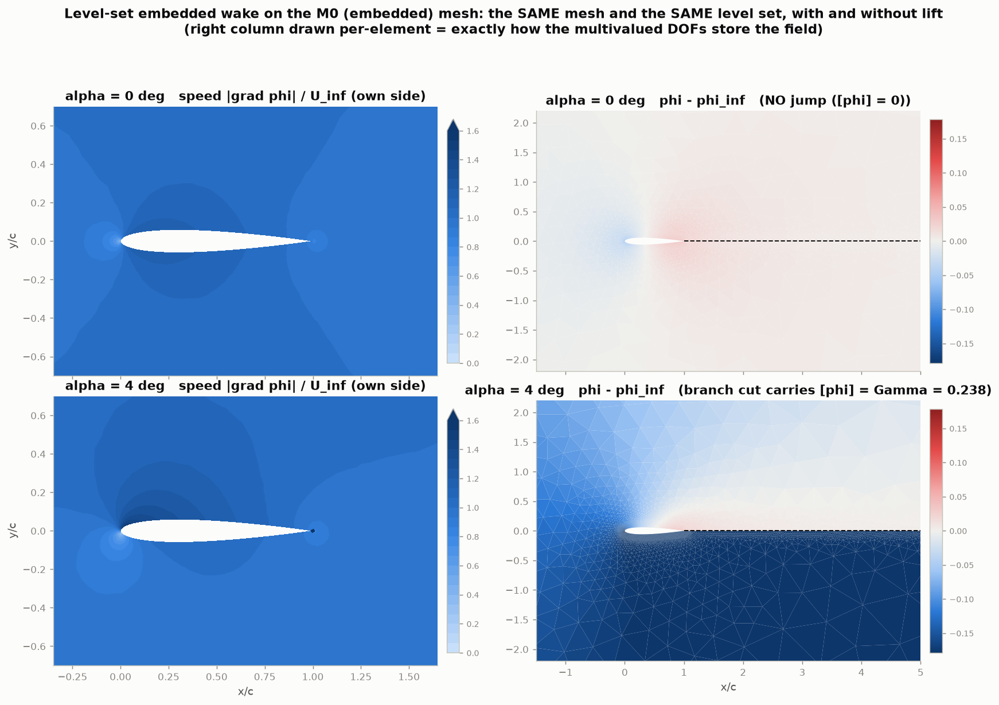
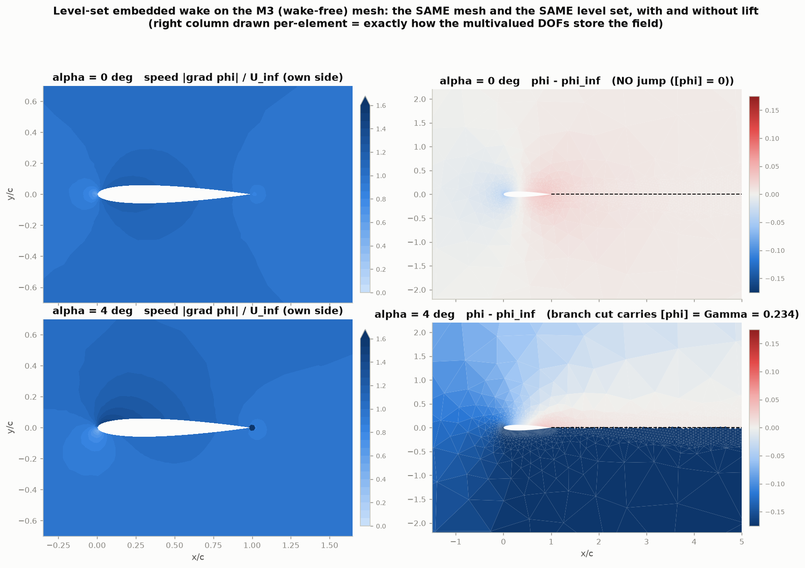

**2. How the jump survives to the far field.** LEFT: the nodal [φ] at every cut node
vs downstream distance is **flat at Γ from the TE (d = 0) out to the far field
(d ≈ 15 c)** — the g₁+g₂ wake LS convects it unchanged, and the far-field aux DOFs
are left **FREE** so it exits rather than being drained. *(Pinning them to the
vortex's lower branch was measured to decay the jump 0.0147 → 0.001 — i.e. to drain
the circulation. This is a load-bearing fix, not a detail.)* RIGHT: the **storage** —
the MAIN dof holds the node's own-side value, the AUX dof the other side, and the gap
between them is exactly Γ, all the way out.

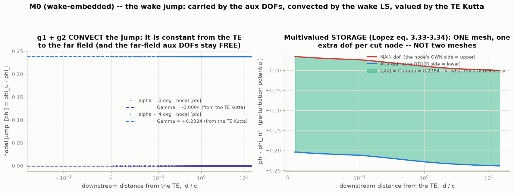

**3. Surface Cp on both families**, using the **D11 per-side DOF mapping** (solid =
M0 embedded, dotted = M3 wake-free, grey dashed = conforming; Cp axis inverted,
suction up). Lower-surface TE triangles *must* read the TE's AUX value — reading
`phi_main` alone gives cl_p = **−3.35**, junk. At α = 0 upper and lower collapse; the
M3 cl_p lands within 2.3% of conforming despite being a coarser, wake-free mesh.

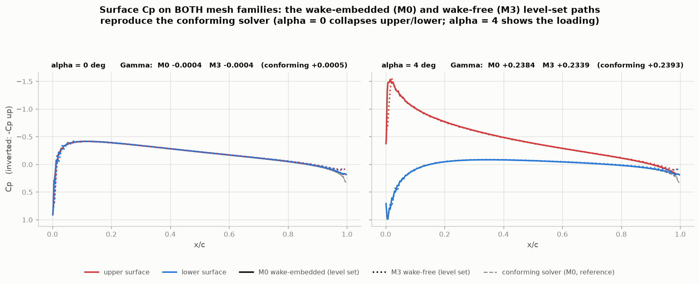

**4. The dual-mesh rule made visible** — the same level-set path on the
wake-**embedded** M0 mesh (which *has* a `wake` tag, its wake nodes lying exactly on
the sheet) and on the wake-**free** M3 mesh (**no `wake` tag anywhere**, generic cuts
through generic elements). Γ agrees to **1.9%**. This is the payoff: **lift on a mesh
that never had a wake embedded**, where no conforming counterpart exists at all.

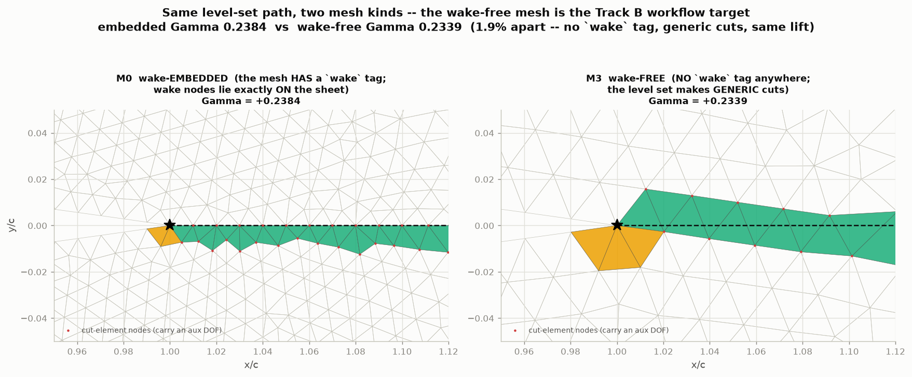

---

### B4 — TE control volume / implicit-Kutta re-derivation (NEW + closed 2026-07-12)

**Evidence:** `tests/test_b4_te_control_volume.py` — **8 passed** (~29 s); the
B3 demo above is shared. B4 was **inserted** into the track mid-flight because B3's
emergent Γ converged to the **wrong value** — and the reason turned out to be
structural, not a bug.

**★ The finding: the wake LS CANNOT pin Γ.** Its residual is **identically zero for
any spatially-constant jump**, because Σ_c ∇N_c = ∇(Σ_c N_c) = ∇(1) = 0 (partition of
unity) — measured **1.9e−16**. Therefore design_track_b.md §2.3/D2's claim that "the
g₂ on the TE-adjacent wake element **is** the discrete Kutta condition" is **FALSE and
retired**. (Cross-checked against the source: the López dissertation has no explicit
Kutta condition anywhere — the word never appears in its method chapter.) **Γ needs
its own equation.**

Without one, Γ was being pinned by a single *wrong* equation — the TE aux row
(lower-side mass conservation), whose control volume is up/down **asymmetric** on a
symmetric airfoil (the TE fan is 9 upper / 6 lower / 3 cut, because the ε shift sends
every on-sheet node "+"). It over-circulated by **+42%**, *mesh-convergently* — which
is the signature of a method defect rather than a discretization error.

**★ The fix: the nonlinear TE pressure-equality (Bernoulli) Kutta.** Symmetrizing the
control volume is **not available** — the mesh is naturally asymmetric at the TE
(user-arbitrated) — so the condition is instead a **pointwise physical statement that
needs no symmetry**:

> |q_u|² = |q_l|², factorized **exactly** as (q_u + q_l)·(q_u − q_l) = 0, and
> linearized by freezing the mean s̄ = q_u + q_l at the previous iterate.

That yields a row **linear in φ**, re-linearized once per Picard outer (the same
cadence as the density lag — **no new outer loop**), converging to the exact nonlinear
condition. It replaces the TE **aux** row; the displaced lower-side mass-conservation
entries are re-routed onto the TE **main** row, which then carries the **total**
(upper + lower) balance — so mass stays conserved and no side is arbitrarily robbed of
its equation. **Why it is non-degenerate where g₂ is not:** q_u and q_l are recovered on
**different element sets**, so q_u − q_l is *not* a jump gradient and does not vanish for
a constant jump.

**★ The control volumes must be WALL-ADJACENT.** The Kutta condition is about *surface*
velocities, so q must be recovered on the elements carrying a **wall face** (the
upper/lower body surface at the TE), **not** the whole element fan. This is the single
most consequential detail in B4, and it is measurable:

| Γ recovery (α = 2°, incompressible) | coarse | medium | fine | vs conforming |
|---|---:|---:|---:|---:|
| conforming reference | 0.1175 | 0.1200 | 0.1202 | — |
| old B3 `te_kutta="mass"` row | 0.2074 | 0.1760 | 0.1704 | **+42%** (wrong equation) |
| pressure Kutta, **full-fan** control volume | 0.1407 | 0.1355 | 0.1329 | **+11–15%** (interior + wake elements pollute the average) |
| pressure Kutta, **wall-adjacent** ✓ | **0.1177** | **0.1191** | **0.1197** | **< 1%** |

The wall-adjacent control volumes are the highlighted elements in the level-set region
figure — which also shows *where* the level set acts at all: **one** layer of elements
(4.8% of the tets) plus the below-TE fan. The mesh is never modified. Note the cut layer
sits just **below** the sheet: the ε side-shift sends on-sheet nodes "+", so the sheet
effectively lies at y = −ε. **That bias is exactly what B4's TE condition had to be made
immune to.**

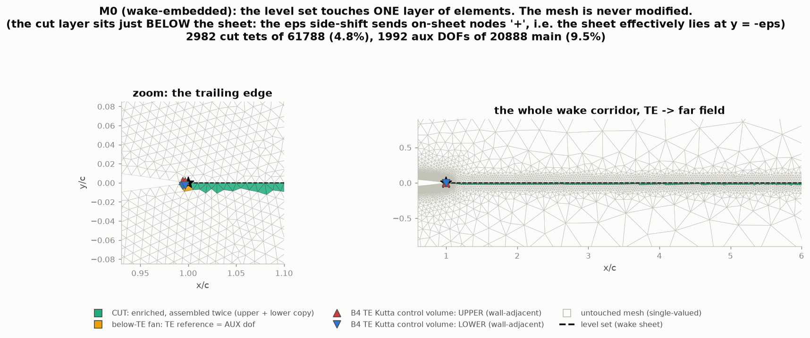

**Gate checks.** LS constant-jump null space pinned numerically (1.9e−16 — the reason a
separate TE condition is *structurally* required); TE control volumes verified
wall-adjacent (every element carries a wall face); the below-TE fan is never cut (the
López p.57 ε-shift trap, regression-pinned — the ε shift had been manufacturing
**spurious cuts** there, giving 3 of 6 elements a bogus UPPER copy *below* the wake);
emergent Γ within 5% of conforming (**measured 0.1–0.7%**), while the old
`te_kutta="mass"` row is still >30% out, so the before/after contrast stays honest.

**Consequence: the D2 penalty-Kutta fallback is no longer needed** — this route has **no
penalty weight and no tuning parameter** (s̄ is solved for, not calibrated). Interfaces:
`solve_multivalued_lifting(..., te_kutta="pressure")` (default), with `te_kutta="mass"`
retained purely for the contrast. Derivation in [design_track_b.md §9](../design_track_b.md).

---

### B5 — far-field A/B: Dirichlet+vortex vs Neumann outlet (closed 2026-07-12)

**Demo:** `cases/demo/b4p5_farfield/` (directory name predates the renumber) —
`python run_demo.py` redraws and self-checks from the committed `summary.csv`
(**9/9 PASS**); `PYFP3D_B45_RESOLVE=1 python run_demo.py` re-solves the whole study
from scratch (~15 min, threads capped). `tests/test_b45_farfield.py` (**10 passed**,
~20 s) holds the cheap 15c locks.

**Question.** The level-set lifting path needs a far-field BC, and two self-consistent
options exist (design_track_b.md §5.4):

- **option a (vortex)** — spherical Dirichlet freestream **+ a PG point vortex** on the
  far-field MAIN DOFs, with the emergent Γ refreshed into the vortex each outer
  iteration. pyFP3D's compact **15c** domain is calibrated *for* this correction.
- **option b (Neumann)** — the **López** form: inflow Dirichlet freestream (**no
  vortex**), outflow a Neumann outlet carrying the freestream flux ρ∞(u·n̂).

Option b is attractive for the workflow (no Γ-into-far-field feedback, simplest α
sweep), but **with no vortex it truncates the O(Γ/r) far-field tail**, so its domain
must grow — which is why the dissertation uses 10²–10⁷-chord domains.
New interface: `solve_multivalued_lifting(farfield="vortex"|"neumann"|"freestream")`,
default `"vortex"`; helpers `_farfield_split`/`_neumann_outlet_rhs` in
`solve/picard_ls.py`. Conforming path byte-untouched.

**Method — a López-style domain-size re-calibration** (the dissertation §4.1.4 method).
Coarse NACA0012, M0.5, α = 2°, on **both** Track B mesh families, with the far-field
radius swept over R ∈ {15, 30, 60, 120}c. Γ vs R, one panel per family, against the
conforming reference and its ±2% B3 band:

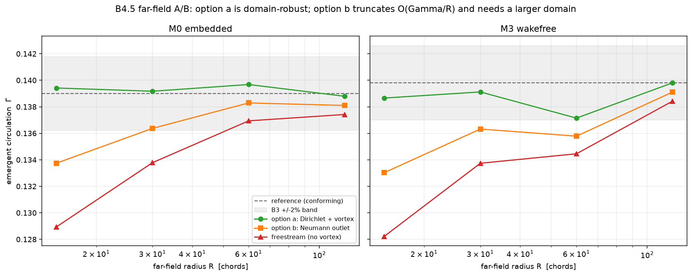

**Result** (M0 embedded shown; the M3 wake-free family agrees to the third digit):

| R/c | conforming | option a (vortex) | option b (Neumann) | b − a | freestream − a |
|----:|-----:|-----:|-----:|-----:|-----:|
| 15  | 0.1391 | 0.1394 | 0.1337 | **−4.07%** | −7.52% (**diverges**) |
| 30  | 0.1389 | 0.1392 | 0.1364 | −2.01% | −3.87% |
| 60  | 0.1389 | 0.1397 | 0.1383 | −0.99% | −1.96% |
| 120 | 0.1391 | 0.1388 | 0.1381 | −0.50% | −0.99% |

- **Option a is domain-robust:** Γ stays within **0.45%** (M0) / **1.09%** (M3) of the
  truth across the whole 15→120c sweep, and within **0.25%** of the conforming solver
  at 15c.
- **Option b truncates O(Γ/R):** −4.07% at 15c, and the error **halves every time R
  doubles** — the textbook point-vortex far-field decay, visible as a clean straight
  line in the figure. It therefore meets the B3 ±2% band only at **R ≥ ~30c**, and gets
  below 1% only at **R ≥ 60c** — a 2–4× larger domain, ~4× the tets at equal near-body
  h. This is exactly why López needs 10²–10⁷-chord domains.
- **Freestream-Dirichlet** (no vortex, whole boundary) is crudest at every R and
  **diverges** on the compact 15c M0 mesh (M_max 5.9): a lifting body cannot sit in a
  tight box without either the far-field vortex or an outlet.

**★ Verdict — option a stays the DEFAULT.** For pyFP3D's compact 15c workflow the vortex
correction pays for itself. Option b is **validated** as an alternative but is
domain-hungry, so its workflow simplicity does not pay at pyFP3D's scale. Because the
O(Γ/R) truncation is **geometry-universal** (a 3D wing truncates the same
horseshoe-vortex tail), this also decides the far-field default for the M6 B-path — so
the gate did not need its own M6 run to be conclusive.

**The M6 leg is folded into B7** (user-arbitrated 2026-07-12): running the level-set
B-path *solve* on M6 needs the 3D wake-BC machinery that is B7's deliverable — and,
separately measured here, the span-uniform option-a vortex **without** the P5 Γ(z)
taper recreates the **branch-ray artifact** on M6, itself B7 machinery.

---

## B7 — ONERA M6 3D gate (closed 2026-07-12; `cases/demo/b7_onera_m6/`, 35/35 PASS)

**Why the phase exists.** B1–B6 all ran on quasi-2D meshes, where the wake sheet is a
flat strip: no sweep, no tip, no spanwise direction. Three pieces of the level-set path
were therefore *structurally* untested — the **TE-polyline ruled level set** (D9; its
per-segment (v, d̂, n̂) frame is oblique, and B1 already found a real defect there), the
**spanwise clip** `0 ≤ q ≤ span_length` (what makes Γ(tip)=0 *discretely* — the LS
analogue of the conforming free-edge rule), and the **g₂ spanwise-free jump gradient**
(the trailing-vortex DOF). B7 runs the full transonic B-path solve on ONERA M6 and A/Bs
it against the committed P5/P8 conforming baseline.

**Setup.** M∞ 0.84 / α 3.06°, coarse, `farfield="neumann"`, Mach ramp 0.60→0.84 @
dm 0.04, dual-mesh (M1 wake-embedded + M4 wake-free — M4 is within 6–9% of M1's tet
count at equal h_wall, which is what makes the comparison controlled).

| | **M1** embedded | **M4** wake-free | P5 conforming **Picard** | P8 conforming **Newton** |
|---|---|---|---|---|
| cl_KJ | **0.2765** (+2.7% of Newton) | **0.2710** (**+0.7%**) | 0.24788 (**−8.6%**) | **0.2692** (truth) |
| cl_p (3D) | 0.2716 | 0.2656 | 0.24194 | 0.2560 |
| V6 consistency | 1.77% | 1.97% | 2.40% | — |
| shocks η .44/.65/.90 | 0.635/0.588/0.449 | 0.634/0.584/0.454 | 0.596/0.570/0.425 | 0.596/0.541/0.362 |
| Γ root → tip | 0.1076 → **−0.0003** | 0.1055 → **+0.0003** | 0.097 → 0.0206 | — |
| M_max, limited/floored | 1.453†, **0/0** | 1.368, **0/0** | 1.398, 0/0 | 2.13 |
| solve wall time | 22.7 min | 18.4 min | — | — |

> † **Re-read 2026-07-14** (B8-backlog `element_mach2` default flip to
> `mixed_plain="main"`): M1 **1.453 (side) → 1.392 (main)** — the committed
> M_max was itself a beyond-tip mixed-plain artifact cell; honest value sits
> closer to P5's conforming 1.398. M4 and both 2.5D B6 states are bit-identical
> under either reading; all gate bands unchanged. Artifact:
> `cases/demo/b8_tip_taper_ls/results/mmax_reread.csv`.

**★ Finding 1 — the B6 lift inversion reproduces in 3D, first try.** Against the
conforming **Newton** truth (the B6 user-arbitrated baseline), the level-set Picard sits
**+2.7% (M1) / +0.7% (M4)**, while the conforming **Picard** (P5) sits **−8.6%** below
it. Same mechanism as B6's 2D finding: the LS path has **no early-stoppable Γ outer**
(the implicit Kutta makes Γ a *solution mode*, converged with the field), whereas the
conforming Picard's frozen-Γ inner solves plus budgeted per-station secant
under-circulate (the P4-erratum bias; P8 measured it independently at +7.9% for M6
medium). Gating B7's lift on P5 would have **penalised the B path for being closer to
the truth** — hence the Newton anchor. Note the **wake-free workflow mesh (M4) is the
more accurate of the two**, which is the outcome Track B exists to deliver.

**★ Finding 2 — the 3D far field, and why the P5 Γ(z) taper is *structurally
unnecessary* here** (`farfield_decision.png`). The B-path vortex
(`picard_ls._farfield_main`) is a **span-uniform** 2D point vortex whose branch cut is
the ray y=0, x>0 *at every z*. On a 3D wing it misfires two independent ways — both
measured, both appearing as a spurious near-sonic spot at the **outlet, where the sheet
leaves the domain** (max local Mach there, M∞ 0.5):

| far field | outlet M_max | mechanism |
|---|---|---|
| `neumann` (no vortex) | **0.513** | — |
| vortex, sheet re-aimed to y=0 (coplanar) | 0.825 | (b) only |
| vortex, sheet α-aimed (the default) | **0.958** | (a) + (b) |

- **(a) non-coplanarity** — the α-aimed sheet has climbed to y ≈ x·tan α ≈ 0.5 by the
  outlet (x≈10c), far off the vortex's y=0 cut, so the outlet carries a prescribed Γ
  jump **no cut supports**. This is B3's recorded coplanarity rule, in 3D.
- **(b) span-uniformity** — re-aiming coplanar *shrinks but does not remove* it: one
  scalar Γ cannot match Γ(z)→0, and outboard of the tip there is **no cut at all**.
  This is precisely P5's branch-ray artifact, whose conforming fix was the Γ(z) taper.

⇒ **neumann carries no vortex, so neither defect can exist**: the taper is *unnecessary*
on the B path, not merely unimplemented. Price: B5's O(Γ/R) outlet truncation (a few % of
lift on a compact domain) — which is why the gate uses A/B bands, not <1% bands.

**★ Finding 3 — Γ(z) comes out spanwise-smooth, with no smoothing applied** (unplanned — it
became visible the moment the *real* P5 curve was overlaid in `gamma_of_z.png`). Normalised RMS
second difference of Γ(z): **0.0079 (M1) / 0.0091 (M4) vs 0.0970 for the conforming P5 — an
11–12× reduction.** The conforming path solves a **separate secant per TE station**, so its Γ(z)
carries station-to-station jitter — the very defect P5's `INVESTIGATION_gamma_smoothing.md`
chased (concluding that spanwise-Γ *smoothing* moves Γ **away** from the self-consistent value),
and the same machinery whose single-station failure (st133, 32% under-circulated) cost P5 an
entire investigation. The implicit Kutta has **no per-station loop to be noisy in**: Γ is one
solution mode of the coupled system. Track B therefore does not *fix* the P5 spanwise-Γ problem
— it makes it **structurally impossible**.

**★ Finding 4 — the 3D-only machinery needed no new solver code.** B1's oblique-frame and
spanwise-clip fixes held: Γ(z) decays monotonically root→tip and reaches **~3e-4 at the
tip** on both families (`gamma_of_z.png`). The only code gap was post-processing (the TE
node is multivalued, and `section_cp_curve` takes a single nodal field):
`post/surface_ls.py` gained `section_cp_curve_levelset` (D11 per-side plane cut — the
**upper surface is bit-identical** to the `main`-based curve, so every gate shock metric
is unaffected; the lower surface is where D11 bites, and reading `main` there is the junk
that gave B3's cl_pressure = −3.35) and `cl_pressure_3d_levelset` (planform-area
normalisation, pairing with `cl_kj_3d` for V6). Cost came in far under the plan's risk
estimate: the per-outer `spsolve` on ~12k 3D DOFs is ~0.6 s, so a 7-level continuation is
**~20 min, not hours**.

**Honest caveats (recorded, not chased).** (1) **Convergence semantics = the recorded
transonic Picard tail, not `tol_residual`**: the top Mach levels exhaust the 600-outer
budget at |R| ~4–6e-6 (M1 levels 0.72–0.84; M4 0.68/0.76/0.84). The field is **bounded and
physical at every level** (0 limited / 0 floored throughout) and every gate metric is in
band, so the gate asserts *bounded + in-band*, not `converged` — the same P4/B6
engineering-converged regime. (2) **LS Newton on M6 deferred**: `newton_ls.py` uses a
plain `splu`, and P8/N6 measured true-3D LU fill at ~100× the 2.5D cost (it needed
lagged-LU); porting `direct_refactor_every` is the follow-up. (3) Shocks sit 0.02–0.04 c
aft of P5 (in band, and self-consistent with the higher circulation); against the P8
*Newton* shocks the η=0.90 station is 0.087 aft — a like-for-like shock A/B needs the
deferred LS Newton. (4) Coarse only.

**Figures:** `gamma_of_z.png` (Γ(z) both families vs the committed P5 curve; tip→0),
`section_cp.png` (upper/lower Cp at η = 0.44/0.65/0.90), `shock_planform.png` (swept
shock line, forward migration toward the tip), `farfield_decision.png` (the table above).
`p5_gamma_baseline.csv` is committed alongside so the A/B curve reproduces without the
gitignored P5 solution cache. Tests: `tests/test_b7_onera_m6.py` (6 fast + 5 gated).

---

## Track B / B8 — level-set tip-edge desingularization (row-blend tip taper)

**Status: ◐ IMPLEMENTED, GATE NOT MET — a NEGATIVE result, and the reason is the
finding.** Demo `cases/demo/b8_tip_taper_ls/run_b8_taper_ls.py` (**12/12 PASS** —
every check asserts a *measured fact*, including the ones that record the
failure). Artifacts: `results/b8_taper_ls.csv`, `results/b8_taper_ls.png`,
`results/checks_b8.csv`. Tests `tests/test_b8_tip_taper_ls.py` (13).
Case: ONERA M6 coarse+medium, M∞ 0.5, α 3.06°, `upwind_c = 0` (no limiter, no
shock — the clean geometric probe, as G13.1 established).

### What was built

P13/G13.2 killed the tip/wake-edge singularity on the **conforming** path with a
spanwise loading taper `Γ_eff(z) = F(z)·Γ_Kutta(z)`. That cannot be ported to the
level-set path: it has **no Γ DOF** (the implicit Kutta makes Γ a solution mode)
and its TE Kutta row `s·(q_u − q_l) = 0` is **homogeneous** (RHS ≡ 0), so scaling
it by F is an algebraic **no-op** (G13.2 finding (8)). B8 implements finding (8)'s
prescribed analogue — a convex **blend** of the pressure-equality row with B2's
continuity weld, per TE node:

```
F_i · [ s·(q_u − q_l) ]  +  (1 − F_i) · [ φ_aux − φ_main ]  =  0
```

`F=1` inboard ⇒ pure pressure Kutta (**bit-identical**); `F=0` at the tip ⇒ weld
⇒ jump = 0 ⇒ tip unloaded. Shipped in `kernels/cut_assembly.py`
(`te_kutta_coo(weights=F)` + new `te_weld_coo`), `wake/multivalued.py`
(`assemble_matrix(tip_taper=…)`), and threaded through
`solve_multivalued_lifting` / `_transonic` / `solve_multivalued_newton` (blended
residual **and** Jacobian). Default `None` ⇒ every existing B3–B7 result is
bitwise unchanged (B-suite **59 passed / 0 failed**).

### The measured result

| variant | edge peak coarse→medium | **p** | **q** (Γ_last ~ h^q) | Δ inboard Γ | Δ cl_KJ |
|---|---|---|---|---|---|
| untapered | 0.672 → 1.532 | **+1.341** | 0.44 | — | — |
| `vanish_smooth` r_c=0.03 | 0.675 → 1.564 | +1.37 | | | |
| `vanish_smooth` r_c=0.05 | 0.681 → 1.619 | +1.41 | | | |
| `vanish_smooth` r_c=0.08 | 0.702 → 1.856 | +1.58 | | | |
| `vanish_linear` r_c=0.05 | 0.678 → 1.569 | **+1.367** | **4.73** | **+0.01%** | **+0.03%** |

The blend **works exactly as its model predicts**: it converges cleanly (0
limited / 0 floored at every r_c), it **unloads the tip circulation far past the
conforming criterion** (q = 4.73, criterion q ≥ 1), and it is **perfectly local**
(inboard Γ +0.01%, cl_KJ +0.03%). **And the tip-edge peak still diverges under
every taper** — larger r_c is *worse*.

The untapered **p = +1.341 reproduces G13.1's level-set exponent (1.34)** on the
same meshes, so the off-body metric (dx > 0, z/b > 0.98 — G13.2 finding (6)'s
trap-free box) is measuring the right object.

### Why — three findings

1. **G13.2's DISCRETE mechanism does not transfer.** There, `p ≈ 1 − q`: the
   outermost TE station sheds its retained `Γ_last` as a concentrated vortex over
   the last cell, so the edge velocity ~ `Γ_last/h`, and `q ≥ 1` kills it. Here
   **q = 4.73 yet p = +1.37** — nowhere near `1 − q = −3.73`. **Killing `Γ_last`
   does not kill the peak.**

2. **The lift cost is ~0 (+0.03%, vs the conforming taper's −1.74%) because there
   is nothing to unload.** The level-set **implicit Kutta already drives
   Γ(tip) → 0 emergently** (B7 measured ±3e-4). The conforming path *needs* the
   taper only because its free-edge rule leaves `Γ_last ~ √h` (q = 0.44). **The
   level-set path never had that disease.**

3. **★ MECHANISM — where the peak actually lives.** The peak cell is **outboard
   of the geometric tip** (z/b = **1.0118**, dx = +0.061); it is a **`beyond_tip`
   element** — one the **spanwise clip refuses to cut** (`cut_elements.py`: a
   crossing needs `q ≤ span_length`); it is the **same element tapered or not**
   (elem 93977); and it is **not a small-cut sliver** (volume **0.71×** the
   median, and not even a cut element — so the CutFEM small-cut instability is
   ruled out). ⇒ **the level-set tip singularity lives in how the embedded sheet
   TERMINATES, not in the circulation it sheds.**

### Two-path physics A/B (the decisive measurement)

Read from the committed conforming numbers
(`cases/demo/p13_tip_edge_singularity/results/taper_probe.csv` — **same meshes,
same M0.5/α3.06**; read, never recomputed, per the cost rule):

| | conforming `Γ = F·Γ_Kutta` | level-set row blend |
|---|---|---|
| untapered | p = **+0.521** (diverges) | p = **+1.341** (diverges) |
| `vanish_linear` r_c=0.05 | p = **+0.103** (**bounded**) | p = **+1.367** (**diverges**) |
| lift cost | **−1.74%** | **+0.03%** |

**The same F(z), the same meshes, the same condition: the conforming taper bounds
its edge; the level-set row blend does not.**

### Verdict

**The two paths' tip singularities are DIFFERENT OBJECTS.** Finding (8)'s "clean
analogue" is a faithful analogue of the conforming *model* — but the level-set
path does not have the conforming path's disease, so the analogue treats a
patient that is not ill. **The shipped machinery is correct, tested, and
bit-identical by default; it is simply not the cure.** **B8 needs a re-spec aimed
at the sheet TERMINATION** (the spanwise clip / beyond-tip zone) — candidate
directions: a graded/faded sheet termination, ghost-penalty-style stabilization
of the clip boundary, or extending the sheet beyond the tip. **User arbitration
required before re-speccing.**

### Cost boundary (recorded)

The level-set path has **no `precond` option** — `solve_multivalued_lifting` is
hardcoded to sparse-direct `spsolve` (a deliberate B2 decision to decouple
"is the assembly correct" from preconditioner convergence; GMRES + AMG is the
deferred B3+ scaling path). M6 **medium costs ~484 s / solve** at 67,426 extended
DOFs (~1.2 GB RSS). **M6 fine (~450k DOFs) on the level-set path would hit the
same splu wall P9 hit on the conforming Newton — with no AMG escape hatch.** So
this demo is coarse+medium **by necessity**, and any fine-mesh level-set work
needs the deferred GMRES+AMG path first.

## Track B / B8 re-spec — termination diagnosis + span blend (CLOSED as CHARACTERIZED-NOT-CURED, user-arbitrated 2026-07-14)

Demos `cases/demo/b8_tip_taper_ls/run_b8_termination_diagnosis.py` (diagnosis;
artifact `results/b8_termination_diagnosis.csv`) and `run_b8_span_blend.py`
(**8/8 PASS**; artifacts `results/b8_span_blend.csv/.png`,
`checks_b8_span_blend.csv`). Same condition throughout: M6 coarse+medium,
M∞0.5, α3.06, `farfield="neumann"`, `upwind_c=0`. The user's re-spec proposal
(span-blend of the wake-LS rows) was reviewed against the code first; the
review found the B8 verdict number standing on an unaudited metric chain, so a
**diagnosis ran before any implementation** — and it split the verdict in two.

### Diagnosis finding 1 — the committed LS exponent p = +1.341 was a ×5 METRIC ARTIFACT

`element_mach2` reports **mixed-side PLAIN elements** — exactly the
`beyond_tip` class where B8's verdict cell lives — from the aux-substituted
SIDE field (`side_potentials` puts the aux value at "−" cut nodes), but a
plain element's **assembly is single-valued on MAIN dofs**
(`mass_conservation_coo` scatters `el[plain]`). The diagnostic field is not
the assembled field: this is the **B6 `own_side_field` disease in the one
element class `own_side_field` cannot fix** (neither side field is the
assembled one there). Measured at the verdict element (medium, elem 93977,
2/4 nodes carry aux DOFs): **side 1.532 vs main 0.309**.

| untapered tip-edge box peak | coarse | medium | p |
|---|---|---|---|
| committee (`element_mach2`, the committed metric) | 0.672 | 1.532 | **+1.341** |
| **honest** (main field on mixed-side plain cells) | 0.672 | 0.984 | **+0.620** |
| honest, no-sliver (V/median ≥ 0.1) | 0.551 | 0.691 | **+0.367** |

⇒ **the honest LS exponent is the SAME OBJECT as the conforming +0.52** — the
2026-07-13 "LS 1.34 ≥ conforming 0.52" magnitude comparison is RETIRED (and
G13.1's LS-vs-conforming exponent comparison carries the same erratum; its
conforming numbers are metric-clean and stand). Fix shipped **opt-in**:
`element_mach2(mixed_plain="main")` — the default `"side"` stays bit-identical
because the **B6/B7 M_max gate locks read through this function** (flipping
the default + re-reading those numbers is a recorded backlog item, per the
2026-07-14 arbitration). Related recorded, NOT fixed: the same aux-mixed side
field feeds `element_densities`, so junk density weights DO enter the matrix
on mixed-side plain elements (measured rho_up min 0.43 vs physical ~0.87,
M0.5 medium; no NaN) — also backlog, since fixing it moves every committed LS
gate number.

### Diagnosis finding 2 — the honest residual object: a FINITE termination-ring jump, decoupled from the TE

The last cut ring carries |δ| ≈ **0.026** (max over termination-box aux
nodes), **h-independent** (0.0262 coarse / 0.0256 medium) and **TE-taper
independent** (0.0256 → 0.0258 under `vanish_linear` r_c=0.05 — while the
same taper drives Γ_last to exactly 0). **The ring jump and the TE jump are
decoupled — which is precisely why the 2026-07-13 TE row blend measured no
effect** (q = 4.73 yet p unchanged). Also recorded: the *untapered* emergent
Γ(tip)→0 property degrades under refinement (Γ_last 0.00011 coarse → 0.00218
medium; B7's ±3e-4 was coarse-only).

### The span blend — machinery + result: it WELDS its target, and the price disqualifies the model

`MultivaluedOperator(span_blend=(form, r_blend))`: per non-TE cut node j,

    w_j · [wake LS row]  +  (1 − w_j) · s_j · [φ_aux − φ_main]  =  0

with `w_j = tip_taper_factors(q_j, span_length, form, r_blend)` (the same
F(z) family, row-level per node), `s_j` = the row's own LS 1-norm (LS entries
are O(h), a bare weld O(1) — the normalization keeps the blend itself
h-invariant), and beyond-tip straddler nodes (q > span_length) welded at any
r_blend. Default `None` bit-identical (`tests/test_b8_span_blend.py`, 11
passed; B-suite 116 passed / 9 skipped; full suite 350 + 17 + 2). The blend
needs **no solver plumbing**: it lives in the cached `_ls_coo`, so Picard,
transonic and LS-Newton all inherit it through `assemble_matrix`.

| variant | ring |δ|max (medium) | honest no-sliver p | Δcl_KJ medium |
|---|---|---|---|
| none (baseline) | 0.0256 | +0.367 | — |
| vanish_smooth rb0.03 | **0.0580 (×2.26 — WORSE)** | **+1.311 (worse)** | −19.8% |
| vanish_smooth rb0.05 | 0.0010 (0.04×) | +0.388 | −20.2% |
| vanish_smooth rb0.08 | 0.0003 (0.01×) | +0.048 (confounded) | −21.8% |

Four measured facts (all asserted by `checks_b8_span_blend.csv`):

1. **The lift cost is GLOBAL**: Γ(z) scales down ~0.8× **uniformly
   root-to-tip**, including where the blended rows are bitwise identical to
   baseline (test-locked) — the global circulation mode re-levels, this is
   not local tip unloading. And it is **r_blend-insensitive** (2-point spread
   over a 1.7× dose range).
2. **Component isolation** (coarse): the straddler weld ALONE costs
   **−13.3%**, the inboard smooth blend ALONE **−10.8%** — both components of
   a sheet-side δ-pin are amplified, so this is not a defect of either piece.
   ⇒ **the implicit Kutta has no per-station target: Γ is ONE global solution
   mode, and ANY constraint intervention on the sheet near the tip re-levels
   it** — G13.2 finding (2)'s fixed-point amplification (slope b ≈ 0.93 ⇒
   ~10×) acting GLOBALLY, where the conforming secant keeps it per-station.
   That is why the same F(z) costs −1.6% on the conforming path and −20% here.
3. **The loss GROWS under refinement** (rb0.08: −16.9% coarse → −21.8%
   medium), so it **contaminates the exponent**: p_unload ≈ −0.10 of the
   apparent +0.37 → +0.05 reduction; the corrected ~+0.15 hints at a real
   partial regularization but is **not certifiable** from a 2-point ladder
   under a 20% global flow distortion — and is moot at this cost.
4. **A narrow blend (~2 elements, rb0.03) is ACTIVELY harmful** — it
   re-creates the Heaviside it was meant to remove, steeper (ring jump ×2.26,
   honest p +1.31).

### Verdict (user-arbitrated 2026-07-14)

**Both constraint-side routes are now measured dead** — TE rows (2026-07-13:
no effect on the peak) and wake-LS rows (this: target welded, ~20% global
10×-amplified lift damage). Any further cure must change the **FUNCTION
SPACE** at the termination (how the spanwise clip ends the multivalued
region), not add sheet-side constraints. **B8 is CLOSED as
CHARACTERIZED-NOT-CURED**: the honest LS tip exponent (+0.62 / +0.37
no-sliver) is the same object, at the same magnitude, as the conforming
+0.52 that every closed conforming gate lives with — so **B9 (wing-body LS
solve, M∞0.5) is UNBLOCKED**. Recorded backlog (arbitration items 2–3): the
`mixed_plain` default flip + B6/B7 M_max re-reads + G13.1-LS erratum; the
`element_densities` mixed-plain junk-weight fix. All shipped machinery
(`span_blend`, `mixed_plain`) is default-inert and stays.

## Track B / B11 — LS-path infrastructure: unified post-processing + GMRES/AMG scaling (`cases/demo/b11_ls_infra/`, 2026-07-14)

Two long-standing LS-path infrastructure gaps, closed together (a B9 enabler).

**(1) Unified post-processing** (`run_b11_unified_post.py`, 4/4 PASS).
`post/surface.py` (conforming) and `post/surface_ls.py` (level-set) now share
private cores — `_cp_from_q2` (the isentropic/Bernoulli Cp branch),
`_pressure_force` (the `-(cp·area)·n_out/s_ref` integral + lift/drag),
`_wall_plane_crossings` / `_resolve_station` / `_section_curve_dict` (the
triangle plane-cut + station-resolve + chord/x_le), `_d11_wall_state` (the D11
two-sided q² selection) — under a keyword-dispatched upper layer `post/unified.py`
(`wall_cp` / `wall_forces` / `section_cp`, `phi=` conforming vs `mvop=,phi_ext=`
level-set). The three near-duplicate blocks (Cp+D11, the copy-pasted section-cut
loop, the force integral) collapse to one implementation each. The demo solves one
NACA0012 level-set case and extracts its wall Cp through BOTH the unified entry
and the legacy functions on BOTH dispatch forms: **max|Δcp| = 0.0 exactly** on
all four (LS wall_cp, LS section_cp, conforming wall_forces, conforming
section_cp). Every legacy public function keeps its name/signature; the extraction
preserved float op order, so the bit-identity locks
(`test_b7_onera_m6.py::test_d11_upper_surface_equals_the_main_based_section`, the
shock `x_shock` asserts, `test_post_surface.py`) pass unchanged. Evidence:
`results/cp_unified_overlay.png`, `summary.csv`, `checks_unified_post.csv`;
`tests/test_b11_post_unified.py` (9 passed).

**(2) GMRES escape from the splu wall** (`run_b11_gmres_ls.py`, 4/4 PASS; the
deferred design_track_b.md §5.3 landing). `solve_multivalued_laplace` / `_lifting`
/ `_newton` grow `precond=None|"ilu"|"amg"` (None = the pre-B11 `spsolve`,
bit-identical default; `solve_multivalued_transonic` inherits via `**kwargs`).
★ **ILU is the effective escape** — spilu on the real fused nonsymmetric matrix,
warm-started per outer:

| mesh | precond | γ | \|Δγ\| vs spsolve | GMRES iters | stalls | wall |
|------|---------|-----|-----|-----|-----|-----|
| coarse | spsolve | 0.139418 | 0 (baseline) | — | — | 1.9 s |
| coarse | ilu | 0.139418 | 3.9e-10 | 434 | 0 | 2.6 s |
| medium | spsolve | 0.141376 | 0 (baseline) | — | — | 8.6 s |
| medium | ilu | 0.141376 | 7.5e-10 | 148 | 0 | 18.2 s |

(ILU is *slower* than `spsolve` at these small 2.5D sizes — expected: the win is
at M6-fine scale where the single splu factor's fill blows up, the P9 4h39m/26 GB
wall. The point here is that ILU-GMRES CONVERGES to the same solution, so the
escape route works.) The medium ILU needed a robustness ladder in
`build_ilu_preconditioner` (gentler drop + MODIFIED-ILU `SMILU_2`): the default
`drop_tol=1e-4` left the incomplete factor *exactly singular* on the fused matrix
(its aux weld / wake-LS / TE-Kutta rows carry zero/negative diagonals); MILU
compensates the dropped mass onto the diagonal. The default first attempt is
unchanged, so the conforming Newton caller's ILU success path is bit-identical.

★ **AMG does NOT converge on the lifting operator — an honest §5.3 finding.**
`_amg_surrogate_preconditioner` builds SA-AMG on an SPD surrogate (the
single-valued Picard block + SPD springs tying each aux dof to its coincident
host so SA aggregates them). This converges for the SPD `continuity`-closure
(Laplace) system, but on the `wake_ls`-closure lifting operator the aux rows are
the g₁+g₂ wake-LS + nonlinear TE-Kutta rows (convection-like, not SPD springs),
the surrogate cannot model them, and **GMRES stalls at the restart cap**:
measured coarse M0.5 lifting **γ 0.0033 vs 0.139, all 80 outers stalled, 455 s**
vs ILU's 2.7 s. So AMG stays wired for the Laplace case + as the recorded §5.3
knob, and **ILU is the shipped lifting escape**. The Núñez symmetric row
assignment (which would restore genuine AMG applicability) stays not-prebuilt.
Evidence: `results/solver_ab.csv`, `gmres_ls_ab.png`, `checks_gmres_ls.csv`;
`tests/test_b11_linear_ls.py` (8 passed + 1 gated). lagged-LU
(`direct_refactor_every`) port to `newton_ls` = recorded out-of-scope follow-up.

**(3) M6 medium headline — the splu wall quantified** (`run_b11_m6_headline.py`,
gated one-shot; G11.4; `results/m6_medium_ab.csv`). The M6 medium level-set
solve at M0.5/α3.06 (neumann far field), **67,426 extended dofs**:

| precond | γ | wall | per-outer | outers | note |
|---------|-----|------|-----------|--------|------|
| spsolve | 0.0668527 | **454.8 s** | 17.5 s | 26 | the splu wall, converged |
| ilu | n/a | 306.7 s (17 outers) | — | — | factor went singular at a hard outer |

The spsolve baseline is the splu wall, quantified: **454.8 s / 67 k dofs** — and
at the M6 FINE ~450 k dofs it is the P9 catastrophe (a single splu ran 4h39m /
26 GB without returning, killed). ★ **Honest finding: the M6-medium 3D fused
matrix resists cheap incomplete factorization.** ILU-GMRES factored and advanced
~17 of the 26 outers, but at a hard outer even the diagonal-shifted MODIFIED-ILU
(`A + 1e-3·mean|diag|·I`, `SMILU_2`) at fill 20 produced an exactly-singular
incomplete factor — near-full fill (the first-run `fill×4≈40`, which does
complete but is ~spsolve cost at this size) would be needed. So **at 67 k dofs
spsolve is still the right tool; ILU is not advantageous there.** The ILU
escape's value is the FINE-scale regime where spsolve is *impossible* on memory
(where even an expensive high-fill ILU is bounded and the only option) — that is
a feasibility argument, extrapolated, not run. The escape is *demonstrated to
converge* at 2.5D medium above (|Δγ| 7.5e-10, 148 iters, 0 stalls). The demo
records this outcome rather than crashing (the `build_ilu_preconditioner`
robustness ladder — gentler drop → MILU → diagonal shift — was added here after
the M6 medium exposed the singular-factor failure that the 2.5D meshes do not).

**Net (B11):** the unified post-processing is bit-identical and shipped; the
GMRES/ILU escape is wired into every LS driver (`precond=None|"ilu"|"amg"`,
default bit-identical) and *works* at 2.5D; AMG on the SPD surrogate is honestly
measured to stall on the `wake_ls` operator (Laplace-only); and the M6-medium
splu wall is quantified with the escape's advantageous regime placed at fine
scale. The Núñez symmetric row assignment (which would restore genuine AMG and a
cheaper factorization) and the `newton_ls` lagged-LU port are the recorded
follow-ups.

## Track B / B12 + B13 — lagged-LU direct-reuse (the medium/M6 scaling escape) (`cases/demo/b12_lagged_lu/`, `cases/demo/b13_lagged_picard/`, 2026-07-14)

B11's finding — the iterative escapes are coarse-only on the fused LS matrix
(ILU diverges at 2.5D medium lifting, `factor_failed`s at M6 medium; AMG stalls)
— means that at medium/M6 sizes sparse-direct is the only converging tool and
the cost driver is the **number of factorizations** (17.5 s per splu at 67 k
dofs). B12/B13 port the conforming N6 **lagged-LU** mechanism (refactor the LU
every k-th step, drive the steps in between with GMRES preconditioned by the
stale *exact* LU) — **minus the Woodbury**, since the LS system has no Γ DOF and
its step is a plain `J_free d = −R_free`. Default `direct_refactor_every=1` is
byte-identical per-step `spsolve`.

**B12 (`solve_multivalued_newton`, demo 6/6):** M6-medium Newton (M0.5, 67,426
dofs, 7 steps) — spsolve refactors 7× (**145.6 s**), lagged-LU (k=1000)
refactors **once** + 30 reuse-GMRES iters (**66.7 s, 2.18×**), γ bit-identical
(|Δγ| 6.7e-13), 0 stalls.

**B13 (`solve_multivalued_lifting`, demo 6/6):** the Picard OUTER loop is the
post-B12 driver. M6-medium lifting (26 outers) — spsolve **447.6 s** vs lagged-LU
**68.3 s (6.55×)**, 2 refactors vs 26, γ bit-identical (|Δγ| 6.9e-13); the
end-to-end seed+Newton pipeline **~330 s → 111.9 s (~3×)**. ★ Measured: the
Picard `direct_reuse_rtol` must be 1e-10 (not B12's 1e-8) — a Picard fixed point
is pinned only by its 1e-6 lag tolerances, so an inexact reuse step SHIFTS the
stopping point. **Honest boundary:** both amortize the factorization COUNT; they
still need ≥1 in-memory splu, so they do NOT break the FINE memory wall (that is
the B14 Schur design / Núñez route, designed-not-scheduled).

## M6 medium level-set WORKFLOW — methods × meshes × regimes (`cases/demo/m6_medium_ls_workflow/`, 2026-07-15)

The capability B11/B12/B13 unlock, made concrete: the ONERA M6 **medium**
level-set solve, both **subsonic (M∞0.5)** and **transonic (M∞0.84)**, on the
**wake-free workflow mesh** (the wake built analytically from the TE polyline,
nothing embedded), at a wall-clock now comparable to the conforming path. The
demo cross-checks three axes — **mesh** (level-set wake-free M4 vs wake-embedded
M1), **method** (level-set vs conforming), **regime** (M0.5 vs M0.84) — and is
self-checking (`checks.csv`, **10/10 PASS**). Solves cache to gitignored
`results/*.npz` (P5 policy); the committed evidence is 4 PNGs + `summary.csv` +
`checks.csv`.

### It solves — both regimes, both meshes

`summary.csv` (cl_kj / M_max / γ_root / γ_tip):

| regime | LS wake-free | LS embedded | conforming |
|---|---|---|---|
| subsonic M0.5 | 0.2116 / 1.15 | 0.2129 / 0.98 | 0.2126 / (P3-class) |
| transonic M0.84 | 0.2765 / 2.455 | 0.2789 / 2.195 | 0.2499 / 1.995 (P5 Picard) |

- **Mesh A/B (LS wake-free vs embedded):** cl within **0.62 % (sub) / 0.85 %
  (trans)** — the dual-mesh agreement B7 measured at coarse (~2 %) tightens at
  medium.
- **Method A/B (LS vs conforming):** **0.47 % subsonic**; **+10.65 % transonic**
  — the documented B6/B7 inversion (the conforming *Picard* under-circulates
  4–8 % at these shocks; the LS Picard sits closer to the conforming *Newton*
  truth, so the gap is the conforming baseline's, not the LS path's).
- **Γ(tip) → 0** on every LS solution (0.013–0.027 of Γ_max — the spanwise clip
  / free-edge rule, discretely); **M_max bounded** < M_cap = 3 (2.455 / 2.195).

### ★ The transonic solve is bounded/engineering-converged, not strict — and *why* was diagnosed live

The M6-medium transonic ramp was first run with `tol_residual=1e-7` and *looked*
stuck (~1 h, no completion). A per-level streaming diagnostic (the P4/P5/G13.3
method: ramp M0.60→0.84 manually, print each level's residual trajectory + M_max
+ lim/flr) showed it was **not a breakdown**: M0.64 drove the residual to
5.8e-7 by outer 59 then **plateaued flat at 3.5e-7** for 240 more outers, with
**M_max 1.515, 0 lim/flr** — the P4/B6/N5 transonic Picard residual floor (the
shock-position soft mode), stiffest at the shock-forming levels. `tol=1e-7` was
below the plateau, so every level burned its full budget on the floor. Re-run
above the plateau (`tol=1e-5`, the B7 engineering-converged level), the ramp
completes: M_max climbs **1.39 → 1.52 → 1.64 → 1.78 → 1.95 → 2.17 → 2.455**, all
< 3, γ rising physically 0.069 → 0.087, ≤ 3 clamped cells of 329 k. This is the
**B7 gate semantics — assert bounded, not `converged`** — the same status as the
committed P5 medium (M_max 1.995) and B7 coarse.

### The four visualizations (physical reasonableness)

- **`spanwise_loading.png`** — Γ(z) root→tip. Subsonic: the three curves overlap
  (elliptic-ish, → 0 at tip). Transonic: the two LS curves overlap and are
  **smooth**; the conforming curve carries the P5 spanwise Kutta-probe jitter and
  sits below (under-circulated) — a direct picture of B7's "LS Γ(z) is 11–12×
  smoother" and the loading inversion.
- **`section_cp.png`** — Cp(x/c) at η = 0.44/0.65/0.90. LS and conforming track
  each other; the transonic shock (Cp shoulder → drop, moving forward with η) and
  the −Cp* line are clear; the conforming TE Cp dip (its potential-jump Kutta)
  and the LE recovery sawtooth (P6/G6.1, `smooth_passes=0`) are visible and
  documented.
- **`wake_potential.png`** — perturbation potential φ′ on the η=0.65 slice: red
  above / blue below, and the **jump across the wake line persists downstream**
  (convected, not decaying) — the implicit-Kutta wake-LS signature.
- **`tip_mach.png`** — local Mach on a chord-plane slab over the outer span
  (Mach-1-centred diverging map): subsonic is near-uniformly subsonic with a thin
  LE line; transonic shows a **supersonic pocket along the whole outer-span LE**
  up to and around the tip.

**Net:** M6 medium on the level-set wake-free workflow mesh is solvable and
physically sound in **both** regimes, mesh-independent (0.6–0.9 %) and
method-consistent (0.5 % subsonic; the transonic gap is the conforming Picard
baseline's, per B6/B7), at conforming-comparable cost thanks to B12/B13. The
transonic state is the bounded/engineering-converged B7-class solution; a
strict-converged transonic would want the LS Newton ramp (newton_ls + B12
lagged-LU — deferred, the residual plateau is exactly what Newton removes).

---

## Track B / B15 — LS Newton transonic ramp + N5 freeze-selection (`cases/demo/b15_ls_newton_ramp/`, 2026-07-15)

The direct answer to the sentence that closes the section above ("a strict-converged
transonic would want the LS Newton ramp — the residual plateau is exactly what Newton
removes"). **13/13 self-checks PASS** ungated (`results/checks.csv`); part 3 (ONERA M6
medium) is gated.

### The cost is the Picard plateau, not the linear algebra

The 24.5 / 38.4 min of the M6-medium M0.84 level-set solve is **not** an inner-solver
cost: the ramp's top Mach levels (0.80, 0.84) simply **never converge** and burn their
full 200-outer budget on the **shock-position residual plateau** (the P4/B6/N5 soft
mode). `tol_residual` is already pinned *above* the plateau at 1e-5 — 1e-7 would make
every level burn its budget (~1 h). No Picard tuning escapes this; the plateau is
intrinsic to the method. Newton has no such soft mode.

Before B15 the LS Newton could not run a ramp at all: `freeze=` was a **reserved
no-op**, the convergence gate hard-requires 0 limited/floored (which shock limiter
cells block), and there was **no Mach-ramp wrapper**.

### GB15.1 — the frozen per-side selection is exact (FD gate)

The `kernels/upwind.py` frozen apparatus is reused **unmodified**: the level-set
per-side operators are already walk-mode `UpwindOperator`s with a side-masked face
graph, so B15 is *wiring*, not new numerics. New: `newton_side_data(frozen=…)` +
`MultivaluedOperator.freeze_side_state`. Residual and Jacobian were extracted into
**`LSNewtonSystem`** so the solver and the FD gate share **one** assembly path — a
Jacobian must be the derivative of the residual the solver actually evaluates, and an
FD test that re-implements the assembly only tests its own copy.

- **FD: rel 6.7e-9** (eps 1e-5), with clean round-off scaling (5.8e-8 / 6.0e-7 at
  1e-6 / 1e-7) — that scaling *is* the evidence it is a true derivative, not a
  coincidence. ε-guard excludes only **3.1%** of free rows, on a real pocket
  (`nu_max` 0.785; 1,118 elements on branches 1/2).
- The frozen sweep reproduces the live density **bitwise** at the freeze point.
- A clean freeze has **0 floored by design** (no floor is re-applied on branches 0–2)
  — which is exactly what unblocks the 0-clamped convergence gate at a shock.

### GB15.2 — the freeze cures a genuine limit cycle, and does not move the answer

`results/gb152_freeze_limit_cycle.png`. On **NACA coarse M∞0.75** the LIVE LS Newton
**does not converge**: it parks in a **period-6 limit cycle** (3.2e-7, 2.8e-7, 2.7e-7,
1.3e-6, 8.6e-7, 4.3e-7 — repeating) at |R|≈2.7e-7, three orders above tol, with **0
limited / 0 floored** — a *clean* stall, i.e. the upwind assignment churn.

| | converged | steps | \|R\| final | γ |
|---|---|---|---|---|
| live selection | ✗ | 60 (budget) | **2.84e-7** | 0.218804 |
| frozen selection | **✓** | **22** | **8.49e-13** | **0.218809** |

The freeze removes the churn; it does **not** select a different state (γ agrees to 5
digits), and it took **0 reverts**.

### ★ GB15.2 erratum — the conforming freeze recipe does NOT transfer

`solve/newton.py` arms the freeze on `(r < freeze_tol) **or** live_stalled`. Ported
verbatim, this **breaks** the level-set solver. Measured on medium M0-embedded M0.75:
the LS live residual **bounces ±2× for tens of steps while still descending** (γ
travels 0.183 → 0.243 across that stretch — slow progress in a stiff direction, **not**
a stall). `live_stalled` misfires at ~5e-6, the freeze locks a **still-moving**
assignment, the frozen step diverges → revert → re-arm: **3 reverts, no convergence** —
on a case the *untouched live path converges* (54 steps, 7.5e-12).

With the stall trigger removed, the same solve freezes late (|R| < 1e-6, assignment
settled) and converges: **53 steps, 2.1e-12, 0 reverts, landing on exactly the live
γ = 0.243305**, with `residual_unfrozen = 2.1e-12` confirming the LIVE selection agrees
there (an honest pass). ⇒ **the LS freeze arms on `freeze_tol` alone.**

Two fail-safes ship with it: `freeze_max_reverts` (default 3) **disarms** a
misbehaving freeze so it can only ever HELP, never cost convergence; and the reported
`n_limited`/`n_floored` are always re-read **LIVE** — a frozen finish shows 0 floored
*by design* and can never be its own evidence.

### GB15.3 — the ramp beats the Picard, and `intermediate_tol` is free

`results/gb153_ramp_vs_picard.png`. **NACA coarse M∞0.80 / α1.25** — the B6 gate
condition, whose same-mesh **conforming-Newton truth** is shock 0.658 / cl_p 0.459 /
**M_max 1.408**.

| method | wall | γ | \|R\| | levels converged | iterations |
|---|---|---|---|---|---|
| Picard | 44.0 s | 0.190374 | **1.55e-5** (stalled) | **3/5** | 962 outers |
| Newton ramp | **8.1 s (5.4×)** | 0.212445 | **3.10e-12** | 5/5 | 48 steps |
| Newton + `intermediate_tol` | **6.8 s (6.5×)** | **0.212445** | 3.10e-12 | 5/5 | **38 steps** |

- The **plateau is gone**: Picard's top two levels burn their budgets and it ends at
  1.55e-5 — *not a solution*. Newton reaches 3.1e-12, 0 limited / 0 floored.
- **`intermediate_tol` is free**: the final γ is **identical to 6 digits**, while
  Newton steps drop 48 → 38.
- **M_max 1.3924 vs the conforming-Newton truth 1.408 (−1.1%)** ⇒ physically
  consistent.
- **Honest boundary:** γ is **−7.4%** of that same truth. This is the **LS-vs-conforming
  discretization gap** (B6 recorded it as ~13% while the LS side was a Picard stall).
  B15 makes it measurable **strict-to-strict for the first time** — it does **not**
  close it. That remains open.

### The LS-specific ramp mask (differs from conforming on purpose)

The freeze stays **ARMED on loose intermediate levels**, where the conforming mask
(`newton.py:888`) sets `freeze_tol=None`. Reason: *every* accept route — loose ones
included — requires 0 limited/floored, and on a 0.60→0.84 ramp the shock forms
**mid-ramp**, so those levels carry limiter cells and can only reach a 0-clamped accept
**through** a freeze. Loosen the *tolerance*, keep the *mechanism*. The conforming fold
contraindication (a loose level leaving an untracked **Γ** seed, G10.2) has **no
analogue** here: the level-set path has no Γ DOF — Γ is a solution mode carried inside
`phi_ext`.

### Seed trap (found and fixed)

`_seed_from_picard` did **not** forward B13's `direct_refactor_every`, so the Newton
warm start paid a **full sparse factorization on every seed outer** — ≈17 s × `n_seed`
at M6 medium, i.e. **~11 min of pure seed** on a 40-outer warm start, dwarfing the
Newton solve it was seeding. The seed keeps the *lifting* default
`direct_reuse_rtol=1e-10` (**not** Newton's 1e-8): a Picard fixed point is pinned only
by its lag tolerances, so an inexact reuse step would *shift* where it stops (B13).

**Defaults unchanged:** `freeze_tol=None` ⇒ the pre-B15 live solver, byte-identical
(locked). Tests `tests/test_b15_ls_newton_freeze.py` (12 — 11 at closure + the
2026-07-15 errata lock `test_freeze_max_clamped_relaxes_the_convergence_semantics`).

### ★ GB15.4 — ONERA M6 medium M0.84: the plateau is gone, 3.5× faster

The target case: the one the committed Picard needs **38.4 min** to leave
*bounded-but-not-converged*. The Picard baseline is **not re-run** — it is committed
evidence (`cases/demo/m6_medium_ls_workflow/results/summary.csv`).

| | Picard (committed) | **Newton ramp (B15)** |
|---|---|---|
| wall clock | 2304.7 s (**38.4 min**) | **657.4 s (11.0 min) = 3.51×** (committed `summary.csv`; an earlier draft's 672 s was a pre-CSV trial run) |
| residual | **1e-5…1e-4 plateau** — top two levels burn their full 200-outer budget | **~1e-11, every level converged** |
| M_max | 2.4549 | 2.4938 (1.6% apart) |
| clamped cells | ≤3 / 329k | 3 / 330k |

Per level, freeze armed everywhere, **0 reverts**: M0.60 ✓5 steps · 0.65 ✓19 · 0.70
✓23 · 0.75 ✓16 · 0.80 ✓19 · **0.84 ✓16 steps, |R| 6.9e-11**.

**Honest limit (stated, not buried):** most levels accept via `assignment_cycle` —
the **frozen** system converges to ~1e-11 and is accepted at the
**assignment-discontinuity floor** (the live residual stops improving across
refreshes). That is the N5 semantics the conforming path also uses. It beats the
Picard plateau by 6–7 orders of magnitude, but calling it a "live-strict solution"
would be an over-claim.

### ★★ Four errata — porting the conforming N5 recipe is NOT mechanical

Every one was forced out by measurement; none was foreseen. This is the same lesson
B8 taught, and it is the most reusable output of B15.

1. **The TE polyline must come from the authoritative geometry.** A hand-rolled
   `x_te(0)=0.8059` vs `wing3d.x_te(0)=0.80611` — off by **2e-4**. `CutElementMap`
   matches the polyline onto **wall nodes** (M2: the M6 TE endpoints are exact wall
   nodes), so 2e-4 matches **nothing** ⇒ **0 TE nodes ⇒ no Kutta ⇒ Γ unpinned ⇒ 340k
   limited cells and NaN** — and the solver **passed silently**. Both LS solvers now
   **raise** on `te_nodes == 0`.
2. **`freeze_tol` must sit ABOVE the churn floor — and that floor RISES with Mach**
   (**<1e-6** at M0.60 → **8.6e-6** at M0.65 → **2.7e-4** at M0.70). Set below it, a
   discrete upwind-selection flip throws the residual back before the freeze can arm
   (clean descent, then ×300 to **the same value 2.6e-3, twice** — the signature of a
   discrete flip) and the ramp dies. **The same law as "`tol_residual` must sit above
   the Picard plateau".**
3. **Residuals are not comparable across a SELECTION EPOCH.** The frozen phase drives
   `r_best` to 1.5e-11; after a refresh the residual legitimately returns to the live
   scale (2.6e-3) and the fail-fast reads a 1e8× "blow-up", killing a healthy
   freeze-refresh cycle. `r_best` is now reset on every freeze / refresh / revert.
4. **The frozen phase's clamp count is stale by construction** — `n_floored` counts
   `branch==3`, the cells clamped *at the freeze point*, and never falls. Gating
   acceptance on `n_flr == 0` **refuses a 7.8e-14 machine-precision solution forever**
   (measured at M0.70: the freeze cured the period-7 limit cycle and the floored cell
   **cleared itself** — final live `lim/flr = 0/0` — yet the gate would not fire). The
   **live** re-evaluation is the arbiter.

**New knob `freeze_max_clamped`** (default **0** = the conforming N5 rule,
bit-identical): at M6 medium M0.70 a **single** persistently-floored cell of 330k
blocks the freeze at **any** `freeze_tol`. The frozen sweep represents a clamped cell
*exactly* (branch 3: `nu=0`, `rho=rho_floor`, `s_e=s_u=0`), so the 0-clamped
precondition is stricter than the machinery needs; relaxing it lets the freeze arm and
the ramp complete.

⚠ **CORRECTIONS (2026-07-15, self-caught after the first draft):**
1. **The clamped cells do NOT "clear themselves".** Over-generalised from ONE isolated
   80-step M0.70 run (driven to 7.8e-14, ending 0/0). In the SHIPPED ramp (which accepts at
   `assignment_cycle` after ~23 steps) they **PERSIST**: M0.70 `0/1`, M0.75 `0/1`, M0.80
   `1/1`, **M0.84 `1/2` = 3 clamped cells of 330k** — exactly the Picard's ≤3, so consistent,
   but the freeze proceeds **WITH** them, it does not dissolve them.
2. **The convergence semantics ARE relaxed** — "the convergence gate is untouched" was
   FALSE. With `freeze_max_clamped > 0` the `assignment_cycle` / `refresh_budget` accept
   routes do NOT re-check the clamp count, so the returned `converged=True` M0.84 state
   **carries 3 clamped cells**. Only the strict `tol` route still demands live
   0-limited/0-floored. Quote the M6 number WITH this caveat.
3. **P9/G9.1 is CITED, NOT RE-TESTED.** Its record is about permanently-**limited** cells on
   the CONFORMING path; ours are mostly **floored** — same precondition, different clamp.
   `freeze_max_clamped` exists **only on the LS path** (`newton.py` keeps the hard rule).
   Whether relaxing it would unblock G9.1's conforming fine mesh is an **UNTESTED
   HYPOTHESIS**. B15 has NOT revived G9.1.


## Track B / B14 — Schur+AMG structural preconditioner (`cases/demo/b14_schur_precond/`, 2026-07-17)

`precond="schur"` on the level-set drivers — the structural answer to A1's
finding that the 3-D LS Newton path is **preconditioner-bound** (M6 medium
M0.84 = 42.6% of wall in `precond`, even with the B12/B13 lagged-LU). **7/7
self-checks PASS**; parts 4–5 (ONERA M6 coarse + medium A/B) are gated.

### The mechanism, in one sentence

The fused `wake_ls` matrix is nonsymmetric only because of the aux rows
(wake-LS g1+g2 + the nonlinear TE-Kutta row, convection-like, negative
diagonals). B14 removes that mismatch *structurally* rather than papering over
it: eliminate the small aux thin-strip block **exactly** per step
(`lu_aa = splu(J_aa)`, n_ext-sized — 1004/3701 dofs at M6 coarse/medium, split
+ factor **≤ 19 ms**), run GMRES on the reduced main-free operator
`K = J_mm − J_ma·J_aa⁻¹·J_am`, and precondition *that* with AMG on the SPD
single-valued Picard block — the exact operator shape the conforming
`solve/newton.py` already preconditions with AMG. **No springs**: because no
aux DOF survives into the preconditioned system, the B11 surrogate's implicit
jump≈0 prior (which killed the global circulation mode — γ 0.0033 vs 0.139) is
gone by construction. The aux part is recovered by exact back-substitution, so
the aux rows hold to machine precision and the reduced GMRES rtol *is* the
full-system main-row relative residual (locked numerically in the test).

### GB14.1 — J_aa is invertible (measured, not assumed)

The pre-registered diagnostic-first gate. `splu(J_aa)` succeeds on all four
cases and the 1-norm condition estimate is finite: 2.5D coarse **5.1e8**, 2.5D
medium **8.2e9**, M6 coarse **6.5e6**, M6 medium **7.4e7**
(`results/jaa_diag.csv`). The constant-jump null vector mixes main+aux columns
and the TE-Kutta rows pin the level, so the strip is generically nonsingular —
and it is.

### GB14.2 / GB14.3 — correctness, and the ILU-divergence tier

On 2.5D coarse (the exact operator where the B11 spring surrogate **stalled** to
γ 0.0033) schur lands on the spsolve γ to \|Δγ\| 4.2e-11 (lifting) / 2.0e-12
(Newton M0.7, supersonic pocket — Terms 2/3 live in `J_mm`, invisible to the
Term-1 AMG, and it still converges), 0 fallbacks. The pre-registered
**discriminating tier** is 2.5D **medium** lifting, where ILU DIVERGED to
γ = −136.99 (77 stalls, `b11_ls_infra/solver_ab.csv`): schur converges to
γ 0.14137632, \|Δγ\| 9.3e-10. That is what "a real escape" means.

### GB14.4 — ONERA M6 3-D capability, and the timing (RECORDED, not gated)

Fresh same-session A/B on the wake-free family (identical lagged-LU seeds), both
regimes, both levels. Every schur arm converges / reaches the target, and γ
matches both the lagged-LU arm (\|Δγ\| ≤ 1.5e-8) and the **committed GB15.4
state** exactly (γ **0.088338**, M_max **2.4938**). `results/b14_field.png`
shows the Γ(z) arms overlaying and the M0.84 shock the schur path computed.

The design pre-declared the medium-scale gain "uncertain". Measured, it landed
on the winning side (`results/schur_ab.csv`, `b14_wall_ab.png`,
`b14_phase_fractions.png`):

| M6 medium (63,100 dofs) | lagged-LU | schur | speedup | precond share |
|---|---|---|---|---|
| M0.5 subsonic lifting | 73.2 s | **35.2 s** | **2.08×** | 51.7% → **5.2%** |
| M0.84 transonic ramp | 671.2 s | **469.3 s** | **1.43×** | 43.6% → **2.6%** |

The two full-size `splu` factorizations lagged-LU still needs (17.5 s each) are
replaced by a thin-strip LU + AMG V-cycles, so the A1 bottleneck is
structurally gone — below the user's <10% target on both regimes.

### ★ Honest limit — where schur is SLOWER, and what is still unbuilt

At small scale schur **loses**: 2.5D coarse/medium and M6 coarse are 3–6×
slower (the direct solve is already trivially cheap — the reduced-GMRES
iteration count costs more than the tiny factorization). The win appears only
at M6-medium size and grows with the mesh — exactly the design's own prediction
("marginal at medium; the unique value is the FINE memory-bounded path"). The
**fine-scale route — AMG O(n) + thin-strip LU, no full-size splu that cannot
fit in memory — remains the designed, unbuilt use-case**, out of scope here by
user direction (coarse + medium only). The recorded fallbacks (block-triangular;
Núñez additive assignment) were not needed: the aux block factored and GMRES
converged on every case, with **0 spsolve fallbacks** across the whole campaign.
