# Phase demo report — Track P (solver phases)

> Split verbatim from `docs/demo_report.md` on 2026-07-15 (content unchanged;
> only this header was added; sections keep their original chronological order).
> Scope, reproduce instructions and the honesty/evidence rule: see the
> [demo_report.md](../demo_report.md) index. Roadmap gates: [roadmap/](../roadmap/).

## P0 — mesh infrastructure (G0.1–G0.4, closed)

**Purpose.** Establish that the geometric kernels every later phase builds on
are *exact*, so any later error is attributable to the PDE discretization,
never to geometry, I/O, or parallel-assembly bookkeeping.

**Case setup.** Analytic meshes (5-tet unit cube, 8-tet octahedron, Kuhn
cubes, scaled cube) plus the committed gmsh families.

**Key figures.**

**Measured results.**

| Gate | Check | Measured | Criterion |
|---|---|---|---|
| G0.1 | max relative volume error, 5 analytic cases | 1.1e-16 | < 1e-12 |
| G0.2 | max linear-field gradient error (incl. random sliver tets) | 1.5e-13 | < 1e-12 |
| G0.3 | greedy coloring valid on 4 mesh families (24–45 colors) | all valid | validate_coloring |
| G0.4 | max write→read difference, 17k-tet gmsh mesh + fields | 0 (bit-exact) | < 1e-15 |

**Conclusion & analysis.** The P1-tet metric pipeline (volumes, Jacobians,
basis gradients) is exact to machine precision even on deliberately bad
(random, slivered) tets, the element coloring that licenses race-free
`prange` assembly is verified valid on every committed mesh family with
balanced class sizes, and VTK I/O is lossless. This is the foundation claim
of P0: downstream accuracy discussions can exclude geometry/infrastructure
as an error source.

---

## P1 — Laplace solver (G1.1, G1.2 closed; G1.3/G1.4 negative oracles; G1.6 OPEN)

**Purpose.** Show the three closed claims (consistency, order of accuracy,
solver scalability), show the flow physics is right, and document the open
G1.6 gap *with its evidence trail* so nobody re-litigates dead ends.

**Case setup.** MMS on structured cubes (φ = sin πx sin πy sin πz);
incompressible flow past the unit sphere on the committed `sphere_shell`
gmsh meshes (analytic φ and Cp = 1 − (9/4)sin²θ available in closed form).

**Key figures.**

**Measured results.**

| Gate | Check | Measured | Criterion | Status |
|---|---|---|---|---|
| V0 | max interior residual, φ = x, 4 mesh types (largest: 62k-tet NACA) | 8.8e-14 | < 1e-12 | PASS |
| G1.1 | MMS L2 slope over 4 levels (n = 4…32) | 1.96 | ≥ 1.9 | PASS |
| G1.2 | CG+AMG iterations 8 → 11 → 14 over 64× nodes (growth) | 1.75× | < 2× | PASS |
| V2-sanity | sphere solve residual (medium, 95k tets) | 5.7e-10 | < 1e-8 | PASS |
| V2-sanity | wall speed at stagnation poles / equator (exact 0 / 1.5) | 0.20 / 1.45 | sane | PASS |
| **G1.6** | **max wall Cp error, medium sphere** | **11.6%** | **< 2%** | **XFAIL (open)** |
| G1.4 | Option A t-form correction RHS magnitude (medium) | 6.8e-5 | near-zero data defect | PASS (negative result) |
| G1.4 | best exact-gradient correction moves max Cp err by | 0.23 pp | ineffective | PASS (negative result) |
| DP1 | best oracle-corrected max Cp err | 11.3% | > 5% branch confirmed | PASS |

**Conclusion & analysis.** The solver is *consistent* (freestream to machine
zero on every mesh type, including quasi-2D symmetry rows), *second-order
accurate* (MMS slope 1.96), and *scalable* (AMG-CG iteration count nearly
flat over a 64× node increase — the linear algebra will not be the bottleneck
at the 1–3 M-node target). The sphere flow field is physically correct:
stagnation at the poles, suction band at the equator (measured wall speed
1.45 vs exact 1.5), fore-aft symmetry.

The G1.6 gap (11.6% max wall Cp vs 2% gate) is *root-caused, not mysterious*:
the natural BC is satisfied on flat polyhedral facets instead of the true
curved sphere (variational crime). The oracle experiment reproduces the
recorded ceiling exactly (uncorrected 0.1156 → t-form 0.1164 / full-flux
0.1133): even feeding the *exact analytic gradient* into a boundary-data
correction moves the error by only 0.23 percentage points, because on
body-fitted meshes there is almost no boundary-data defect to fix (t-form
RHS max ~7e-5 on the sphere; exactly machine zero, ~1e-17, on the G1.3
cylinder). Hence DP1's "> 5%" branch: boundary-data corrections (Option A),
h-refinement, recovery tweaks, and Nitsche are ruled out with evidence; the
sanctioned route is the Option C gate re-spec plus separately-scoped
curved/isoparametric wall elements.

---

## P2 — wake cut, circulation, Kutta (G2.1–G2.5, closed)

**Purpose.** Show that lift is produced by machinery that is exact where it
must be exact (the cut), convergent where it iterates (the Kutta loop), and
physically consistent where it can be cross-checked (three independent lift
routes).

**Case setup.** NACA0012 at α = 4°, incompressible, on the M0 quasi-2D
meshes (16k / 62k tets), wake cut + master–slave elimination + secant Kutta
loop; reference = Hess–Smith panel solution
(`cases/reference_data/naca0012_incompressible/`, cl(4°) = 0.482556).

**Key figures.**

**Measured results.**

| Gate | Check | Measured | Criterion |
|---|---|---|---|
| G2.1 | max free-dof residual, φ = x on cut mesh (coarse/medium) | 8.4e-13 / 5.6e-13 | < 1e-12 |
| G2.1 | max wake-master row residual | 6.9e-16 / 5.3e-16 | < 1e-13 |
| G2.2 | max \|[φ] − Γ\| for prescribed Γ = 0.3, every wake pair | 7.2e-16 | < 1e-12 |
| G2.3 | Kutta updates to convergence (secant) | 2 | < 20 |
| G2.3 | cl = 0.47858 vs panel 0.48256 (medium; coarse −3.0%) | −0.82% | \|err\| < 2% |
| G2.4 | cl from Γ (0.478646) vs cl from pressure (0.478576) | 0.015% | < 1% |
| — | max speed one cell off the TE (no vortex-like suction spike) | 0.96 U∞ | Kutta physically enforced |
| G2.5a | spanwise gradient of interpolated φ = x on cut mesh | 8.9e-15 | < 1e-12 |
| G2.5b | p99 \|w\|/U∞ 4.82e-3 → 2.35e-3 (RMS 1.62e-3 → 8.2e-4) | ratio 2.05 | ≥ 1.8 (1st order) |

**Conclusion & analysis.** The wake-cut machinery adds nothing spurious: with
Γ = 0 the cut mesh preserves freestream to the same machine zero as an uncut
mesh, and a prescribed jump is reproduced to 1e-16 at every wake node pair.
The secant-accelerated Kutta loop converges in 2 updates — essential, since
the measured relaxation-map slope b ≈ 0.93 means plain under-relaxation would
need O(100) outer solves. Physically, lift is over-determined and consistent:
surface-pressure integration, Kutta–Joukowski from the circulation the loop
found, and the independent panel reference agree (Γ-vs-pressure 0.015%,
vs panel −0.82% on the medium mesh, converging from −3.0% on coarse) — the
circulation is not a tuning knob, it *is* the lift the pressure field
carries. The mid-span field shows smooth flow off the trailing edge and the
branch cut carrying the constant jump Γ = 0.239 in the perturbation
potential. Quasi-2D consistency holds at the level the discretization
permits: the 3-tet prism split makes exact spanwise invariance of a *solved*
field impossible (the roadmap's re-specced G2.5b), and the demo reproduces
the honest criterion — field-wide spanwise noise decays at clean first order
(ratio 2.05 at h-ratio 2), with the un-gated single-element max confined to
the leading-edge gradient peak, not the wake. This also documents why **TE
nodes are duplicated**: a single-valued TE would taper [φ] to zero across
the first wake cell — a point vortex parked at the TE whose spurious suction
~Γ²/h *diverges* under refinement (roadmap P2 assert block).

---

## P3 — subsonic compressible (G3.1–G3.3, closed)

**Purpose.** Show that the density machinery (isentropic ρ(q²) in a nested
Picard outer loop) adds *compressibility and nothing else*: it reproduces the
classical corrections where they apply, degenerates bit-exactly to the
validated Laplace solvers at M∞ → 0, and its assembly rewrite (the retired P1
tech debt) is a pure performance change, not a numerics change.

**Case setup.** (a) Sphere at M∞ = 0.3 (medium shell, 95k tets), freestream
Dirichlet, compressible vs incompressible on the *same mesh with the same
quadratic surface recovery* — the comparison G3.1 prescribes, which cancels
the known G1.6 flat-facet wall bias. (b) NACA0012 at M∞ = 0.5, α = 2° on the
M0 quasi-2D meshes, nested Picard (outer density update, inner secant Kutta
at frozen ρ), PG-scaled vortex far field; reference =
`cases/reference_data/naca0012_m05/` (the P2-verified panel solution under
Prandtl–Glauert and Kármán–Tsien corrections). (c) M∞ = 0 bit-identity
against `solve_laplace_lifting`.

**Key figures.**

**Measured results.**

| Gate | Check | Measured | Criterion |
|---|---|---|---|
| P3-debt | colored fast path vs P1 serial reference kernels | 5.7e-16 rel | < 1e-13 |
| P3-debt | reassembly determinism | bitwise equal | bitwise |
| P3-debt | hot reassembly speedup (medium NACA, warm JIT) | ~160× | > 2× |
| G3.1 | sphere Cp peak −1.33591 vs PG-corrected −1.34020 | 0.32% | < 2% |
| G3.1 | non-lifting Picard (density lag < 1e-10) | 11 iters, monotone | converges |
| G3.2 | cl = 0.28437 vs [PG 0.27877, KT 0.29186] | inside bracket | PG ≤ cl ≤ KT |
| G3.2 | cl vs PG/KT midpoint 0.28532 | −0.33% | < 2% |
| G3.2 | density (outer) iterations | 15 | < 30 |
| G3.2 | residual history 5.9e-6 → 5.0e-11 | strictly monotone | monotone |
| G3.2 | max local Mach | 0.726 | < 1 (ν ≡ 0 regime) |
| G3.3 | A(ρ(M=0)), Kutta φ and Γ vs P2 driver | bitwise equal | bitwise |
| G3.3 | P1/P2 gates with ρ machinery in the loop | 117 passed + 2 xfailed | all green |

**Conclusion & analysis.** The compressibility machinery lands where the
classical corrections say it must: the sphere's suction-peak amplification
matches Prandtl–Glauert to 0.32% once the mesh's own (known, G1.6) wall bias
is cancelled by same-mesh comparison, and the airfoil cl falls inside the
[PG, KT] correction bracket, −0.33% from its midpoint — with the mesh-family
trend pointing toward the KT side in the continuum limit, as expected for a
12%-thick section. Convergence behaves like the theory: the density lag
contracts geometrically (rate ≈ 0.3) and the residual decays strictly
monotonically to the linear-solver floor. Two negative results are recorded
as design constraints: interleaving one Γ update per density iteration (the
literal design.md §8 pseudocode) injects 10× residual spikes down the whole
history — nesting the P2 secant Kutta loop at frozen ρ (where the Kutta map
is exactly affine) restores monotonicity; and a loose *relative* inner CG
tolerance combined with warm starts false-converges (CG exits at x0 without
computing the density correction), so the shipped inexact option is a
forcing term `atol = η‖b − A x₀‖` (η = 0.05 ≈ 2× faster; default η = 0).
The M∞ → 0 limit is bit-exact, not approximately-equal: ρ ≡ 1.0 bitwise from
the density law, β = 1 reduces the PG vortex bit-exactly, the P1/P2 drivers
share the rewritten assembly, and pyamg's unseeded spectral-radius RNG — the
one source of run-to-run scatter, measured at 2e-11 between *identical*
solves — is now pinned in `solve/linear.py::build_amg_preconditioner`.

---

## P4 — transonic artificial density (closed 2026-07-07: G4.1/G4.2/G4.3 all green)

> **★ ERRATUM (2026-07-11, P8/N5 finding — user-approved: record, do not
> re-open).** The "converged" states this section reports are Picard STALL
> states, not solutions of the discrete equations: the P8 exact-Newton
> residual at the committed coarse M0.80 state is **2.2e-4**, and Newton
> walks from it to the true discrete solution (coarse: shock 0.658,
> cl 0.459, M_max 1.408; on medium the family steepens into the FP
> non-uniqueness fold with no reachable solution at M0.80). The gates below
> stand as **Picard-quality/robustness gates** (the machinery is the
> production warm-start engine); Newton-era physical acceptance lives in
> the G8.1 regression locks. Full evidence: roadmap P4 ledger erratum +
> demo_report §P8.

**Purpose.** Show that the artificial-density upwinding produces sharp,
monotone, correctly-placed shocks; that it is an *exact* no-op below
critical Mach; and record the scheme-hardening evidence trail that P4's
"main risk" phase actually consumed (four instability mechanisms found
and fixed with measurements).

**Case setup.** NACA0012 quasi-2D family, M∞ = 0.80, α = 1.25° — the
canonical transonic benchmark (strong upper shock, weak lower shock).
Pipeline: Mach continuation (0.70 → 0.75 → 0.80), each supercritical
level closing the Kutta condition by an outer per-station secant around
frozen-Γ pseudo-time density solves. Reference:
`cases/reference_data/naca0012_m080/` (Euler anchor ~0.60c/0.35c +
documented conservative-FP aft-shift band; provenance in its README —
an open digitized FP table for this case was not retrievable, and the
README says so rather than inventing one).

**Key figures.**

**Measured results (coarse evidence run, re-measured 2026-07-07 under the
`damping_theta` fix — see Addendum 3; the committed coarse/medium and
G4.3-sweep figures + CSVs live in `cases/demo/p4_transonic/results/`,
regenerated by `run_demo.py` heavy mode — see the supplementary analysis
subsection; the G4.1 medium run now PASSES).**

| Gate | Check | Measured | Criterion |
|---|---|---|---|
| G4.2 | ν at M∞ = 0.5 with machinery active | max ν = 0.0 exactly | ν ≡ 0 |
| G4.2 | φ/Γ vs the P3 code path (upwind_c = 0) | bitwise identical | bit-identical |
| scheme | single-hop upstream reach (M0.70 pocket) | median 0.37 extents | documented root cause |
| scheme | multi-hop walk reach | median 1.00 extents | ~1 streamwise cell |
| G4.1 coarse | upper shock x/c | 0.604 | 0.62 ± 0.03 (ref band) |
| G4.1 coarse | shock monotone / expansion shock | monotone, none | required |
| G4.1 coarse | shock sharpness | 1 deduped station (2–3 raw cells) | 2–3 cells |
| G4.1 coarse | lower weak shock x/c | 0.358 | ~0.35 (reported) |
| G4.1 coarse | M_max | 1.373 | physical, no limited cells |
| G4.1 coarse | Γ closure | secant \|F\| = 1.50e-4 in 9 evals | < 2e-4 |
| G4.1 medium | upper shock x/c | 0.633 | 0.62 ± 0.03 (ref band) |
| G4.1 medium | cl_pressure / cl_KJ | 0.349 / 0.354 (sign-consistent) | physical, consistent |
| G4.1 medium | M_max | 1.366 | physical, no limited cells |
| G4.1 medium | Γ closure | secant \|F\| = 1.23e-4, 16m39s wall | < 2e-4 (was: diverged, 2h43m) |

**Conclusion & analysis.** The shipped scheme is the design.md §3
artificial density plus four evidence-forced hardenings, each of which
was found by a measured failure: (1) a **multi-hop upstream walk** —
on the prism-split meshes a single face-neighbor hop reaches only ~1/3
of an element's streamwise extent, putting the effective ν below the
(M²−1)/M² stability bound for M ≳ 1.2 (measured blow-up at M0.75 for
every ω ∈ 0.3–0.9, C ∈ 1.5–2.0, while marginally-stable M0.70 crawled);
(2) a **speed limiter** q² ≤ q²(M=3) — without it, transients run to the
vacuum limit and the positivity guards then stabilize *spurious* dead-
cell solutions (measured: off-body supersonic blobs acting as fake
blockage); (3) a **shock-point operator** ν = max(ν_e, ν_upstream) — the
first subsonic cell downstream of the shock is otherwise purely central
on the field's largest jump; and (4) a **pseudo-transient term**
diag(m/Δτ) (design.md §8 acceleration 4 pulled forward) — the exact-
solve Picard limit-cycles at M0.80 shock strength for every relaxation
tried (φ, ρ̃, or both), while Δτ ≈ 1e-3–3e-3 bounds the update and
yields the physical field (M_max 1.36–1.46); Δτ-ramping (SER) re-ignites
the instability, so Δτ stays fixed and the sharp-shock residual settles
into a slowly-decaying engineering tail (cl drift < 1e-3 per hundreds of
iterations) instead of 1e-10 — the documented P4 convergence semantics,
with Newton (P7) as the designed cure. Γ closure had to move OUTSIDE the
density loop entirely: nested exact-Kutta runs away (Γ 0.115 → 4.99) and
damped interleaving limit-cycles, because the transonic target map's
slope crosses 1 where relaxed fixed-point updates provably diverge — the
outer secant on density-converged evaluations converges in ~4–9 warm-
started evaluations. The coarse result lands where the references say it
should: upper shock 0.604 (Euler anchor 0.60–0.63 band), weak lower
shock 0.358 (~0.35), monotone with no expansion shock, and the
subcritical bit-identity G4.2 guarantees P3 behavior is untouched. (These
are the post-fix numbers, re-measured under the `damping_theta` default —
see Addendum 3; they are consistent with the original 0.599/0.362 to
within the run-to-run Γ-secant noise documented in Addendum 2.)

**Addendum (2026-07-07, audit): the G4.1 MEDIUM gate FAILED on its first
actual run — P4 is NOT closed.** *[Superseded the same day by Addendum 3
below, which lands the fix and re-closes P4; retained verbatim as the
honest failure trail, not as current status.]* The phase had been declared closed with
the medium result left as an unfilled placeholder; running the gate
(`PYFP3D_TRANSONIC_GATES=1`, 2h43m wall) produced a diverged solve:
M_max 30.1 (vs the physical 1.36 on coarse), 423 q²-limited + 271
density-floored cells, Kutta |F| 2.5e-3 vs tol 2e-4, a spurious "shock"
at x/c 0.802, and sign-inconsistent cl (pressure −0.171 vs KJ +0.212).
Both supercritical continuation levels exhausted their 12 Γ evaluations
without secant convergence (n_picard_total 19331; each frozen-Γ eval
burns its full 800-iteration budget by design — the tol_rho early-exit
is unreachable at transonic). Evidence:
`artifacts/G4.1/summary_medium.csv`, `medium_gate_pytest.log`,
`v4_1_cp_shock_medium.png`. Interpretation: the coarse-calibrated
`TRANSONIC_DEFAULTS` (fixed Δτ = 2e-3, dm = 0.05) do not transfer to the
medium mesh — the pseudo-transient damping diag(m_lumped/Δτ) scales as
h³ while the operator stiffness does not, so the stabilizer weakens
under refinement (hypothesis, not yet verified). Candidate routes:
mesh-scaled Δτ, finer Mach continuation steps, or P7 Newton. The gate is
re-opened in roadmap.md; the coarse evidence above and G4.2/G4.3 stand.

**Addendum 2 (2026-07-07, diagnosis follow-up — informal ad-hoc scripts,
not a committed gate artifact): root cause verified, one route ruled
out, three working fixes measured.** The pseudo-transient damping ratio
(m_lumped/Δτ)/diag(K) at the shipped Δτ = 2e-3 was measured directly
rather than only inferred from scaling arguments: wall-node median 0.035
on coarse falls to 0.0092 on medium (~4× weaker) — confirming the
addendum-1 hypothesis. A standalone frozen-Γ density driver, built to
isolate the density solve from the Γ secant entirely, reproduces the
M0.75 blow-up in 50 iterations (M_max → 47), so the divergence lives in
the pseudo-time-stabilized density iteration itself, not in the outer
Kutta root-find. Rescaling Δτ by h² (5e-4 on medium) restores M0.75
stability (M_max 1.22, zero limited/floored cells) — **but the same
state still diverges stepping to M0.80**: the damping needed also grows
with shock strength, so no single Δτ-vs-mesh-size rescaling suffices on
its own. A finer Mach-continuation sub-step (intermediate M0.775, still
at Δτ = 5e-4) **also diverges at M0.80 — the "finer dm" candidate route
is ruled out**; this is not a per-step transient-overshoot problem.
Three candidates were measured to stabilize the M0.80 step from a
converged M0.75 state (500 iterations each, zero limited/floored cells
throughout): global Δτ = 2e-4 (M_max 1.37); **local damping
θ·diag(A_free)** at θ = 0.2 (M_max 1.37, the recommended fix — mesh- and
shock-strength-independent by construction, unlike the mass-lumped
global form that caused the original failure); upwind_c raised 1.5→2.0
at Δτ = 5e-4 (M_max 1.34, more dissipative, would need a shock-position
re-validation against G4.3). None of the three alone closes the gate as
specced: Kutta mismatch |F| still drifts to 4e-4–9e-4 under a fixed
500–800-iteration budget, mirroring a drift already visible on
coarse — |F| rises monotonically from 2.9e-4 at iteration 100 to 8.9e-4
at iteration 800 of a *single* eval, i.e. the eval's own Kutta target
moves inside the fixed budget rather than converging to it and
stalling. This also explains why coarse itself is slower than the
design.md §8 O(100–300)-iteration expectation: the eval path solves
every inner CG to rtol = 1e-10 (`forcing = 0`, bypassing the
P3-validated η ≈ 0.05 forcing-term acceleration already shipped
elsewhere) and rebuilds the AMG hierarchy every 4 iterations; medium
profiling attributes 64% of eval wall-time to CG (22 CG-iterations per
outer step vs 3 on coarse — itself a symptom of the weak damping's poor
conditioning) and 27% of coarse eval wall-time to AMG rebuilds. No
equation-level bug was found in `picard.py`/`upwind.py`/`wake.py` during
this session; one piece of negative evidence supports that: an
independent from-scratch reimplementation of the frozen-Γ inner loop
diverged immediately until it included the same per-iteration
`h_j = TᵀA(ρ̃)g_j` recompute that `WakeConstraint.update_matrix` already
performs, confirming that recompute is load-bearing rather than
removable overhead. Recommended before the next medium-gate attempt:
switch to local θ·diag(A_free) damping (validate θ on coarse first —
G4.2 bit-identity and the G4.1 coarse shock position must survive),
enable eval-path forcing plus a wider AMG rebuild interval, and add an
adaptive per-eval exit on |F| drift (or re-match tol_gamma to the
measured drift floor) instead of the fixed-iteration budget. Separately
identified P5 blocker: `WakeConstraint.update_matrix`'s per-station
`h_j` loop is one sparse matvec per wake station — inert on the
single-station 2.5D meshes but adds ~166 extra matvecs per density
iteration on the ONERA M6 medium mesh (166 stations, M1 delivery); it
must be batched into one `A @ G` sparse product before P5 solves start.

**Addendum 3 (2026-07-07, same day as Addendum 2: fix landed, medium gate
closed, P4 re-closed).** The recommended fix from Addendum 2 was
implemented as-is and closed the gate on the first attempt, with none of
the secondary mitigations (eval-path forcing, wider AMG rebuild interval,
adaptive |F|-drift exit) needed. `solve/picard.py::solve_subsonic_lifting`
gained `damping_theta`: D = θ·diag(A_free), rebuilt every outer iteration
from that iteration's own (upwinded) operator, mutually exclusive with the
retired global `pseudo_dt` (both given raises `ValueError`).
`solve/continuation.py::TRANSONIC_DEFAULTS` now defaults to
`damping_theta = 0.2` in place of `pseudo_dt = 2e-3`. Calibration order
followed the Addendum 2 recommendation: G4.2 bitwise no-op re-verified
first (both new params default `None`, so any caller that doesn't pass
them — including the G4.2 test — is untouched), then the G4.1 coarse
gate re-measured (shock 0.599 → 0.604, within the Γ-secant noise; the
converged Γ/cl shifted a touch more, 0.170 → 0.182 / cl_p 0.334 → 0.357,
since the two stabilizers reach slightly different points on the same
bounded engineering-convergence tail — the shock position and all gated
criteria are unaffected, and cl is reported-not-gated for G4.1), then a
reduced-budget stability probe on the medium mesh (`max_gamma_evals=4,
n_picard_eval=150`, 77 s wall) to catch a repeat divergence cheaply before
committing to the full budget: it came back stable and, unexpectedly,
needed only 1 Γ eval per supercritical level (vs 12 exhausted before) —
suggesting the Kutta-mismatch drift Addendum 2 flagged as a likely second
blocker was largely a symptom of the poorly-conditioned global damping,
not an independent problem. The full medium gate then passed outright
(committed `cases/demo/p4_transonic/results/g41_summary_medium.csv`),
**16m39s wall** (vs the divergent
attempt's 2h43m) — upper shock x/c 0.633 (band 0.62 ± 0.03), Kutta
|F| = 1.23e-4 < tol 2e-4, M_max 1.366, zero limited/floored cells,
cl_pressure/cl_KJ sign-consistent at 0.349/0.354 (the divergent run had
−0.171/+0.212), n_picard_total 12931 (vs 19331 — fewer Γ evals needed,
not merely faster ones: per-iteration wall time also fell from ~0.51 s to
~0.18 s, consistent with the Addendum 2 profiling that blamed the old
global damping's poor conditioning for elevated CG iteration counts on
medium). The G4.3 ten-case sweep was re-run under the new default and
stays green — all converged, zero limited cells, smooth trends — with one
difference recorded as evidence rather than a regression: the
M0.82/α = 1.25° corner's cl moved 0.389 → 0.458 and its Kutta |F| (1.92e-4)
sits closest to the 2e-4 tolerance of the ten cases; G4.3 gates on
convergence and physicality, not an exact cl, so this does not fail it,
but a future θ-sensitivity study should know this corner is the closest
to the boundary. The separately-identified P5 blocker was fixed in the
same session: `constraints/wake.py::WakeConstraint.update_matrix` now
builds one sparse indicator matrix `G` (one column per station) and
computes all stations' `h_j` vectors as a single `T^T @ (A @ G)` product;
verified bit-identical to the old per-station loop on the real ONERA M6
coarse mesh (83 stations). The full default suite (136 passed + 2 skipped
+ 2 xfailed, ~5 min) and the coarse transonic smoke were both re-run
green after both changes landed. Net effect: P4 is closed, and P5 starts
without either the transonic stability gap or the wake per-station cost
that this diagnosis session identified as its two open risks.

### P4 supplementary analysis — mesh-refinement study (G4.1 coarse ↔ medium), the surface-Cp sawtooth, and the G4.3 sweep

This subsection collects the two heavier `PYFP3D_TRANSONIC_GATES=1`
evidence figures. They are committed under
`cases/demo/p4_transonic/results/` and regenerated by that phase's
`run_demo.py` in heavy mode (`PYFP3D_TRANSONIC_GATES=1 python
cases/demo/p4_transonic/run_demo.py`, ~40 min for the medium solve + the
10-case sweep); the always-on default demo run produces only the coarse
figure. They answer a question the coarse Cp figure above raises on
sight: **why is the transonic surface Cp visibly serrated (a ~2-cell
sawtooth along the supersonic run) when the P1/P2/P3 curves on the *same*
mesh, drawn by the *same* extractor, are smooth?**

> **⚠️ ATTRIBUTION CORRECTED (P6 N1, 2026-07-08).** The analysis below
> attributes the sawtooth to the artificial-density flux (the integer
> upstream-walk selection). **That attribution is wrong.** The sawtooth is a
> per-triangle wall-gradient **recovery** artifact on the sliver wall
> triangulation, not the flux. Decisive evidence (design.md §3.1/§9.1;
> `cases/demo/p6_surface_recovery/`): nodal/edge-neighbour smoothing of the *same*
> walk solution's wall gradient drops the sawtooth metric ~330× (0.0758 →
> 0.00023), while a *smoother artificial-density flux* (the P6 streamline
> kernel) does not reduce it at all. G6.1 fixes it in post-processing
> (`smooth_wall_tangential_gradients`, `smooth_passes`), not by changing the
> flux. The paragraphs below are kept as the original (superseded) reasoning;
> read them with this correction in mind — in particular the "requires
> changing the spatial operator" conclusion at the end is refuted.

**[SUPERSEDED — see the correction banner above.]** The sawtooth was thought
to be a real feature of the artificial-density flux. The original mechanism
argument, kept for the record:

- `wall_cp_curve` (`post/section_cut.py`) is deliberately triangle-wise:
  each wall triangle crossed by the section plane contributes *one* point
  carrying *that triangle's own* piecewise-constant tangential velocity,
  with **no nodal averaging** (so the sharp-TE crease needs no
  special-casing). P1, P2, and P3 all use this identical function
  (`p3_subsonic/run_demo.py:205`, `p2_kutta_lifting/run_demo.py:233`), and
  their curves are smooth — so the extractor is not the source.
- The difference is entirely in the field being sampled. In the subsonic
  phases the artificial density is off (ν ≡ 0 — the exact G4.2 no-op), so
  φ solves a *symmetric elliptic* density-weighted Laplace problem and its
  per-triangle tangential velocity varies smoothly element to element. In
  the transonic pocket the shipped scheme adds
  ρ̃_e = ρ_e − ν_e (ρ_e − ρ_u(e)) with **ν = max(ν_e, ν_u)**, where the
  upstream element **u(e) is a discrete, integer-valued directional walk**
  through face neighbours (`upwind.py::upstream_elements`). Both u(e) and
  the `max` are *discontinuous* functions of the local velocity direction
  and the local mesh geometry: two adjacent supersonic wall elements
  routinely select geometrically different upstream cells (different ρ),
  so ρ̃ carries a mesh-scale, near-odd-even (≈2h wavelength) perturbation
  riding on top of the smooth density field. That perturbation propagates
  through the density-weighted stiffness into φ and hence into the raw
  per-triangle wall velocity — displayed undamped by the no-averaging
  extractor. It is the unstructured-mesh signature of a scalar
  artificial-viscosity/artificial-density scheme whose dissipation
  operator is only C⁰-rough in its stencil selection.
- **It is confined to the supersonic pocket, exactly where ν > 0.** On the
  coarse upper surface the serration runs from just aft of the LE peak to
  the shock at x/c ≈ 0.60 and then *stops* — the post-shock recompression
  (subsonic, ν ≡ 0) is smooth, and so is the entire lower surface aft of
  its small front pocket. Cp\* (sonic) = −0.435 marks the boundary: the
  jitter lives precisely on the portion of the curve below (more negative
  than) Cp\*. This is the tell that it is the upwind flux, not noise from
  the Γ-secant or the residual tail.

**Mesh-refinement evidence (the sawtooth is O(h) and decays under
refinement).** The medium mesh (61.8k tets, mean edge 0.085) resolves the
same case at ~3.8× the coarse cell count (16.4k tets, mean edge 0.178):

| Quantity | Coarse (16.4k tets) | Medium (61.8k tets) | Reading |
|---|---|---|---|
| Upper shock x/c | 0.604 | 0.633 | both in the 0.62 ± 0.03 band; drifts aft with resolution (correct direction — coarse dissipation smears the shock forward) |
| Shock sharpness | 1 station, sawtooth pocket | 1 station, near-smooth pocket, steeper jump | serration amplitude drops sharply; shock stays crisp |
| M_max | 1.373 | 1.366 | physical, essentially converged |
| Upper supersonic cells | 58 | 121 | ~2× — finer sampling of the same pocket |
| cp_min (upper) | −1.122 | −1.111 | converging |
| Lower weak shock x/c | 0.358 | 0.364 | stable |
| cl_pressure / cl_KJ | 0.357 / 0.364 | 0.349 / 0.354 | sign-consistent, moves < 3% under refinement |
| Kutta \|F\| | 1.50e-4 | 1.23e-4 | both < 2e-4 tol |

The visual and quantitative story agree: refining h roughly halves the
element scale, the serration amplitude falls with it, the shock sharpens
and moves slightly aft to its better-resolved position, and every
integrated quantity (cl, M_max, shock location) moves < 3%. That is the
signature of a **bounded, mesh-convergent discretization artifact**, not
a physical oscillation, an instability, or a convergence failure — the
monotone-shock and no-expansion-shock gates pass on both meshes.

**This is a *spatial-discretization* defect and is essentially orthogonal
to the Newton work (now P7).** It must not be conflated with the
sharp-shock residual tail, which is a *nonlinear/temporal convergence*
problem that P7 Newton is designed to cure (consistent linearization →
residual to ~1e-10 instead of the engineering tail). P7 Newton changes
*how the nonlinear system is solved*, not the discrete flux itself: run
over the *same* rough ρ̃ operator (discrete integer-valued u(e) +
`max(ν_e, ν_u)`), Newton would converge the serration *more* tightly, not
remove it — indeed it could sharpen the sawtooth once the
θ-damping/under-relaxation that partly masks it is gone. (There is a real
coupling in the other direction, though: the same integer-walk + `max`
non-differentiability that causes the sawtooth also blocks an *exact*
Newton Jacobian, which is why the fix is scheduled as P6, ahead of P7.)
Removing the sawtooth requires changing the *spatial* operator — this is
exactly the new **P6 phase** (roadmap.md P6): (a) a
directionally-consistent / smoother upwind-density flux — a continuous
streamwise-projected density bias in place of the discrete face-neighbour
hop selection and the `max` switch; (b) curved / isoparametric wall
elements (separately scoped, design.md §5.1.2); or (c) mesh refinement,
already shown here to be O(h) convergent but explicitly *rejected* as the
accepted fix (it only reduces amplitude, never removes the oscillation,
and is prohibitive in 3D). It is also explicitly *not* a Δτ/θ-damping
problem (Addendum 3) — the damping change left the shock position and the
serration character unchanged.

**G4.3 parameter sweep (10 cases, re-run under the `damping_theta`
default).** Two α-lines (0.0° and 1.25°) across M∞ ∈ {0.74, 0.76, 0.78,
0.80, 0.82}, gating on convergence + physicality (not an exact cl):

| Trend | Evidence | Reading |
|---|---|---|
| Shock migrates aft with M∞ | upper x/c 0.244 → 0.527 (α = 0°), 0.346 → 0.723 (α = 1.25°) | monotone, physically correct — stronger freestream pushes the shock back |
| Lift builds with M∞ | cl 0.246 → 0.458 (α = 1.25°); ≈ 0 for α = 0° (−6e-4 → −8e-4) | correct: the symmetric α = 0° case carries no lift, the lifting line climbs monotonically |
| All 10 converged | `converged = True`, `n_limited = 0` every row | no limited/floored cells anywhere in the envelope |
| Kutta closure | \|F\| 5.5e-6 → 1.9e-4 | all < 2e-4; the M0.82/α = 1.25° corner (1.9e-4) sits closest to tol |
| M_max stays physical | 1.03 (M0.74/α0) → 1.42 (M0.82/α1.25) | rises smoothly with M∞ and α, never near the limiter cap |

The α = 0° line is the useful control: zero lift to 6e-4 across the whole
range confirms the wake/Kutta machinery injects no spurious circulation
into a symmetric case even as the shock strengthens. The one flagged
datum — the M0.82/α = 1.25° cl of 0.458 (shifted from 0.389 under the old
global damping, and its \|F\| the closest to the 2e-4 boundary) — is
recorded as evidence of a different-but-converged, still-physical state on
the same bounded engineering-convergence tail, since G4.3 gates on
convergence and physicality rather than an exact cl value. A future
θ-sensitivity study should treat that corner as the envelope edge.

---

## P5 — 3D validation: ONERA M6 (closed 2026-07-08; V6 < 1% deferred to P9 curved elements)

**Purpose.** First 3D transonic validation on the ONERA M6 half wing
(M∞ = 0.84, α = 3.06°): the swept-wake / symmetry / far-field pipeline
computes, the tip does not diverge, the λ-shock signature is present, and the
3D post-processing (sectional Cp at η = 0.44/0.65/0.90 plus an inboard
η = 0.20 panel, spanwise Γ(η), the 3D Kutta–Joukowski consistency check,
planform Cp map) is exercised against the user-committed **viscous** AGARD
experiment as a qualitative overlay. This section records the closed-out
evidence **and the two-investigation diagnosis history that closing the
medium gate required** — the first root-cause attribution was wrong, and the
record of how it was overturned is part of the evidence.

**Case setup.** `cases/meshes/onera_m6/{coarse,medium}.msh`. New code:
`post/surface.py::planform_area` + `cl_kj_3d`, `post/section_cut.py::
section_cp_curve` (`wall_cp_curve` refactor verified bit-identical);
`solve/continuation.py` forwards `rtol` (**rtol=1e-7 ~5.5× faster, M_max
identical to 5 digits**; default 1e-10 keeps the P4 path bit-identical).
Final calibrated recipe: `seed40 / eval300 / gamma10 / rtol1e-7` **+ the two
3D closure ingredients landed 2026-07-08** — `farfield_spanwise_gamma=True`
(Γ(z)-tapered vortex far field, 0 at/beyond the sheet tip) and
`n_kutta_polish=4` (fixed-Γ Kutta-closure polish, `omega_rho_polish=0.5`).
All runs cap `NUMBA_NUM_THREADS=16`. Reference:
`reference_data/onera_m6_experiment/` (AGARD AR-138 Test 2308, viscous —
qualitative overlay, **not** a point-wise gate for the inviscid FP solver).

**Key figures (post-fix).**

**Measured results (post-fix; demo 16/16 PASS).**

| Check | Coarse (55.5k) | Medium (350.7k) | Criterion |
|---|---|---|---|
| physical + tip stable (M_max, floored/limited) | **1.398, 0/0 PASS** | **1.995, 0/0 PASS** | M_max < cap, zero floored/limited |
| upper shock x/c η=0.44/0.65/0.90 | 0.596 / 0.570 / 0.425 | 0.594 / 0.526 / 0.345 (~1 cell) | present, monotone, forward-migrating |
| Γ root → tip | 0.097 → 0.0206 | 0.097 → 0.0151 | smooth band-mean decay, Γ_tip → 0 |
| V6 consistency \|CL_p−CL_KJ\|/CL_KJ | 2.40% | 1.82% | **< 3% floor bound (re-spec; < 1% post-P6)** |
| CL (pressure) | 0.2419 | 0.2453 | reported, coarse→medium convergence |
| Kutta \|F\|_max | 5.3e-4 | 5.8e-4 | reported (28× tighter than pre-fix 1.6e-2) |
| demo self-checks | **8/8 PASS** | **8/8 PASS** | — |

**Diagnosis history — why the gate stayed open for two investigations.**
The pre-fix medium solve failed `physical`: M_max 5.204, 8 floored / 4
limited; 26/350 718 cells M > 2, split **18 on the wing at the outboard TE**
(z/b 0.80–0.81) + **8 at the far-field sphere** beyond the tip
(`diagnose_medium.py` reproduces every audit below from the cache).

*Investigation 1 (A–E, `INVESTIGATION_gamma_smoothing.md`):* the cluster
co-locates with the steepest spanwise-Γ roll-off, so a spanwise-Γ-noise
hypothesis was tested via a Gaussian smoother — and **refuted** (flattening
\|dΓ/dz\| 7× at fixed Γ left the spike; in-continuation smoothing made it
worse). The investigation then attributed the cluster to a sharp-TE P1
discretization singularity (G1.6 family) on the strength of refinement-
sharpening (coarse 1.47 → medium 5.20) + well-shaped cells, and concluded
"NOT a wake/Kutta change". **That attribution was wrong.**

*Investigation 2 (T1–T4, `INVESTIGATION_kutta_closure.md`) — the actual root
cause:* the per-station Kutta audit showed the mismatch was a **single-station
anomaly**: st133 (z/b = 0.801) was left **32% under-circulated** (Γ 0.0431 vs
its own target 0.0592; \|F\|/Γ = 37% there vs ≤ 5% at all 165 other stations).
T1: no tet contains both master+slave wake nodes (0/350 718 — jump-in-cell
ruled out). T2: better density convergence at the same Γ leaves the defect
bit-identical (under-convergence ruled out). T3 (decisive): setting ONLY
st133's Γ to its own Kutta target collapses the cluster 18 → 0 cells (band
M_max 3.10 → 1.16) on the same mesh — **a 1/h singularity cannot depend on
Γ**; the refinement-sharpening was the finer mesh resolving a sharper
overspeed around the same Γ *error*. Root cause: the continuation's
per-station secant does not converge at the top Mach level on the 3D mesh
(pushing to 16 evals diverges, M_max ≈ 29 — the 10-eval budget was
early-stopping regularization); the ρ̃-floor + limiter then froze the
under-circulated station's TE overspeed into a spurious M ≈ 3 state. The
8 far-field cells were the independent span-uniform-2D-vortex branch-ray
artifact beyond the tip (no wake cut exists there to carry the prescribed
jump). A latent probe-assignment degeneracy (adjacent stations share Kutta
probe nodes on the swept unstructured TE; st133/134 share their upper probe)
is why st133 specifically stalled — recorded as a known-robustness item.

**Fix + verification.** `farfield_spanwise_gamma=True` removes the far-field
cluster at the boundary-data level; `n_kutta_polish=4` closes the stuck
station by a secant-free damped fixed-point iteration (\|F\| halves per step
to 5.8e-4; omega_rho < 1 *inside* the secant is NOT the fix — measured to
diverge). Both default off; the full default suite is bit-identical
(140 + 4 + 2). From-scratch medium: M_max 1.995 — the mild bounded
tip-TE-corner P1 overshoot, the only surviving trace of the singularity
family — with **0 floored / 0 limited**.

**G5.2 V6 re-spec (user-approved).** V6 is a systematic O(h)
CL_p-below-CL_KJ offset (coarse 2.40% → medium 1.82%, sign-constant) from the
sharp-TE/LE P1 wall gradient and the P4 surface-Cp sawtooth — both **P6**
targets; removing the M>2 clusters left V6 unchanged, proving it independent
of the wake/far-field defects. It is therefore reported against a 3% floor
bound here, and the original < 1% acceptance moves to a post-P6 re-measure
(roadmap P5/P6).

---

## P6 — surface-pressure recovery (G6.1–G6.4, closed 2026-07-08)

**Purpose.** Remove the non-physical ≈2-cell **sawtooth** in the supersonic-run
surface Cp. The N1 investigation root-caused it — decisively — to a *per-triangle
wall-gradient recovery artifact* on the sliver prism-split wall triangulation,
**not** the artificial-density flux: on the same solution, nodal/edge-neighbour
smoothing of the wall gradient drops the metric ~330×, whereas a smoother flux
(the P7 streamline kernel) does not reduce it at all. The fix is a normal-gated
recovery smoothing in post-processing (`smooth_wall_tangential_gradients`,
`smooth_passes`; design.md §9.1), applied to the Cp curve and the force integral,
gated so it never averages across the sharp TE.

**Case setup.** The P4 (NACA0012 M∞ 0.80, α 1.25°) and P5 (ONERA M6 M∞ 0.84,
α 3.06°) cases are re-run through the walk solver; the recovery is a
post-processing change, so the solve (φ, Γ, shock, M_max, cl_KJ) is unchanged —
only the reported Cp/forces move. `smooth_passes = 1`.

**Key figures.**

**Measured results (coarse NACA0012 M0.80, walk solution).**

| quantity | raw per-triangle | recovery-smoothed |
|---|---|---|
| sawtooth metric (upper) | 0.0758 | **0.00023** (330×) |
| slope reversals (upper) | 39 | 1 |
| upper shock x/c | 0.604 | 0.607 |
| cl_pressure | 0.3572 | 0.3562 (−0.3%) |
| cd_pressure | 0.01758 | 0.02014 (~15%; near-field FP drag, untrusted — §9) |
| cl_KJ / M_max (solution) | unchanged | unchanged |

**Conclusion & analysis.** The sawtooth is eliminated on the coarse mesh with no
refinement and no solver change — a recovery, not a flux, problem. The shock and
cl_KJ are untouched; cl_p shifts −0.3% and the (explicitly-untrusted) near-field
cd_p shifts ~15%. The one-panel figure is the evidence that the flux is not the
cause: the walk flux and the smoother streamline-kernel flux serrate identically
(raw recovery), while smoothing the same walk solution's recovery is clean. This
**overturns** the P4-supplementary attribution (see the correction banner in the
P4 section). On ONERA M6 coarse (η=0.65) the same smoothing drops the section-Cp
metric 0.145 → 0.046 (3D confirmation, gated part). **G6.3 nuance (measured):**
smoothing helps the *Cp curve* but not the *loads* — the M6 V6 consistency
|CL_p−CL_KJ|/CL_KJ *worsens* 2.40% → 3.35% under smoothing (the ±sawtooth cancels
in the integral; averaging smears the LE peak, moving CL_p ~1% further below the
trustworthy CL_KJ). So the whole V6 floor is the sharp-TE/LE P1 wall gradient →
tracked to **P9** (curved wall elements), and `smooth_passes` is recommended for
the Cp curve only, `= 0` for `wall_force_coefficients`. Demo: `cases/demo/p6_surface_recovery/` (6/6 PASS incl. the gated M6
part); the differentiable flux itself is **P7** (Newton prerequisite), not a
sawtooth fix.

---

## P7 — frozen-selection differentiable walk flux (G7.3, closed 2026-07-10)

**Purpose.** Deliver the P8 fully-coupled-Newton prerequisite: the exact
sensitivity `∂ρ̃/∂φ` of the shipped P4 **walk** artificial density at **frozen
upstream selection** u(e) (design.md §3.1/§6.3, López Appendix B.3–B.6). Scope
decision (with the user): the forward flux is byte-untouched — no `max_ε`, no
flux replacement — so G7.1/G7.2 hold by construction (locked by V0/G4.2 re-runs
+ a forward-path regression guard) and the phase is exactly the derivative +
its finite-difference verification.

**What was built.** `physics/isentropic.py::mach_squared_derivative_wrt_q_sq`
(dM²/dq² = M∞²[1+(γ−1)/2·M∞²]/D², strictly positive) and
`kernels/upwind.py::rho_tilde_sensitivities_sweep` +
`UpwindOperator.rho_tilde_sensitivities` (walk mode only): branch-wise
`(s_e, s_u) = (∂ρ̃_e/∂q²_e, ∂ρ̃_e/∂q²_{u(e)})` — subsonic `(ρ'_e, 0)`;
accelerating ν=ν_e `(ρ'_e(1−ν) − (ρ_e−ρ_u)ν'_e, ν·ρ'_u)` (B.3+B.4);
shock-point ν=ν_u `(ρ'_e(1−ν), ν·ρ'_u − (ρ_e−ρ_u)ν'_u)`; floored /
self-upstream flat branches → 0, exactly mirroring `rho_tilde_sweep`'s clamp.
The DOF chain `∂q²/∂φ_k = 2∇φ·∇N_k` stays with the caller — P8's Term-2/Term-3
assembly consumes `(s_e, s_u)` as the physics factor.

**Verification method.** Directional (JVP) central difference against the
*shipped* `rho_tilde_sweep` with u(e) held frozen — the forward flux is reused
verbatim, so the check verifies exactly the derivative P8 relies on.

**Key figures.**

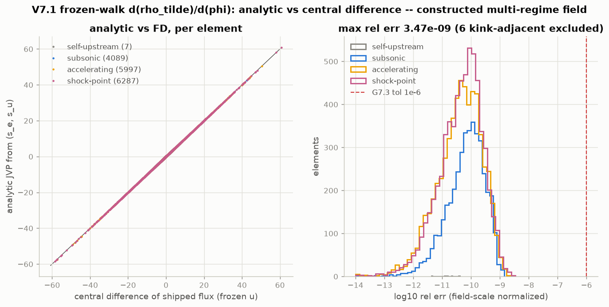
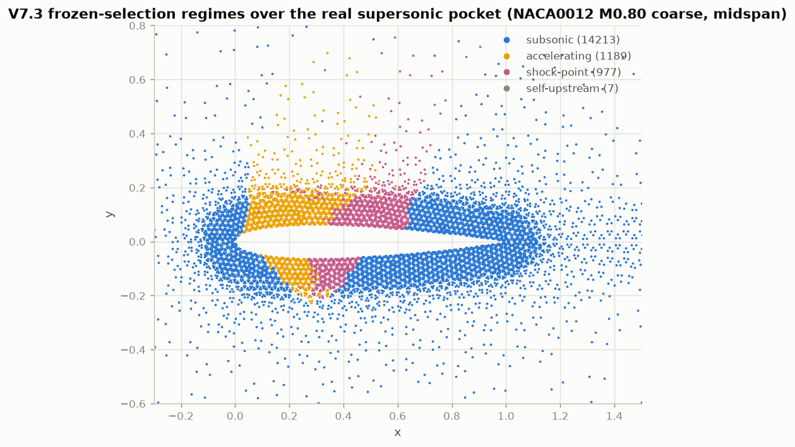
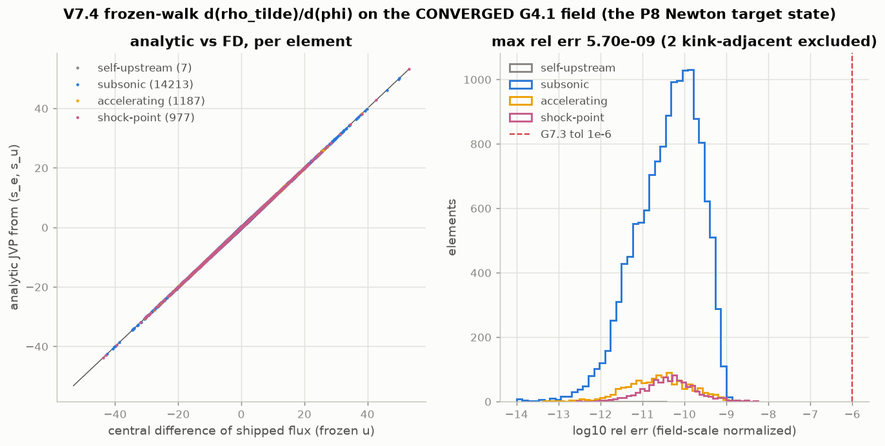

**Measured results (gate < 1e-6).**

| field | max rel err | regimes exercised |
|---|---|---|
| structured cube, 4 fields (`tests/test_p7_diff_flux.py`) | **3–5e-10** | subsonic / accelerating / shock-point / self-upstream / floored |
| constructed multi-regime, NACA coarse 16.4k elements | **3.5e-9** | 4.1k subsonic / 6.0k accelerating / 6.3k shock-point |
| **converged G4.1 M0.80 field** (the P8 target state) | **5.7e-9** | pocket = 1189 accelerating + 977 shock-point, M_max 1.3729 |

**Conclusion & analysis.** The derivative is exact to FD-noise level in every
frozen-selection branch, including on the real converged transonic field — the
P8 Newton Term-2/Term-3 physics factor is in place, sparse (~+1 upstream
element/row), with the forward P4/P5/P6 paths bit-identical (suite 165 passed +
4 skipped + 2 xfailed). Two findings worth their record: (1) **sign
arbitration** — the FD gate settled the design.md §6.3 chain to
`dμ/dM² = +M_c²/M⁴` (the doc's "−" was a transcription typo, fixed); (2) the
**C⁰ kink locus is real but measure-zero in practice** — an FD probe straddling
the max(ν_e,ν_u) tie or the switch threshold reads a branch *average* (~1e-5
apparent error, not a bug); on generic fields only 0.04 % of elements (2/16.4k
on the converged field) sit inside the ε-neighbourhood, but symmetry-degenerate
(separable) fields on structured/prism-split meshes park whole element slabs
exactly on the tie — the measured trap is documented in the test docstrings,
and any future FD check must use generic/noise-broken fields. Demo:
`cases/demo/p7_diff_flux/` (7/7 PASS incl. the gated converged-field part).

---

## P8 — fully-coupled Newton (closed 2026-07-11: G8.1 + G8.2 + G8.3)

**Purpose.** Replace the Picard/secant iteration with a fully-coupled
(φ_red, Γ) Newton on the exact Jacobian (design.md §6.3 at frozen selection,
§8.1 coupled system): quadratic convergence to the actual discrete solution,
Kutta closed as an unknown (no secant–density coupling — the P5 instability
class), and the speed to retire the ~10⁴-iteration Picard budgets.

**What was built.** N2: `kernels/jacobian.py::assemble_newton_jacobian` —
Terms 1+2 fused on the shared Picard CSR pattern, Term 3 (upstream coupling,
graph-distance ≤ 4) as active-set COO rebuilt per step; JVP FD-verified to
~1e-10. N3/N4: `solve/linear.py::solve_gmres` + `solve/newton.py` — one shared
`eval_residual` path, exact δΓ elimination with the far-field vortex column
FD-guarded, GMRES+AMG and **direct (splu + Woodbury)** linear paths. N5: the
transonic robustness chain — **direct exact steps** (the shock-position soft
mode stiffens under refinement; η-accurate Krylov steps stall: measured
frozen-system residual flat at 3.7e-6 with GMRES converging to η),
**stall-adaptive freeze** of the upwind assignment with **active-set refresh**
(the 2.5D prism-split mesh parks ~10³ elements in the max(ν_e,ν_u) near-tie
band — the P7 kink trap in Newton form; live Newton limit-cycles there,
measured branch flips 300–800/step), two-cycle acceptance with the honest
`residual_unfrozen` floor, and freeze-revert / level-fail-fast /
best-of-tried-line-search safety nets.

**★ Baseline findings (user-arbitrated 2026-07-11; roadmap P4 erratum).**
(1) The P4 Picard "engineering-converged" states are **not discrete
solutions**: the coupled Newton residual at the committed coarse M0.80/α1.25
state is **2.2e-4**, and Newton started from it walks in 6 quadratic steps to
the true solution — **shock 0.658, cl 0.459, M_max 1.408** (dissipation-scan
robust, continuation-path independent to the last bit). (2) On the medium
mesh the solution family steepens into the **FP non-uniqueness fold**:
Newton-converged M0.775 → shock 0.570/cl 0.396 (residual 1.8e-13), M0.7875 →
shock 0.674/cl 0.523 (7.9e-11); **no reachable isolated solution at M0.80**
(M_max ≈ 1.45, beyond the isentropic validity envelope — conservative FP
over-lifts strong-shock cases vs Euler, Holst PAS 2000). G8.1 was therefore
re-specced to coarse M0.80 + medium M0.7875 with regression-lock physics
bands; `cases/reference_data/naca0012_m080/` untouched (hard rule 6).

**Key figures.**

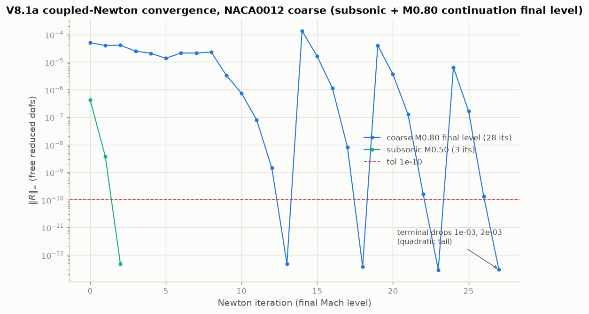
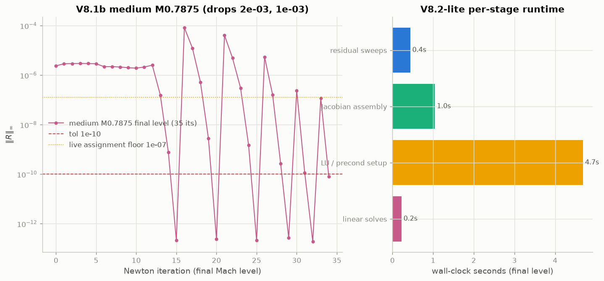

The sawtooth in both convergence plots is the freeze-refresh cycle working as
designed: each frozen phase collapses quadratically to ~3e-13, the live
re-evaluation jumps to the current assignment-staleness level, and the refresh
contracts it (measured stale counts 693 → 81 → 2 → 0 at M0.70 medium) until
the assignment is self-consistent or its intrinsic discontinuity floor
(~1.3e-7 on medium, reported honestly) is reached.

**Measured results (demo 15/15 PASS, `cases/demo/p8_newton/`).**

| check | value | criterion |
|---|---|---|
| subsonic cl Newton vs P3 Picard | 1.4e-7 | < 0.5 % |
| coarse M0.80 terminal residual / quadratic drops | 3.0e-13; 1.3e-3, 1.8e-3 | < 1e-9; both < 3e-2 |
| coarse shock / cl (regression lock) | 0.6581 / 0.4590 | 0.658 ± 0.012 / 0.459 ± 0.010 |
| coupled Kutta closure \|F\| | 8.3e-17 | machine (secant era: ~1e-4) |
| medium M0.7875 terminal residual / drops | 7.8e-11; 1.7e-3, 1.0e-3 | < 1e-9; both < 3e-2 |
| medium shock / cl (regression lock) | 0.6738 / 0.5234 | 0.674 ± 0.012 / 0.523 ± 0.010 |
| assignment-discontinuity floor (honesty) | 1.3e-7 | < 1e-5, reported |
| medium gate run end-to-end | ~100 s | Picard G4.1 medium: 16m39s, non-solution |

**N6 addendum (2026-07-11) — ONERA M6 + performance, G8.2/G8.3 closed.**
The M6 medium (63k nodes / 351k tets) Newton run at M0.84/α3.06 is
**249.2 s end to end** (mesh+cut 7.3 s, solve 239.8 s, forces + 3 section
shocks 2.1 s) against the 300 s gate — vs 4539 s for the P5 Picard recipe;
the coarse mesh takes 42 s. Both meshes have a reachable isolated Newton
solution at the full M0.84 (the FP-fold contingency planned for this run
never triggered): every continuation level converges with zero dm-halving,
the frozen phases end terminal-quadratic (medium final level
2.6e-7 → 2.1e-10 → 7.0e-15), 0 limited/floored, coupled Kutta |F| ~2e-16.

Two ingredients close the runtime gate: the **lagged-LU direct mode**
(`direct_refactor_every` — on a true-3D mesh the LU fill makes each splu
~18.6 s at 63k dofs, ~100× the thin 2.5D cost, and the every-step-direct
N5 recipe spent 1606 s, 97% in splu; the lagged mode refactors once per
level and drives the steps between with GMRES on the fresh coupled operator
preconditioned by the stale LU at rtol 1e-8, falling back to refactor +
exact Woodbury if GMRES fails — same solution, 6.4× faster) and the P5
**dm=0.05 Mach schedule** (the M6 family is far from the NACA-medium fold).

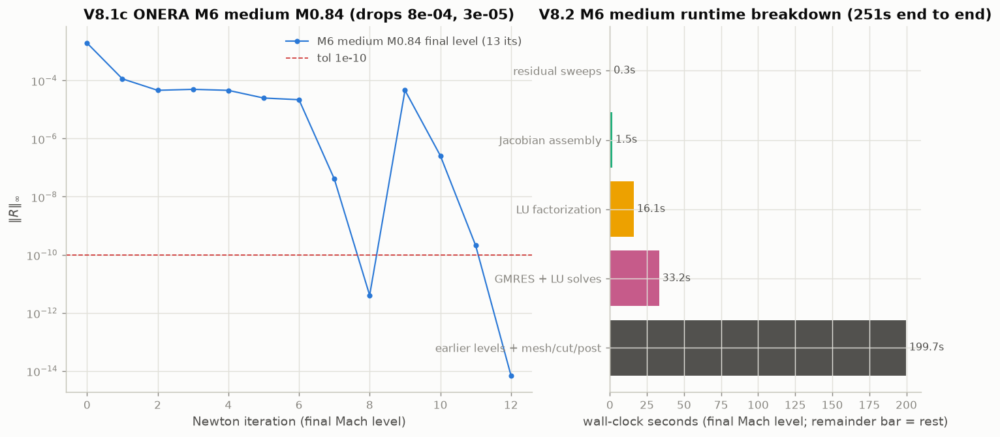

**P5-caveat measurement** (the recorded follow-up to the P4 erratum): the
committed P5 Picard states are not discrete solutions either, but the
failure is milder in degree — Newton residual 8.6e-6 coarse / 7.6e-6 medium
(Kutta |F| ~5.5e-4) vs the P4 stall's 2.2e-4. The Newton true solutions:

| quantity | P5 Picard (committed) | Newton true solution |
|---|---|---|
| cl_p coarse | 0.2419 | **0.2560 (+5.8%)** |
| cl_p medium | 0.2453 | **0.2646 (+7.9%)** |
| cl_KJ medium | 0.2499 | 0.2692 |
| shocks η44/65/90 (medium) | 0.594/0.526/0.345 | 0.596/0.541/0.362 |
| M_max (medium) | 1.995 | 2.13 |
| Kutta \|F\| | 5.8e-4 (secant+polish) | ~2e-16 (coupled unknown) |

The under-convergence lives in the circulation/lift, not the shock
positions. cl_KJ 0.2692 narrows the inviscid-vs-Tranair/KRATOS (0.288) gap
assigned to P9 from 0.043 to 0.019. The P5 gates stand as Picard-quality
gates (roadmap P5 ledger note).

**G8.3**: the default regression suite is **301.66 s (5m02s)** at
NUMBA_NUM_THREADS=16 — 182 passed + 8 skipped + 2 xfailed; every heavy
transonic/M6 gate sits behind PYFP3D_TRANSONIC_GATES=1.

**Conclusion.** P8 closed: G8.1 terminal quadratic convergence on both gate
cases with the FD-verified Jacobian (rel ~1e-10 on the converged pocket),
G8.2 M6 medium end to end in 249.2 s < 5 min, G8.3 CI budget 5m02s < 10 min.
The production path for a 3D transonic case is now: Picard warm levels +
coupled Newton finish, ~18× faster than the Picard recipe and converging to
the actual discrete solution.

---

## P8 capability assessment — cross-case evaluation demo (2026-07-11, NOT a gate)

**Purpose.** Post-P8 stock-taking requested by the user: run the production P8
Newton solver over the geometry × mesh matrix and measure, in one reproducible
place, (a) convergence behaviour (residual, Kutta closure, circulation → KJ
lift, per Mach level — using the new `gamma_history`/`level_results` solver
instrumentation added for this demo, additive keys only, suite bit-unchanged
at 182+8+2), (b) section-Cp accuracy against the available references, and
(c) end-to-end cost — as the evidence base for choosing the next track (curved
walls vs Track V viscous vs Track B level-set wake; on 2026-07-11, after this
demo, the user inserted the P9 discrimination phase and the P10
Newton-usability phase — curved walls are now P11, backlog P12). This demo asserts
convergence quality and regression locks but does NOT close or claim any
roadmap gate. Demo: `cases/demo/p8_capability/` (part 1 NACA coarse always;
the full matrix under `PYFP3D_TRANSONIC_GATES=1`, ~23 min with the 16-thread
cap `NUMBA_NUM_THREADS=16 OMP_NUM_THREADS=16 OPENBLAS_NUM_THREADS=16`).

**Case matrix and measured results (36/36 PASS, `results/checks.csv` +
`results/summary.csv`).**

| case | mesh (nodes/tets) | condition | levels / Newton steps | final ‖R‖∞ | Kutta ‖F‖ | cl_p (cl_KJ) | shock x/c | end-to-end |
|---|---|---|---|---|---|---|---|---|
| NACA sub | coarse 5.6k/16.4k | M0.50/α2.00 | 1 / 2 | 4.7e-13 | 0 | 0.2776 (0.2781) | — | 3.6 s |
| NACA sub | medium 20.9k/61.8k | M0.50/α2.00 | 1 / 2 | 2.1e-13 | 0 | 0.2844 (0.2844) | — | 13.6 s |
| NACA tr | coarse | M0.78/α1.00 | 5 / 29 | 8.3e-11 | 0 | 0.2626 (0.2658) | 0.486 | 4.1 s |
| NACA tr | medium | M0.78/α1.00 | 9 / 252 | 2.0e-13 | 0 | 0.3238 (0.3257) | 0.555 | 54.1 s |
| NACA tr (fold attempt) | coarse | M0.78/α1.25 | 5 / 35 | 2.2e-11 | 0 | 0.3399 (0.3445) | 0.522 | 4.4 s |
| NACA tr (fold attempt) | medium | M0.78/α1.25 | 7 / 194 | 2.1e-11 | 0 | 0.4339 (0.4372) | 0.602 | 44.2 s |
| ONERA M6 | coarse 11.0k/55.5k | M0.84/α3.06 | 4 / 35 | 6.9e-12 | 1.7e-16 | 0.2560 (0.2621) | 0.600/0.573/0.429 | 13.4 s |
| ONERA M6 | medium 63.2k/350.7k | M0.84/α3.06 | 4 / 47 | 7.0e-15 | 2.1e-16 | 0.2646 (0.2692) | 0.596/0.541/0.362 | 256.5 s |

All eight runs: 0 limited / 0 floored, Kutta closed to machine precision
(secant era: ~1e-4), terminal super-linear collapse (assessment band 5e-2 on
the best consecutive drop pair; the G8.1 gate cases keep their 3e-2 in the
gated tests — the one 3.7e-2 pair, NACA coarse α1.0, is a warm start already
at 6e-6 leaving only a 2-step tail: 1.64e-7 → 8.3e-11). Subsonic reference:
corrected 2D panel bracket [PG 0.2788, KT 0.2919] — medium 0.2844 inside the
bracket, −0.3% of the midpoint (P3 G3.2 semantics); coarse −2.7%. M6 medium
reproduces every G8.2 regression lock (cl_p 0.2646, shocks 0.596/0.541/0.362,
M_max 2.129, 257 s < 300 s).

**★ Fold-zone grid-sensitivity finding (the user's contingency ladder
exhausted).** The NACA transonic pair was specified SAME-condition
M0.78/α1.25 on both meshes with an α→1.0 fallback if the FP fold interferes.
Both meshes converge cleanly at BOTH alphas — but to points far apart on the
fold-steep solution family: α1.25 coarse shock 0.522/cl 0.3399 vs medium
0.602/0.4339 (Δcl 0.094); after the rule-mandated rerun, α1.0 STILL gives
0.486/0.2626 vs 0.555/0.3238 (Δcl 0.061 > the 0.05 comparability band). This
is the G8.1 fold finding in grid form: the measured family slope dcl/dM ≈
6–10 in the M0.775–0.80 zone means O(h) discretization differences act like
an O(0.01) M∞ shift — same-condition grid comparison is intrinsically
ill-conditioned near the fold, and NONE of the four states is a solver
failure (all are true discrete solutions, terminal-quadratic, 0 lim/flr).
The demo therefore regression-locks each mesh's own Newton solution
(±0.012 shock / ±0.010 cl, G8.1 semantics) instead of asserting a
grid-convergence band, and reports both attempts (`summary.csv`; the α1.25
pair is the dashed overlay in the Cp figure). Contrast: away from the fold
the grid behaviour is benign — M6 M0.84 coarse→medium moves cl_p by only
0.0086 and the η0.44 shock by 0.004. The medium α1.0 run also exercised the
N5 robustness chain for real: 9 levels / 252 Newton steps with dm-halving
retries visible in the convergence figure, still finishing at 2.0e-13.

**Key figures.**

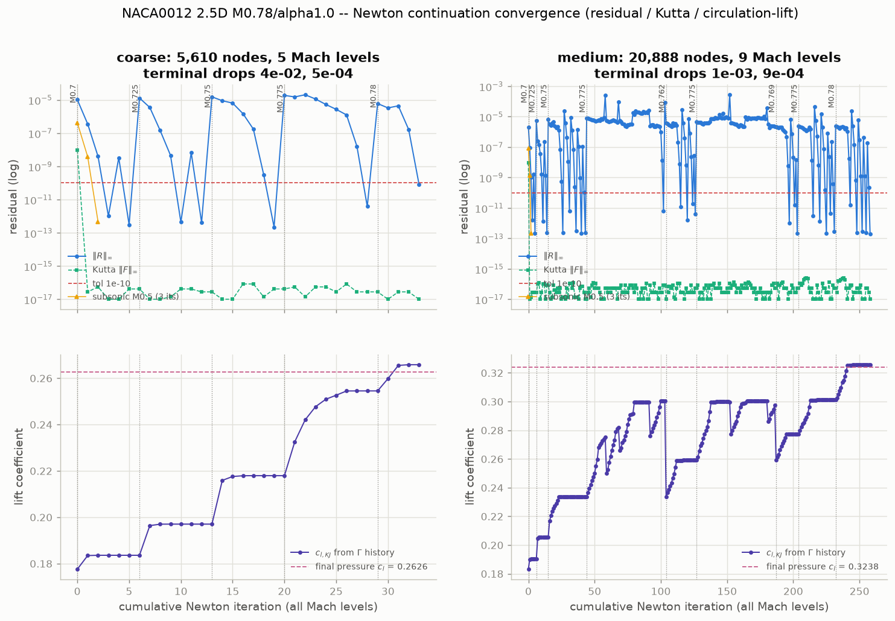

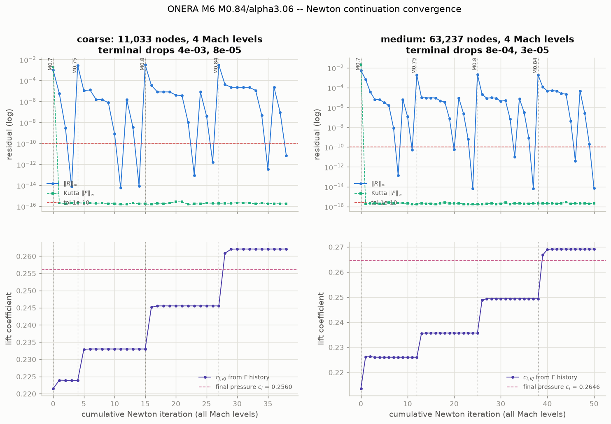

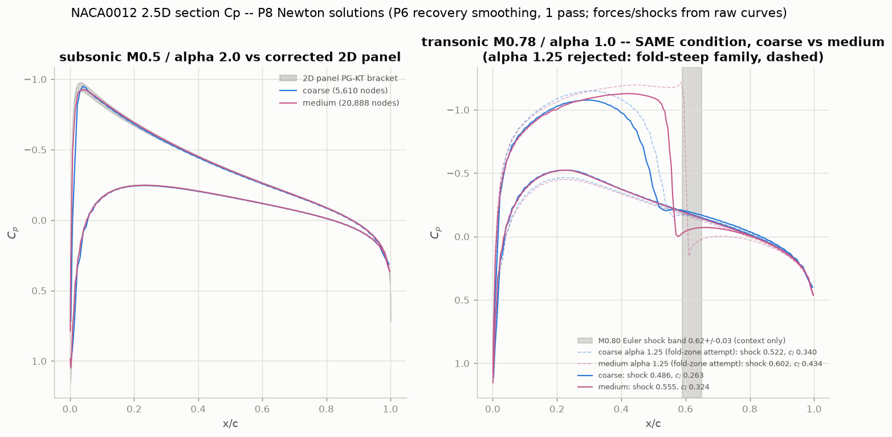

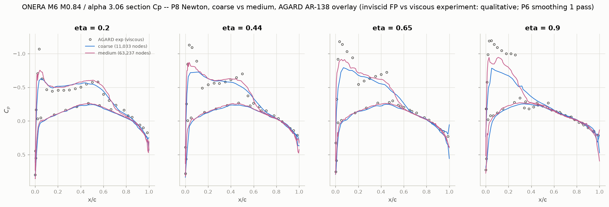

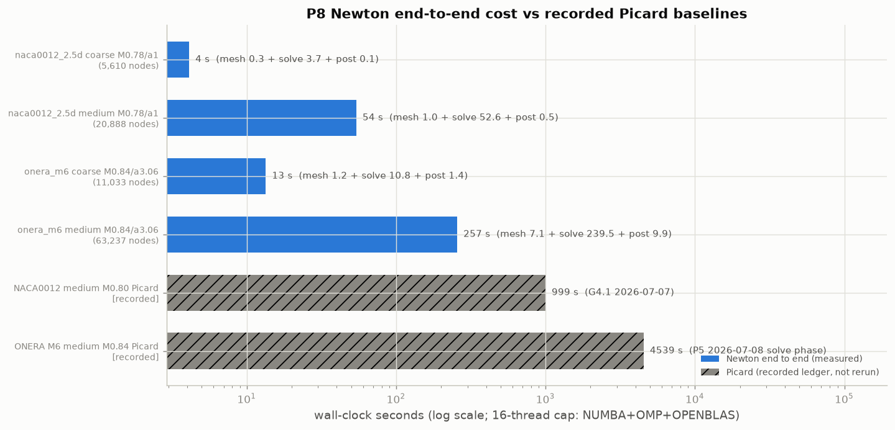

Presentation notes: Cp curves are plotted with the P6 normal-gated recovery
smoothing (1 pass); forces and shock/regression locks are measured on raw
curves (G6.3/G8.2 protocol). The M6 lift-convergence panels make the V6 gap
directly visible: cl_KJ (from Γ) settles ~2% above the pressure-integrated
cl_p on both meshes. The M6 coarse tip section (η0.90) smears the double
shock the medium mesh resolves — expected at 11k nodes.

**Timing.** Newton end-to-end (mesh+cut / solve / post): NACA medium 54.1 s
(1.0/52.6/0.5), M6 coarse 13.4 s (1.2/10.8/1.4), M6 medium 256.5 s
(7.1/239.5/9.9) — vs the RECORDED Picard ledger baselines (not rerun, cost
rule): NACA medium M0.80 G4.1 999 s to a state the P4 erratum showed is NOT
a discrete solution, and M6 medium P5 solve 4539 s with Kutta |F| 5.8e-4 —
~17.7× the Newton end-to-end that closes Kutta to 2e-16.

**Honest capability boundaries (assessment).**

1. **No non-lifting Newton path**: `solve_newton_lifting` structurally
   requires the wake cut + Kutta/Γ block — a sphere cannot even build the
   `(mesh_cut, wc)` pair (`cut_wake` raises without a wake group).
   Non-lifting bodies run Picard (`solve_laplace`/`solve_subsonic`, P1/P3
   demos) and carry the OPEN G1.6 flat-facet sphere-Cp gap (~11.6% vs the
   2% gate, refinement-saturating ~3.6% at 7M tets; root-caused geometry
   variational crime → P11 curved walls; the missing Newton entry itself is now
   P10/G10.1). The sphere is deliberately absent from this
   Newton demo (user arbitration 2026-07-11).
2. **V6 lift floor (P11 curved walls; attribution under P9 test)**: M6 medium cl_KJ 0.2692 vs the Tranair/KRATOS
   inviscid reference 0.288 — the remaining 0.019 is the sharp-TE/LE P1
   wall O(h) floor (P5/P8 evidence), visible in this demo as the ~2%
   cl_KJ-over-cl_p offset.
3. **Fold-zone conditions are certification-hostile** (finding above):
   single-mesh numbers near the FP fold are not mesh-converged engineering
   data; report them with the family-slope context or move off the fold.
4. **cd_p untrusted** (FP pressure drag on P1 walls, ~15% recovery
   sensitivity — P6 record); not asserted anywhere in this demo.
5. **Viscous effects absent**: the AGARD overlay is qualitative; VII
   (Track V, designed) moves CL down toward experiment (~0.26–0.27) and
   does NOT close the 0.288 inviscid gap (that belongs to P11 curved walls,
   pending the P9 discrimination).

**Development outlook (evidence from this demo; the user arbitrates the
order).**

- **Curved walls (now P11)** attacks the only two measured ACCURACY gaps — G1.6
  (11.6% sphere Cp) and V6 (cl_KJ 0.019 below the inviscid references) —
  both root-caused to the flat-facet P1 wall. Highest leverage on
  reference-matching; medium-high risk (own effort, roadmap).
- **Track V (VII/IBL)** adds the missing physics for absolute CL/CD against
  experiment (the M6 Cp overlays in this demo show exactly the inviscid
  offsets it would shrink); V1 is parallelizable with the accuracy phases, V3 consumes the
  P8 Newton machinery.
- **Track B (level-set wake)** buys geometry flexibility (M2 wing-body);
  no accuracy payoff on the current case set.
- **Discrete adjoint (backlog, now P12)** is cheap to open now: the exact P8 Jacobian +
  `reduce_operator` machinery is the transpose seed; note the fold finding
  also warns that fold-zone gradients will be ill-conditioned.
- The `gamma_history`/`level_results` instrumentation added here is the
  natural hook for all of these (convergence dashboards, VII coupling
  monitors, adjoint checkpointing).

---

## P10 (partial) — G10.2 level-adaptive intermediate continuation tolerance (closed 2026-07-11; G10.1 still open, so the phase stays open)

**Demo:** `cases/demo/p10_newton_usability/run_ab_g102.py` (one-shot A/B
evidence, not a suite test; 16-thread timing protocol). Result: **34 PASS +
6 XFAIL** — the XFAILs are the *documented negative result* for the
fold-zone case, not open defects.

**What shipped** (`pyfp3d/solve/newton.py`): `solve_newton_transonic`
gained the opt-in `intermediate_tol` (default None = bit-identical,
suite-locked); `solve_newton_lifting` gained the loose acceptance
criteria `tol_residual_loose` / `tol_residual_rel` / `accept_on_stall`
(all default off) and reports `accept_reason`
("tol"/"loose_tol"/"rel_drop"/"stall") per solve and per level. Loose
acceptance keeps the 0-limited/0-floored and ‖F‖ guards, requires ≥ 1
Newton step at the level, and never applies inside a frozen phase; only
ORIGINAL-SCHEDULE intermediate levels run loose — the final level and
every dm-halving retry level keep the full strict tol-1e-10 +
freeze/honesty machinery. Suite +2 (`tests/test_p10_continuation.py`);
baseline **184 passed + 8 skipped + 2 xfailed**.

**A/B on the two committed recipes** (`results/summary.csv`,
`results/levels.csv`, `results/*_ab.png`):

| case | default | adaptive (`intermediate_tol=1e-5`) | verdict |
|---|---|---|---|
| ONERA M6 medium M0.84/α3.06 (`NEWTON_M6_RECIPE`) | 239.5 s, 47 steps (intermediate levels 11+12+12) | **140.3 s (+41.4%)**, 18 steps (3+1+2 loose, ending ~1e-5) — final level IDENTICAL: 12 steps, ‖R‖ 7.8e-15, cl 0.2646 / M_max 2.129 / shocks 0.596-0.541-0.362 equal to 4 digits, all G8.2 locks PASS | **PROMOTED** into `NEWTON_M6_RECIPE` (≥ 15% criterion met; gated G8.2 now ~145 s) |
| NACA0012 medium M0.7875/α1.25 (`NEWTON_TRANSONIC_RECIPE`, fold zone) | 79.1 s, 403 steps, 6 dm-halvings, converges 7.8e-11 | ends UNCONVERGED at 4.3e-6: cl 0.369 vs lock 0.523, shock 0.535 vs 0.674 | **NEGATIVE result recorded** — recipe unchanged |

**The fold-zone failure mechanism (the pre-registered P8 trap, now
measured).** Round 1 exposed a degenerate path: warm-started levels ENTER
below any absolute threshold (~2-9e-6 here), so the naive ‖R‖ ≤ 1e-5
clause accepted intermediate levels with ZERO Newton steps — the ramp
becomes a level skip. Two hardenings were added and kept (≥ 1 step
required; dm-halving retries strict), after which the loose ramp does 1–4
steps/level — but near the fold (dcl/dM ≈ 6–10) that still never tracks
the circulation: the final level arrives with an untracked Γ seed and
stalls at the ~5e-6 live-churn floor for the full 60-step budget, and so
do the STRICT retry levels warm-started from the same loose state (round
2: 0.7812 and 0.7781 both 60 steps, no convergence — a strictly
re-converged level cannot repair the seed within budget either).
Conclusion: **loose intermediates are contraindicated in fold zones**;
away from folds (M6 class) they are pure profit. This is the P8 N2–N4
"warm-start only from CONVERGED levels" warning in its G10.2 form, and it
is why the promotion is per-recipe.

**G10.3 no-ramp direct-solve feasibility (closed 2026-07-11; verdict: KEEP
the Mach ramp).** `run_g103_noramp.py` (9 PASS; `results/g103_noramp.csv`,
`g103_summary.csv`, `g103_noramp_convergence.png`): single-level Newton at
the target M∞, seedings s1 = Picard-5 / s2 = Picard-40, four cases.
Measured answer to "what is the ramp actually buying":

| case | s1 (Picard-5) | s2 (Picard-40) |
|---|---|---|
| M6 coarse M0.84 | **A** — same solution, 5.9 s vs ramp 8.0 s, but clamped transient (peak 11) | **A**, clamp-free, 11.0 s (−37% vs ramp) |
| M6 medium M0.84 | **A** — same solution (cl 0.2646, ‖R‖ 6.6e-15), **79.0 s vs ramp 141.4 s (+44%)**, but clamped transient (peak 45; final 0/0) | **A**, clamp-free, 132.0 s (+6.6%) |
| NACA coarse M0.80 | A — 4.0 s (clamped transient + 1 freeze revert; single-case exception) | **C** — the un-continued Picard-40 seed itself diverges (1625 lim/138 flr, M_max at the 3.0 cap) |
| NACA medium M0.7875 (fold) | **C** — stalls at 4.6e-6, cl 0.449 ≠ lock 0.523 | **C** — seed diverges (9934 limited) |

Findings: (1) **far from the fold, branch selection is not the binding
constraint** — no-ramp converges to the identical solution under both
seedings; the ramp's measurable value there is a clamp-free transient.
(2) No seeding satisfies the pre-registered promotion rule (s1 fails the
clamp-free clause despite +44%; s2 is clamp-free but under 20%), so
**no recipe change** — the +44%-but-clamped observation is recorded for
user arbitration if the clamp-free clause is ever to be relaxed.
(3) **Deep Picard seeds are actively harmful without a ramp** (both s2
fold-zone divergences) — consistent with the P4/P5 record that Picard
itself needs continuation at supercritical M∞. (4) Fold-zone no-ramp
fails on medium regardless of seeding — the ramp stays, everywhere, as
shipped. Instrumentation added: `clamp_history` on `solve_newton_lifting`
(additive key).

## P9 — grid-convergence & accuracy-gap discrimination (closed 2026-07-11; G9.3 verdict awaits user arbitration)

**Demo:** `cases/demo/p9_grid_discrimination/run_demo.py` — **11 PASS + 3
XFAIL**, where the XFAILs ARE the result (the fine-mesh failure, with its
root cause), not open defects. The M6 fine solution is npz-cached locally
(gitignored, like P5's); the committed CSVs/PNGs are the evidence.

**The phase asked:** is the 0.019 M6 lift gap (cl_KJ 0.2692 vs
Tranair/KRATOS 0.288) resolution, or a sharp-TE/LE flat-facet floor?
**The answer:** the question was mis-posed — the gap is **unsplittable as
posed**, because the 3D sequence does not converge, and the reason it does
not converge is a *different* defect than either candidate.

### G9.2 (PASS, clean) — a sharp TE imposes NO lift floor

NACA0012 2.5D, M0.5/α2, coarse→medium→fine, all three converged
(|R| ≤ 4.4e-11). Error vs the corrected-panel PG–KT midpoint:

| level | tets | cl | \|error\| |
|---|---|---|---|
| coarse | 16 386 | 0.2776 | 2.71% |
| medium | 61 788 | 0.2844 | 0.33% |
| fine | 239 022 | 0.2853 | **0.03%** |

Monotone to well inside the ±1% clause. **The 2D leg of the
"sharp-TE/LE P1 wall gradient" attribution is gone.**

### G9.1 (INVALID) — ★ the fine mesh is not a discrete solution

| level | tets | converged | cl_KJ | M_max (unlimited) | cells over M_cap=3 |
|---|---|---|---|---|---|
| coarse | 55 531 | yes (6.9e-12, 0/0) | 0.2621 | 1.40 | 0 |
| medium | 350 718 | yes (7.1e-15, 0/0) | 0.2692 | 2.13 | 0 |
| fine | 2 513 255 | **NO** (1.1e-5, 1 limited) | *0.2393* | **7.93** | **9** |

The fine Newton limit-cycles at ‖R‖ ~ 1e-5 for its entire 60-step budget:
permanently speed-limited cells block the N5 freeze machinery (which
requires 0 limited/floored to engage), so the assignment churn never
freezes. Its cl_KJ (0.2393, italic above) is a **limit-cycle artifact, not
a lift** — with only two discrete solutions there is no three-point
Richardson, so the pre-registered bands (≥ 0.283 / ≤ 0.278) **cannot
fire**. Nothing was fabricated: `verdict.csv` records the extrapolant and
both attribution shares as `n/a`.

**★ Where the singularity is — this is the phase's real finding.** All 9
capped cells sit at:

- **z/b = 0.998–1.000** — the wing tip,
- **x − x_TE = +0.002 … +0.017** — *aft* of the trailing edge (so **not on
  the wing at all**),
- **|y| < 0.003** — in the chord plane, i.e. **on the wake sheet**,

that is, at the **free tip edge of the rigid planar wake sheet**, exactly
where `Γ(tip) = 0` is enforced (M1: tip free edges stay single-valued).
This is the classical **vortex-sheet-edge singularity**: a flat sheet of
trailing vorticity (strength −dΓ/ds, largest at the tip where the wing
unloads fastest — **not** the bound Γ, which correctly → 0 there) that
simply *ends* induces a **1/√r flat-plate-edge** velocity at its free edge
(**corrected from the earlier "1/r-type"** — P13/G13.1 measured the
conforming refinement exponent p ≈ 0.59, i.e. 1/√r; a 1/r line vortex would
give p = 1), whereas the real flow rolls the sheet up into a tip vortex.
P5's "bounded tip-TE-corner
P1 overshoot" (M_max 1.995 on medium, recorded then as *the only surviving
singularity trace*) is the **same object**, seen at a resolution too coarse
to reveal that it is unbounded: refinement makes it **worse** (1.40 → 2.13
→ 7.93), not better.

**⇒ It is a WAKE-MODEL defect, not a wall-element defect.** Curved or
isoparametric *wall* elements cannot remove the edge of a wake sheet.

### G9.3 — attribution verdict (user arbitrates)

1. The 0.019 gap **cannot be split** by grid convergence: the 3D sequence
   does not converge.
2. **2D sharp TE: exonerated** (G9.2). **3D blocker: the rigid planar
   wake's tip edge** (G9.1).
3. **Recommendation:** **P11 (curved walls) is not supported by P9 as the
   3D-lift fix.** Its remaining justification is **G1.6** (sphere-Cp on a
   *smooth curved* wall — a different, still-valid mechanism). The 3D
   accuracy route now points at the **tip/wake treatment**: wake **roll-up**
   or an explicit **tip-vortex** model — which must land before *any* 3D
   grid-convergence claim is possible.

   ★ **Correction 2026-07-12 (this was over-stated as "P9 corroborates the
   Track B route").** Track B's level-set wake changes the wake
   *representation*, not the rigid-planar-sheet *model*: it keeps the same
   sheet ending at the tip with Γ(tip)→0. The `cases/demo/p13_tip_edge_singularity/`
   probe (subsonic M0.5, no limiter — the clean geometric test) measures the
   tip-edge peak Mach **diverging under refinement on BOTH the conforming and
   level-set paths** (same mesh, coarse→medium: ×1.38 conforming, ×2.28
   level-set — ★ **ERRATUM 2026-07-14**: the LS ×2.28 is the `element_mach2`
   mixed-plain ×5 metric artifact retired at the B8 re-spec diagnosis; honest
   LS exponent +0.62 ≈ conforming +0.52, both still diverge, see §B8), while
   the wing control stays flat. So Track B does **not** fix
   this singularity; only a genuinely new wake model (roll-up / tip vortex)
   does, and **no current Track B phase does that** (B9 free-wake is shelved,
   and is about O(θ²) deflection rather than roll-up). What Track B *does*
   eliminate is the separate **secant/Kutta-closure** family of M6 defects (the
   P5 st133 stall, the swept-TE probe-sharing degeneracy, the Γ(z) spanwise
   jitter, the far-field branch-ray artifact) — see the B7 section.

### Solver-path findings recorded en route (feed P10; no default changed)

- **`precond="direct"` does not scale to the fine mesh.** A *single* `splu`
  at ~450k dofs ran **4 h 39 min without returning** (RSS 26 GB) and was
  killed — vs **18.6 s** per factorization on medium (63k). True-3D LU fill
  is the wall; this is the N6 finding one mesh level further.
- **The `precond="amg"` fallback is valid *and faster than direct at every
  size* — once the Eisenstat–Walker forcing is tightened to η = 1e-8.**
  Validated against the G8.2 locks on medium *before* spending the fine
  budget: **66 s vs 141 s** direct, same solution to 4 digits (cl 0.2646,
  M_max 2.129, shocks 0.596/0.541/0.362), terminal quadratic in the frozen
  phase, 0 GMRES stalls; coarse **8 s vs 42 s**. N5's "Krylov steps stall on
  the shock-position soft mode" is a property of the **loose default
  forcing**, not of AMG — a candidate P10 recipe change.
- **The fine mesh's cold Picard seed overshoots the LE into the density
  floor.** A cold M0.70 Picard-5 seed lands 4036 speed-limited + 1847
  density-floored cells; level-0 Newton then stalls at ‖R‖ ~ 6e-2, and since
  level 0 cannot dm-halve, the *whole* solve breaks (a M0.50 cold seed still
  floors 658). Fixed at **continuation-path level only** — `m_start = 0.30`
  (deep subcritical, where a crude seed cannot reach the floor) plus
  `n_picard_seed = 12` — giving a clean 0/0 start; the ramp then carries it
  up in 13 levels, **5294 s (88 min)**, inside the 2 h budget. Path changes
  are safe by G8.2's continuation-path independence.

## P13/G13.1 — Tip / wake-edge singularity: characterization (`cases/demo/p13_tip_edge_singularity/`, 10/10, 2026-07-13)

*(This is the evidence for P13/G13.1 — roadmap.md Track P P13, design.md §4.1.
It began 2026-07-12 as the "wake MODEL vs REPRESENTATION" probe below; the
2026-07-13 update added the conforming **fine** third point, the refinement-rate
fit, and the dΓ/dz mechanism, closing G13.1.)*

**★ Rate + mechanism (P13/G13.1, 2026-07-13).** With the conforming **fine** M6
mesh added as a third point (coarse/medium/fine = 55.5k / 350.7k / 2.51M tets),
the tip-box peak Mach goes **0.712 → 0.981 → 1.510**, a log-log exponent
**p = 0.59** (peak ~ h^−p) — squarely in the flat-plate-edge band [0.4, 0.65],
i.e. **1/√r, not 1/r** (a 1/r concentrated line vortex would give p = 1). The
**driver is the trailing vorticity dΓ/dz**, not the bound circulation Γ: Γ → 0
at the tip (a necessary-not-sufficient regularity condition), but the *unloading
rate* |dΓ/dz| is largest at the tip (~10× mid-span on B7's smooth Γ(z)), and a
terminating flat vortex sheet cannot regularize its own free edge — exactly a
flat-plate leading/trailing edge at incidence. Within the same tip box the
**p95/mean stay flat** (0.573 → 0.562 → 0.525 / ~0.49) while the peak diverges —
the localized-edge signature. **★ And the conforming fine M∞0.5 solve does NOT
converge** (limited/floored cells, ~1.4k NaN): the tip singularity trips the
speed limiter / density floor **even subsonically**, so the fine mesh is not a
discrete solution — the exact M∞0.5 analogue of what G9.1 found transonically.
This **corrects the committed "1/r-type" phrasing** (this file above and
roadmap.md) to 1/√r and supplies the dΓ/dz mechanism. Figure `tip_edge_growth.png`
now overlays the measured p, the 1/√r (p=0.5) and 1/r (p=1) guide slopes.

**Original probe (2026-07-12): wake MODEL vs REPRESENTATION.**

**Why.** P9/G9.1 found the M6 transonic solve does not converge under refinement —
the unlimited local Mach at the wake sheet's free tip edge climbs 1.40 → 2.13 → 7.93
(coarse/medium/fine) and 9 cells cross the M_cap=3 limiter on the fine mesh, blocking
the Newton freeze machinery so the fine "solution" is a limit-cycle artifact. P9 called
it a vortex-sheet-edge singularity of the rigid planar wake and pointed at "the
tip/wake treatment (Track B / …)". One doc over-stated that as "precisely what Track B
exists to fix". This demo settles whether the Track B level-set **representation**
removes it, or whether it is a wake-**model** property present on any discretization.

**Method (the point is that it is cheap and clean).** Probe SUBSONICALLY (M∞ 0.5): no
shock, no artificial density, no speed limiter — nothing to confound the pure
potential-flow 1/r edge signal. Measure the peak local Mach in the P9 tip-edge box
(z/b > 0.95, at/just aft of the swept tip TE corner, chord plane) coarse→medium, on the
conforming path (`solve/newton.py`) and the level-set path (`solve/picard_ls.py`, both
the wake-embedded M1 and wake-free M4 meshes). **conforming-M1 vs level-set-M1 use the
IDENTICAL onera_m6 mesh** — a true same-mesh A/B of the representation change. A wing
box (x < x_TE, z/b < 0.95) is the control: the real, bounded flow.

**Result.**

| path | tip-edge M_max (levels) | growth c→m | exponent p | tip-box p95 (c→m) |
|---|---|---|---|---|
| conforming (M1) | 0.712 → 0.981 → **1.510** (fine ✗conv) | ×1.38 | **0.59** (3-pt) | ×0.98 (flat) |
| level-set (M1, same mesh) | 0.672 → 1.532 | ×2.28 | 1.34 (2-pt) | ×0.98 (flat) |
| level-set (M4, wake-free) | 0.661 → 1.151 | ×1.74 | 0.89 (2-pt) | ×0.93 (flat) |

> ★ **ERRATUM 2026-07-14 (B8 re-spec diagnosis).** The two level-set rows were
> read through `element_mach2`'s then-default mixed-plain "side" handling,
> which inflates beyond-tip mixed-side plain cells ×5 (elem 93977: side 1.532
> vs main 0.309). The HONEST LS exponent is **+0.62** (+0.37 excluding the
> straddler sliver) — the same object and magnitude as the conforming +0.52.
> The "LS ≥ conforming" magnitude comparison is RETIRED; the qualitative claim
> (the edge diverges on both paths) stands. See §B8
> (`run_b8_termination_diagnosis.py`, `b8_termination_diagnosis.csv`).

The tip-edge **peak** diverges on **all three** paths while the same-box
**p95/mean stay flat** — the signature of a *localized* edge singularity (only
the few cells at the very corner grow), seen with **zero transonic machinery**, so
it is a genuine potential-flow feature, not a shock/limiter artifact. (The bulk
"wing" interior is flat coarse→medium too; only the fine conforming wing *max* is
polluted by a separate sharp-TE edge cell — another P1 edge feature — so the clean
same-box control plotted is the tip-box p95.) The conforming three-point exponent
**p = 0.59** puts the growth in the **1/√r flat-plate-edge** band, not 1/r. The
level-set representation does **not** remove it: the honest LS exponent (+0.62,
per the erratum above — the raw "1.34 ≥ conforming 0.52" comparison is retired)
is the same object and magnitude as the conforming +0.52, and the LS peak
sits in the **+2.9% straddler cells** at/just beyond the geometric tip (z/b ≈ 1.01),
where the jump terminates mid-element.

**⇒ It is a WAKE-MODEL defect.** Track B changes the wake *representation*, not the
model (B7 keeps the same rigid planar sheet ending at the tip with Γ(tip)→0), so it
does **not** fix G9.1's cause. The model-level fix is wake **roll-up / an explicit tip
vortex**, which **no current Track B phase does** (B9 free-wake is shelved, and is about
O(θ²) deflection rather than roll-up). This corrects the earlier "P9 corroborates the
Track B route" framing. What Track B *does* structurally eliminate is the separate
**secant/Kutta-closure** family (P5 st133, probe-sharing, Γ(z) jitter, branch-ray) — see
the B7 section. Figure `tip_edge_growth.png` (log-log peak Mach vs 1/h, tip edge vs wing
control); heavy solves cache to `results/*.npz` (gitignored, ~20 min to regenerate).

---

## P13/G13.2 — Tip-edge desingularization: the spanwise loading taper (`cases/demo/p13_tip_edge_singularity/run_taper_probe.py` + `run_taper_physics.py`, 2026-07-13)

**The fix.** Taper the accepted circulation toward the tip,
`Γ_eff(z) = F(z)·Γ_Kutta(z)`, on the per-station Kutta target
(`constraints/wake.py::tip_taper_factors`; `solve_newton_lifting(tip_taper=…)`,
default `None` = bit-identical; reaches the transonic driver via `newton_kw`).
**Shipped model (user-arbitrated): `vanish_smooth` (smoothstep, compact
support), r_c = 0.05·b_semi.**

**★ The mechanism is DISCRETE — and it is neither roll-up nor a vortex core**
(both of which this report and design.md §4.1 previously proposed). The solver
never sees the continuum edge: it sees the **outermost TE station**, which
retains `Γ_last` and sheds it as a *concentrated vortex over the last cell*
(free-edge nodes are single-valued, so the jump falls to 0 in one element),
inducing `~Γ_last/h`. With `Γ_last ~ h^q`:

> **edge peak ~ h^(q−1)  ⟹  p ≈ 1 − q,  criterion q ≥ 1**

This predicts the baseline *exactly*: Γ~√u with u_last~h gives Γ_last~√h, i.e.
q = 0.44 measured ⟹ p_pred 0.56 against **p_meas 0.52**.

**★ The taper is amplified, not applied.** Γ is a fixed point of
`Γ = F·Γ_Kutta(Γ)`, and the Kutta map has slope b≈0.93 (P2), so
`Γ/Γ* = F(1−b)/(1−F·b)` — a taper of 0.8 yields **0.21×**, not 0.8× (test-locked).
This is why the measured q ≈ 3.3 far exceeds the naive exponent, and why r_c must
stay small.

**Result (M∞0.5, strict OFF-BODY edge box).**

| | coarse | medium | fine | p |
|---|---|---|---|---|
| untapered | 0.712 | 0.981 | 1.510 | **+0.592** |
| tapered | 0.567 | 0.565 | 0.570 | **+0.009** |

**★ The M6 fine mesh is now a GENUINE DISCRETE SOLUTION** (converged, 0 limited /
0 floored / 0 NaN) — exactly what P9/G9.1 could not achieve. Transonic **M0.84**:
coarse/medium converge 0-limited and the medium `M_max` drops **2.13 → 1.725**
(P5's "bounded tip-TE-corner overshoot" was the same object).

**The price, and that it is LOCAL** (`run_taper_physics.py`). cl_KJ falls
**−1.1…−1.6 %** (scaling with r_c: −0.70/−1.58/−3.27 % at r_c = 0.03/0.05/0.08 b).
But Γ(η), cl(η) and the sectional Cp are **unchanged inboard of η≈0.95** (inboard
circulation −0.51 %), and TE pressure closure at η=0.90 stays at the baseline
value (0.232 vs 0.218). The taper even makes cl *more* mesh-convergent than the
untapered baseline (+0.2 % vs +0.7 % coarse→medium — the untapered case is still
gaining spurious tip lift).

**★ The tanh form is disqualified — but not for the reason first argued.** It
*does* regularize (q ≈ 1.00, exactly the marginal case its s=0 predicts). It is
rejected for **unbounded support**: tanh never reaches 1, so it depresses F over
**57 of 83 stations** (inboard to η=0.77), costing **−7.4 % lift**, **−4.9 %
inboard circulation**, and **breaking TE pressure closure at η=0.90** (gap 0.972
vs baseline 0.218) — where there is no singularity to fix. A tip model must be
*local*; the tanh silently re-rigs the whole wing.

**★ A metric trap, found the hard way.** G13.1's tip box (z/b>0.95, dx ≥ −0.05)
admits WING cells. Once the edge is regularized, the box's max **migrates onto the
ordinary wing suction peak** at z/b≈0.95 and stops measuring the singularity —
making a *working* fix look like it made p *worse*. The edge must be measured
off-body (dx>0, z/b>0.98).

**Two pre-existing artifacts, confirmed taper-independent** (both user-flagged on
first sight of the figures): the Cp **sawtooth** is the **P6/G6.1 wall-gradient
recovery** artifact (`smooth_passes`, default 0 — slope reversals 40→2 when
enabled; the *raw* count is identical for all three tip models); the **Γ(η)
jitter** is conforming **Kutta-probe placement** on the unstructured swept TE (P5
known item; RMS d² 0.042 vs P5's 0.097 — the level-set path is 11–12× smoother by
construction, B7); and the **baseline TE Cp gap of 0.14–0.22** is the conforming
**potential-jump** Kutta (design.md 4.4) being only an approximation of true
pressure equality, plus the sharp-TE P1 floor — which is precisely why Track B's
B4 had to introduce the explicit nonlinear |q_u|²=|q_l|² Kutta.

**Open: the level-set clause.** Not a mechanical port — the LS path has **no Γ
DOF** and its TE row is **homogeneous** (`s·(q_u−q_l)=0`), so scaling it by F is a
**no-op**. The clean analogue blends the pressure-equality row with B2's
continuity weld (`F·K̂ + (1−F)·Ŵ = 0`), which is a *different model* needing its
own r_c calibration. Designed, not implemented.

**★ Honest gap — G13.3 is still blocked, by further causes.** All three M6 meshes
are now discrete solutions, so a Richardson is *mechanically* possible — but the
lift sequence is **not in the asymptotic range**: cl_KJ 0.2001 → 0.2005 → 0.2121,
i.e. increments **+0.2 % then +5.8 %**, which *grow*. **No extrapolation was run**
(P9/G9.3 discipline: report `n/a`, never fabricate). Removing the tip singularity
**revealed** the remaining problems rather than curing them — see the G13.3
section below, which localizes them (and **retracts** this section's first
reading, that the residual growth was "mid-span Γ ⇒ wing/LE resolution": the wing
interior turns out to be *converged*).

Demos: `run_taper_probe.py` (**16 passed + 2 xfailed**) and `run_taper_physics.py`
(**10 passed + 1 xfailed**). The xfails are the *documented negatives*, and they
are the point: `tanh_half` sits exactly on the criterion's knife edge (q = 1.00)
**and** is disqualified for unbounded support (it unloads the wing to η = 0.77);
`vanish_smooth` at r_c = 0.03 is under-regularized (p = 0.207 > 0.20) — which is
*why* the shipped r_c is 0.05. Tests: `tests/test_p13_tip_taper.py` (15).

---

## P13/G13.3 — The third singularity: a flat tip cap (`cases/demo/p13_tip_edge_singularity/run_g133_ladder.py`, 5/5, 2026-07-13)

G13.2 fixed the wake's free tip edge, and Track M (M1b) fixed the mesh ladder —
and the M6 lift sequence *still* is not asymptotic. Growing increments under
**uniform** refinement are the signature of a singularity still being resolved,
so a third object had to be there. A three-region box study on the self-similar
ladder `RICHARDSON_LADDER = (coarse_ss, medium, fine)` finds it, and it is **on
the wall, not in the wake**:

| region | coarse_ss → medium → fine | p | verdict |
|---|---|---|---|
| **tip-cap edge (WALL)** | 0.662 → 0.824 → **1.015** | **+0.321** | **DIVERGES** |
| wake free edge (the G13.2 fix) | 0.536 → 0.565 → 0.570 | +0.045 | bounded |
| wing p99 (control) | 0.642 → 0.628 → 0.629 | −0.014 | bounded |

The control matters: the ordinary wing field is **mesh-converged**, so this is a
*localized* divergence (a singularity), not "the whole solution is under-resolved"
— and it retracts the earlier "mid-span Γ / wing-LE resolution" reading. The
G13.2 taper also **holds** across the full ladder.

**Root cause: a documented, deliberate geometry simplification.**
`meshgen/wing3d.py` builds a **flat** tip cap where the real ONERA M6 has a
**rounded** one. A flat cap meets the upper and lower surfaces at a sharp convex
edge — in potential flow, an edge singularity of exactly the kind P13 exists to
remove, only on the **body** instead of the wake. **This is not a P11 (curved wall
*element*) problem:** isoparametric elements cannot regularize a genuinely sharp
geometric *edge*. The geometry itself is wrong, so the fix belongs to **Track M**
(round the cap), and neither P11 nor the level-set port is required.

**⇒ Three distinct defects blocked 3D grid convergence, and they were different
objects:** (1) the wake free tip edge (p = 0.59) → **fixed** by the G13.2 taper;
(2) the `h_far` mesh-ladder clamp → **fixed** by Track M M1b; (3) the flat tip-cap
wall edge (p = +0.32) → **fixed** by Track M **M5** — the geometry is corrected
(seam crease q = −0.92 vs the flat cap's −0.00) AND the flow follows: on the round
ladder the cap-surface exponent drops to +0.09 (bounded) and the lift Richardson
becomes definable (p = 2.31, cl_KJ→0.2050). See the P13/G13.3 (subsonic) section
below. All three defects are addressed at M0.5. **At M0.84 the story is
different** — the rounded tip lets flow wrap around and accelerate, which
*amplifies* the (pre-existing, shared) sharp tip-TE singularity until the fine
mesh's Mach ramp dies at M = 0.75 and never reaches M0.84. A sub-problem at the
trailing edge, not a defect of the cap; the P9 band verdict is not earned on
either geometry. See the P13/G13.3 (transonic) section below.

**✓ Evidence status (audit 2026-07-13; RESTORED same day).** This report's G13.2
transonic claim (cl_KJ 0.2593 → 0.2652 → **0.2866** at M∞0.84, M_max 2.818, 0
limited/floored) was found **prose only** — no committed script, CSV or cached
solve, a repo-wide search finding those numbers in the `.md` files and nowhere
else, while a P11 ledger status had been changed on its strength. It was **re-run
from scratch and REPRODUCES to 4 digits**, and now has a committed artifact:
demo `cases/demo/p13_tip_edge_singularity/run_g132_transonic.py` (5/5 PASS),
`results/g132_transonic.csv`:

| level | n_tets | cl_KJ | cl_p | M_max | over M_cap | lim | flr | conv | wall_s |
|---|---|---|---|---|---|---|---|---|---|
| coarse | 55 531 | 0.2593 | 0.2534 | 1.394 | 0 | 0 | 0 | ✓ | 9 |
| medium | 350 718 | 0.2652 | 0.2608 | 1.725 | 0 | 0 | 0 | ✓ | 149 |
| fine | 2 513 255 | 0.2866 | 0.2835 | 2.818 | 0 | 0 | 0 | ✓ | 2679 |

All three are genuine discrete solutions; the census is G9.1's own (unlimited
Mach field + M_cap count), so it is a strict A/B — the only change is `tip_taper`.
⇒ "the flat-cap fine mesh is a discrete solution" and "cl_KJ reaches 0.2866" are
real, not prose. **Two honest limits remain, and the M5 work above resolves the
first:** (a) 0.2866 is on the **FLAT-cap** sequence, which is not asymptotic (the
flat tip cap diverges — G13.3), so it is a REPORTED single point, not a Richardson
value; the definitive P9-band verdict needs the M0.84 Richardson on the **round**
ladder. (b) The rerun exposed the recipe trap that lost the original evidence: the
fine mesh (~450k dofs) needs `precond="amg"` + tight EW forcing (η=1e-8) +
`m_start=0.30, n_picard_seed=12`; the medium recipe's `precond="direct"` is P9's
4h39m/26GB splu trap (killed at 1h16m/24GB on the first attempt). The docs' "38
min" was in the right ballpark — the amg rerun took 44.6 min at RSS 3.9 GB.

---

## P13/G13.3 (subsonic) — rounding the tip cap restores 3D grid convergence (`cases/demo/p13_tip_edge_singularity/run_g133_roundtip.py`, 9/9, 2026-07-13)

The M5 geometry fix, tested where it matters: a strict A/B of the box study and
the three-point Richardson on the round ladder vs the flat one, at M∞0.5/α3.06
(subsonic, so the edge signal is geometric — no limiter/shock in the way), tip
taper on both, only `tip_cap` differing. All six levels converged, 0 limited /
0 floored.

**The cap edge singularity is gone.** Measuring the fluid just outboard of the
tip (`z > B_SEMI`), the peak-Mach exponent falls from **+0.327 (flat)** to
**+0.091 (round, bounded)**; the tip region with the design-sharp LE/TE excluded
(chord-frac 0.05–0.90) is **converged, p = −0.006**. The wake free edge stays
bounded (+0.071, the G13.2 fix holds) and the wing interior stays converged
(−0.013).

**★ The three-point Richardson G9.1 could never run is now earned.** Round-cap
cl_KJ **0.2159 → 0.2073 → 0.2055**, increments **−3.95% then −0.88% (shrinking)**
⇒ the sequence is asymptotic; observed order **p = 2.31**, extrapolated
**cl_KJ(h→0) = 0.2050**. The flat ladder's cl was **non-monotone**
(0.2015 → 0.2005 → 0.2121) — no Richardson is definable from it, which is exactly
G9.1's failure reproduced and now removed.

| region | flat (M1) | round (M5) | verdict |
|---|---|---|---|
| cap surface (`z > B_SEMI`) | p = +0.327 | **p = +0.091** | bounded |
| tip, LE/TE excluded | — | **p = −0.006** | converged |
| wake free edge (G13.2) | +0.045 | +0.071 | bounded |
| wing interior (control) | −0.014 | −0.013 | converged |
| cl_KJ Richardson | non-monotone → n/a | **p = 2.31, cl→0.2050** | earned |

**★ Honest caveat — the metric trap (G13.1 finding 6).** The *broad* G13.1 tip
box `(z/b>0.98) & (dx<0)` still shows a divergence (p = +0.38), but its maximum
has **migrated**: on the fine round mesh it sits at **chord-frac 0.999 — the
zero-thickness trailing edge**, which is sharp *by design* (it carries the Kutta
condition), present in *both* families, and is not something any tip-cap change
removes or should. It is a local, integrable feature and does not spoil the
integrated lift — which is why the lift Richardson is clean. Once the edge you
fixed is gone, a broad max-in-box metric latches onto the next-sharpest feature;
the cap-surface and TE-excluded boxes above are the honest measures of the fix.

**Scope.** This is the subsonic (M0.5) leg — it proves the *mechanism* (the
geometry fix restores grid convergence and the Richardson is now definable).
Firing P9's pre-registered decision bands (cl_KJ∞ ≥ 0.283 resolution / ≤ 0.278
floor) is a *transonic* question (M0.84), run next.

---

## P13/G13.3 (transonic) — the round cap AMPLIFIES the tip-TE singularity, and the fine mesh never reaches M0.84 (`cases/demo/p13_tip_edge_singularity/run_g133_roundtip_transonic.py`, 5/5 + `..._locate.py`, 2026-07-13/14)

The M0.84/α3.06 three-point Richardson on the round ladder, same recipe as the
committed flat-cap run (`run_g132_transonic.py`: tip taper, `precond="amg"` +
tight EW forcing + the `m_start`/Picard fine guards). It is a **negative result**,
and the demo's checks assert it truthfully.

| level | n_tets | ramp reached | last converged | M_max | over M_cap | cl_KJ (flat-norm) |
|---|---|---|---|---|---|---|
| coarse | 59,359 | **M0.84** ✓ | 0.8400 | 1.51 | 0 | 0.2769 |
| medium | 448,197 | **M0.84** ✓ | 0.8400 | 2.00 | 0 | 0.2763 |
| **fine** | 3,257,273 | **M0.75** ✗ | 0.7375 | n/a | n/a | **n/a** |

**★ The finding is sharper than "the fine did not converge": the fine mesh never
reaches M0.84 at all.** Its Mach continuation **breaks down at M = 0.75** — it
dm-halves until dm < dm_min and gives up (one cell in the density floor, residual
stalling ~8e-6) — so it never gets to M0.80, let alone M0.84. **There is no M0.84
fine state to census.** Only two of three points exist, so there is no three-point
Richardson and no P9 band verdict.

**★ The site is the SHARP TIP TE — and the round cap does not create it, it heats
it.** The committed **flat** M0.84 run *completes* the ramp at the same refinement
level and converges (M_max 2.818, 0 over cap, cl_KJ 0.2866), which at first seems
to exonerate the shared trailing edge — if the TE were the culprit, the flat cap
would die too. It does not. But the field-saving rerun
(`run_g133_roundtip_transonic_locate.py`) settles it: of the **20 fastest cells on
the failed fine field, 20 are on the sharp tip TE** (z/b 0.97–0.99, chord-frac
≈ 0.998) and **none is on the new cap surface** (z/b > 1). The rounded tip lets
flow **wrap around the tip and accelerate**, which raises the velocity at that
same, pre-existing sharp TE at *every* level (M_max 1.51 / 2.00 round vs
1.39 / 1.73 flat) — and at fine resolution that pushes it past the limiter, where
the flat cap's cooler tip flow stays under. **⇒ the cap did not add a
singularity; it amplified the tip-TE one that was always there.** This also
*confirms* the subsonic box study's site (chord-frac 0.999), rather than
contradicting it.

**⚠ Method erratum, self-caught — three numbers retracted.**
`solve_newton_transonic` returns the **failed level's state** (`converged=False`,
at *that* level's Mach, not at `m_inf`). An earlier version of this demo censused
that state at `M_INF = 0.84` anyway — applying the **wrong freestream Mach** to a
M ≈ 0.75 velocity field — and so reported a spurious **"M_max 3.97 / 5 cells over
M_cap / cl_KJ 0.2415 at M0.84"**. **Those three numbers are retracted.** `solve()`
now records `target_reached` / `m_final` / `m_last_converged` and **refuses to
census a state whose ramp did not reach the target**; every census column reads
`n/a` for the fine level in `g133rt_transonic.csv`, and `get()` rejects any cache
that predates the guard.

**Net G13.3 picture.** Rounding the cap is a clean **subsonic** fix (Richardson
p = 2.31). Its **transonic** cost is that the amplified tip-TE flow becomes
unsolvable at fine resolution — a sub-problem at the *trailing edge*, not a defect
of the cap. And the P9 transonic band verdict is **not earned on either
geometry**: the flat cap's solves converge but its sequence *rises*
(0.2593 → 0.2652 → 0.2866, non-asymptotic, on the clamped ladder and polluted by
the flat cap edge), so 0.2866 is a single reported point, not a Richardson
extrapolation; the round cap has no third point at all. The
"0.019 gap = resolution ⇒ P11 refuted" conclusion therefore has **no clean
asymptotic discrete-solution basis on either geometry**.

---

## P14 — Probe-free conforming Kutta: the wall-adjacent-CV pressure-equality estimator (`cases/demo/p14_pressure_kutta/`, 20 PASS + 1 XFAIL, 2026-07-17)

A2 proved two conforming symptoms were one estimator's fault and routed the fix
here (S1 Γ(z) jitter = the per-station probe-difference sampler manufacturing
jitter from a smooth field, D = 7.33/25.70; S2 TE Cp gap = equal-*potential*
standing in for equal-*pressure*, 34×/133× vs level-set). P14 replaced it with
the B4 objects ported to the conforming cut mesh: per TE node, an UPPER
(slave-copy) and LOWER (master-copy) **wall-adjacent** element fan (exact
wall-face ownership), a per-side volume-weighted P1 velocity, and the
pressure-equality residual |q_u|² − |q_l|² per station
(`constraints/te_pressure.py`; opt-in `kutta_estimator="pressure"` on
`solve_laplace_lifting` + the coupled Newton drivers, default "probe"
bit-identical). **Both symptoms are gone in one swap, at both Mach numbers.**

### Headline numbers (all committed: `results/checks.csv`, `m05_ab.csv/png`, `m084_pressure.csv/png`, `dgamma_*_m05.csv`)

| metric | mesh | probe (was) | pressure (now) | factor |
|---|---|---|---|---|
| Γ(z) roughness, M0.84 | coarse | 0.0970 (A2) | **0.0043** | 23× |
| Γ(z) roughness, M0.84 | medium | 0.0390 (A2) | **0.0024** | 16× |
| raw TE Cp gap (median), M0.84 | coarse | 0.318 (A2) | **0.0040** | 80× |
| raw TE Cp gap (median), M0.84 | medium | 0.228 (A2) | **0.0024** | 95× |
| Γ(z) roughness, M0.5 | coarse / medium | 0.1203 / 0.0504 | **0.0052 / 0.0024** | 23× / 21× |
| raw TE Cp gap, M0.5 | coarse / medium | 0.2278 / 0.1603 | **0.0045 / 0.0026** | 51× / 62× |

The M0.84 roughness lands AT/BELOW the level-set band (0.003–0.009) and the TE
gap inside the LS path's own measured band (0.009/0.002) — on the **primary**
G14.6 clause (raw recovery, < 0.02); the pre-registered `smooth_passes=1`
fallback was not needed. Ramps converge clean: coarse 11 steps |R| 7.0e-12,
medium 12 steps |R| 5.6e-15, 0 limited/floored, 9.9 s / 288.0 s.

### What did NOT change, stated honestly

- **The shared P1 recovery spike is untouched** (A2 GA2.4: ~0.08–0.1 per side,
  present on the level-set path too). It cancels in the differential TE-gap
  metric on both paths — P14 fixes the Kutta *form* error, not the recovery
  artifact. That is A2's own decomposition, and the second half is still open.
- **The discriminator is 1.80, not 1.0.** A2's fixed-Γ protocol rerun on the
  new estimator gives D = 1.80 (probe: 7.33). A2's pre-registration was
  confirm > 3 / refute < 1.5, so **1.80 sits in the INCONCLUSIVE zone**: the
  pressure estimator still regenerates ~1.8× the roughness of a smooth input.
  The jitter-manufacturing *mechanism* is gone (0.0043 absolute is LS-grade),
  but the estimator is not a perfect measurement operator, and the residual
  factor is recorded rather than rounded away.

### ★ G14.7 XFAIL — the lift moves, and the band was not moved to match

Medium M0.84: cl_p **0.2776 (+4.92%)**, cl_KJ **0.2823 (+4.85%)** vs the G8.2
locks 0.2646/0.2692 — outside the pre-registered 1–2% band. **Reported
failing; the band stands as written.** The interpretation note in
[roadmap/track_p.md](../roadmap/track_p.md) P14 was written and committed
*before* these runs and fired exactly as anticipated:

- The G8.2 locks are **probe-path** locks. Tier 1 had already measured that
  the swap MUST move the converged lift: the two closures agree pointwise only
  to the probe's own O(h) reading bias (cross-read at the pressure-converged
  state: 3.67% → 1.05% coarse→medium at M0.5, **0.79% at medium M0.84** — so
  this is a shifted closure, not a wandered solution), and the Kutta map's
  near-unity slope b ≈ 0.93 (P2 record) amplifies that bias by 1/(1−b) ≈ 14×
  into the converged Γ.
- **Direction (RECORDED, not a gate):** |cl_KJ − 0.288| goes **0.0188 →
  0.0057 — 69% of P9's "0.019 gap" closed** by an estimator swap. P9 could not
  see this: both its meshes used the same estimator, so the bias was common
  mode to its Richardson.
- **What this is NOT:** not a grid-convergence claim (P9: the M6 fine mesh is
  not a discrete solution — no Richardson exists here); not a re-opening of
  "the 0.019 gap is resolution" (still *strongly indicated, NOT earned*,
  2026-07-14 arbitration); not proof the pressure lift is *right* — it is one
  single-mesh medium number moving toward one inviscid reference. What it does
  establish: a measurable share of that gap was **Kutta-estimator bias**.
- **User arbitration open:** accept the move as the finding (and re-lock G14.7
  against pressure-path locks), or treat it as a defect to chase.

### Solver-recipe finding: seed the pressure Newton from the probe solution

The quadratic pressure row has a **smaller Newton basin** than the affine probe
row. On M6 medium M0.5 a Picard-5 cold seed wanders to cl +16% and fail-fasts
at step 29 (417 s wasted); probe-seeded, the same solve converges in **3
quadratic steps** (|F| 6e-3 → 2.8e-4 → 2e-6 → 5e-11, 26 s — *faster* than the
probe path's own 6 steps/60 s). The M0.84 ramp seeds its level 0 (M0.70) from a
probe Newton solve at the same Mach; later levels warm-start from the previous
pressure level as usual. This is the spec's "the nonlinear closure may need its
own damping" risk landing in its mild form: a seeding rule, not a damping
scheme.

### Diagnostic-first (spec-mandated), `cases/analysis/p14_te_pressure_diag/`, 20/20

Run BEFORE any wiring: CV construction clean on NACA coarse + M6
coarse/medium (two-sided fans never empty — min fan 1 element on NACA, 2 on M6;
exact wall-face ownership ≡ the LS ≥3-node proxy on both; probe-membership side
identity; **zero far-field-Dirichlet contact** ⇒ dF/dΓ carries only the
slave-jump chain, no V_red term); dF/dΓ tridiagonal, cond 4.2–6.4, |D_jj| ∈
[29, 216], central-FD exact to roundoff (7.1e-11 / 1.2e-10 — F is exactly
quadratic in Γ); implied Γ* 0.01% off the converged probe Γ on NACA and
0.88–2.15% median on the cached M6 M0.84 states; S1 preview on the SAME cached
fields: Γ*(z) roughness 0.0226/0.0081/0.0074 vs the probe target's
0.0965/0.0389/0.0365. One firming correction it forced: the "uniform-sign
dF/dΓ diagonal" clause holds at converged states (0 flips at all five) but NOT
at a rough Picard-5 seed, so σ-freeze records the flip count
(`kutta_sigma_sign_flips`) instead of raising — σ is merit weighting only (it
cancels in the elimination, `test_newton_pressure_sigma_independence`), and the
per-step exact D carries the true signs.
